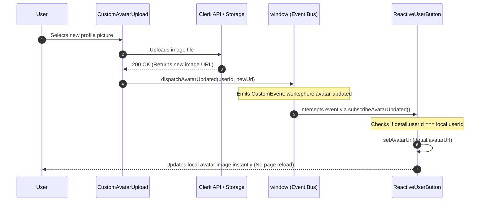

# Event Emission Lifecycle Architecture: `avatar-events.ts`

## 1. Executive Summary & Overview

WorkSphere employs a lightweight, decoupled event emission lifecycle via `src/lib/avatar-events.ts` to manage real-time UI avatar updates across components.

When a user uploads or updates their profile picture (for example, in `CustomAvatarUpload` or `NotificationSettings`), rather than triggering an expensive full page re-render (`router.refresh()`, `window.location.reload()`, or invalidating top-level Context state trees), an in-memory `CustomEvent` is dispatched onto the `window` global object. Subscribed components, such as `ReactiveUserButton`, intercept the event and update their local state reactively with zero re-rendering overhead for unrelated component hierarchies.

---

## 2. `CustomEvent` Dispatching & Listener Subscription Pattern

The event architecture consists of three core abstractions defined in `src/lib/avatar-events.ts`:

### 2.1 Event Constant & Payload Specification

```typescript
export const AVATAR_UPDATED_EVENT = "worksphere:avatar-updated";

export interface AvatarUpdatedDetail {
  /** The unique user ID associated with the updated avatar */
  userId: string;
  /** The new avatar image URL */
  avatarUrl: string;
  /** Unix timestamp in milliseconds when the event was dispatched */
  timestamp: number;
}

export type AvatarUpdatedCustomEvent = CustomEvent<AvatarUpdatedDetail>;
```

### 2.2 Event Dispatcher (`dispatchAvatarUpdated`)

`dispatchAvatarUpdated` constructs a strongly typed `CustomEvent<AvatarUpdatedDetail>` and dispatches it globally on `window`:

```typescript
export function dispatchAvatarUpdated(userId: string, avatarUrl: string): void {
  if (typeof window === "undefined") return;

  const detail: AvatarUpdatedDetail = {
    userId,
    avatarUrl,
    timestamp: Date.now(),
  };

  const event = new CustomEvent<AvatarUpdatedDetail>(AVATAR_UPDATED_EVENT, {
    detail,
    bubbles: true,
    cancelable: true,
  });

  window.dispatchEvent(event);
}
```

### 2.3 Subscription Listener Helper (`subscribeAvatarUpdated`)

`subscribeAvatarUpdated` registers an event listener on `window` and returns an idempotent cleanup function for `useEffect` unmounting:

```typescript
export function subscribeAvatarUpdated(
  callback: (detail: AvatarUpdatedDetail) => void,
): () => void {
  if (typeof window === "undefined") return () => {};

  const handler = (event: Event) => {
    const customEvent = event as CustomEvent<AvatarUpdatedDetail>;
    if (customEvent.detail) {
      callback(customEvent.detail);
    }
  };

  window.addEventListener(AVATAR_UPDATED_EVENT, handler);

  return () => {
    window.removeEventListener(AVATAR_UPDATED_EVENT, handler);
  };
}
```

---

## 3. How `ReactiveUserButton` Avoids Full Page Re-renders

### 3.1 Traditional Problem vs. Reactive Solution

| Approach                                | Mechanics                                                                                                           | Performance & UX Impact                                                                                                        |
| :-------------------------------------- | :------------------------------------------------------------------------------------------------------------------ | :----------------------------------------------------------------------------------------------------------------------------- |
| **Traditional (Server Refresh)**        | Calls `router.refresh()` or `location.reload()` after avatar upload.                                                | Causes full DOM re-parsing, layout jumps, lost transient form state, and network re-fetches for all server components.         |
| **Context Invalidation**                | Mutates global React Context or state store.                                                                        | Triggers recursive re-renders down every sub-tree consuming the user context.                                                  |
| **Event-Driven (`ReactiveUserButton`)** | Dispatches `worksphere:avatar-updated` `CustomEvent`. `ReactiveUserButton` intercepts and updates local `useState`. | **Isolated Component Mutation**: Only the avatar image element re-renders. All sibling/parent layout trees remain undisturbed. |

### 3.2 Component Implementation Flow (Mermaid Sequence Diagram)



### 3.3 Forcing Image Cache Invalidation

When a user uploads a new avatar, the browser might aggressively cache the old image if the storage URL remains identical. To solve this, `ReactiveUserButton` uses the `timestamp` included in the event payload to forcefully invalidate the browser cache by appending it as a query parameter.

```typescript
// Inside ReactiveUserButton.tsx
subscribeAvatarUpdated((detail) => {
  if (detail.userId === userId) {
    // Append the timestamp to bypass the browser's aggressive image caching
    const cacheBustedUrl = `${detail.avatarUrl}?t=${detail.timestamp}`;
    setAvatarUrl(cacheBustedUrl);
  }
});
```

---

## 4. Code Snippets & Developer Usage Guide

### 4.1 Dispatching an Avatar Update Event

Call `dispatchAvatarUpdated` immediately after a successful profile picture upload or deletion:

```typescript
import { dispatchAvatarUpdated } from "@/lib/avatar-events";

async function handleProfilePhotoUpload(file: File) {
  const updatedUser = await user.setProfileImage({ file });

  if (user.id && updatedUser.imageUrl) {
    // Notify all active reactive UI components immediately
    dispatchAvatarUpdated(user.id, updatedUser.imageUrl);
  }
}
```

### 4.2 Subscribing to Avatar Updates in React Components

Use `subscribeAvatarUpdated` inside a React component's `useEffect` hook to handle updates reactively:

```typescript
import React, { useState, useEffect } from "react";
import { subscribeAvatarUpdated, AvatarUpdatedDetail } from "@/lib/avatar-events";

export function UserHeaderBadge({ userId, defaultAvatar }: { userId: string; defaultAvatar: string }) {
  const [avatarUrl, setAvatarUrl] = useState(defaultAvatar);

  useEffect(() => {
    // Subscribe to avatar update events
    const unsubscribe = subscribeAvatarUpdated((detail: AvatarUpdatedDetail) => {
      // Filter by target userId to ensure multi-user safety
      if (detail.userId === userId && detail.avatarUrl) {
        // Implement cache busting
        const cacheBustedUrl = `${detail.avatarUrl}?t=${detail.timestamp}`;
        setAvatarUrl(cacheBustedUrl);
      }
    });

    // Cleanup event listener on unmount
    return () => {
      unsubscribe();
    };
  }, [userId]);

  return (
    <div className="flex items-center gap-2">
      
    </div>
  );
}
```

---

## 5. Summary of Architecture Benefits

1. **Clean Architecture**: Decouples UI display components from avatar mutation components.
2. **Sub-millisecond Reactivity**: Updates avatar thumbnails instantaneously across the page header, sidebar, and map markers.
3. **Zero Layout Thrashing**: Eliminates full-page re-renders and server component re-validation cycles.
4. **Cache Safe**: Built-in cache busting ensures the UI always displays the freshest image data.
