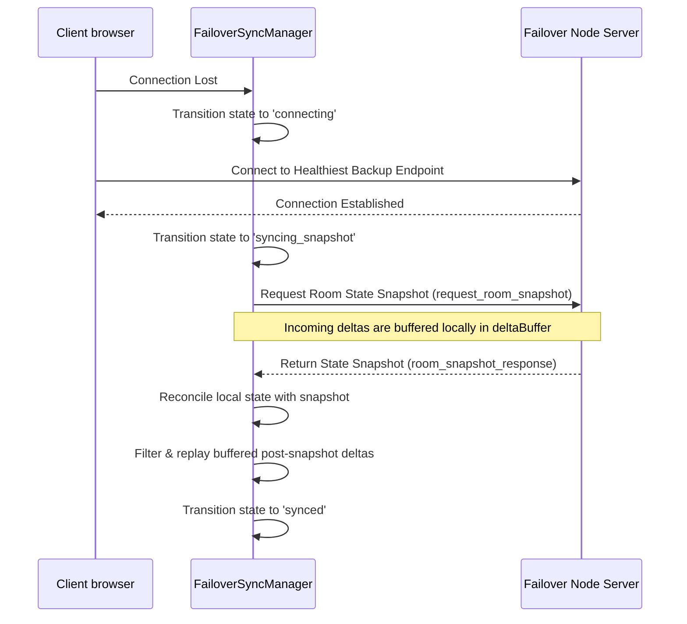

# Edge Geo-Routing & Regional Failover Synchronization

This architectural guide details how WorkSphere routes regional user sessions to the closest real-time WebSocket server nodes using geolocation telemetry, and coordinates state synchronization during edge node failover events.

---

## 1. Architectural Overview

To deliver sub-100ms presence updates, seat booking synchronizations, and interactive collaborative spaces, WorkSphere routes users to local nodes distributed globally (e.g. PartyKit edge nodes).

```
                     [ User Browser ]
                            │
               (Extracts Geo IP Headers)
                            ▼
           [ Edge Geolocation Routing Engine ]
            ├── Resolves Nearest Node
            └── Latency & Health Checks OK?
                     /            \
                   YES             NO
                   /                \
        [ Primary Regional Node ]   [ Failover Backup Node ]
```

---

## 2. Geolocation Routing & Distance Calculation

### Geolocation Header Extraction

During the handshake, the edge proxy inspects HTTP country and continent headers supplied by the hosting infrastructure (Cloudflare CDN or Vercel Edge Middleware):

- `cf-ipcountry` / `x-vercel-ip-country` / `x-country-code`
- `cf-ipcontinent` / `x-vercel-ip-continent`

### Haversine Distance Formula

If a country mapping is not explicitly predefined, the router resolves the closest regional node. It performs distance calculations between the client's estimated coordinate location and target edge coordinates using the **Haversine Formula**:

$$d = 2R \cdot \arcsin\left(\sqrt{\sin^2\left(\frac{\Delta \text{lat}}{2}\right) + \cos(\text{lat}_1) \cdot \cos(\text{lat}_2) \cdot \sin^2\left(\frac{\Delta \text{lng}}{2}\right)}\right)$$

Where:

- $d$ is the distance between coordinates.
- $R$ is the Earth's radius (mean radius $R = 6371 \text{ km}$).
- $\Delta \text{lat} = \text{lat}_2 - \text{lat}_1$
- $\Delta \text{lng} = \text{lng}_2 - \text{lng}_1$

Implemented in [geoRouter.ts](file:///c:/Users/shrut/OneDrive/Desktop/WorkSphere/src/lib/edge/geoRouter.ts):

```typescript
function haversineDistance(
  lat1: number,
  lng1: number,
  lat2: number,
  lng2: number,
): number {
  const R = 6371; // Earth's radius in km
  const dLat = ((lat2 - lat1) * Math.PI) / 180;
  const dLng = ((lng2 - lng1) * Math.PI) / 180;
  const a =
    Math.sin(dLat / 2) * Math.sin(dLat / 2) +
    Math.cos((lat1 * Math.PI) / 180) *
      Math.cos((lat2 * Math.PI) / 180) *
      Math.sin(dLng / 2) *
      Math.sin(dLng / 2);
  const c = 2 * Math.atan2(Math.sqrt(a), Math.sqrt(1 - a));
  return R * c;
}
```

### Region Selection

- The closest matching region node is chosen among defined regional server coordinates: `us-east`, `us-west`, `eu-west`, `eu-central`, `ap-south`, `ap-northeast`, and `sa-east`.

---

## 3. Node Selection & Reconnection Flow

Node health is continually audited. The client selects the optimal endpoint using the following hierarchy:

1. **Local Node Selection**: Filters nodes matching the preferred region that exhibit a latency below 100ms.
2. **Fallback Node Probing**: If no local node responds cleanly, the router calculates the closest geographical backup node displaying a latency below 200ms.
3. **Primary Default**: Falls back to the root connection host if all telemetry checks are unreachable.

---

## 4. Failover Room State Reconnection

When a primary edge node crashes or drops connection, the client reconnects to an alternative regional failover node. To prevent data corruption or state drift (where local edits conflict with stale failover state), the [FailoverSyncManager](file:///c:/Users/shrut/OneDrive/Desktop/WorkSphere/src/lib/edge/failoverSync.ts) enforces a strict state reconciliation protocol.

### Reconnection Synchronization Pipeline



### Core Operations

1. **Request Snapshot**: On reconnect, the client issues a `request_room_snapshot` query to retrieve the current authority state of the new edge node.
2. **Buffer Live Changes**: While the snapshot is in transit, incoming client actions and live network deltas are stored in a local queue (`deltaBuffer`).
3. **Reconcile**: When the snapshot arrives, the local state is fully synchronized.
4. **Replay**: Buffered deltas that arrived _after_ the snapshot generation timestamp are replayed in order to maintain up-to-date presence without duplication.

---

## 5. Environment & Failover Configuration

The system uses the following environment and module keys to map network fallbacks:

```typescript
// Defined in failoverSync.ts
export const secondaryNodes = [
  "https://backup-a.example.com",
  "https://backup-b.example.com",
  "https://backup-c.example.com",
];
```

- **`snapshotTimeoutMs`**: The timeframe (default `3000ms`) to wait for a snapshot response before draining the delta buffer directly to prevent rendering lockups.
- **`probeIntervalMs`**: The background health check frequency (default `30000ms`) that checks endpoints via their `/health` ping routes.
