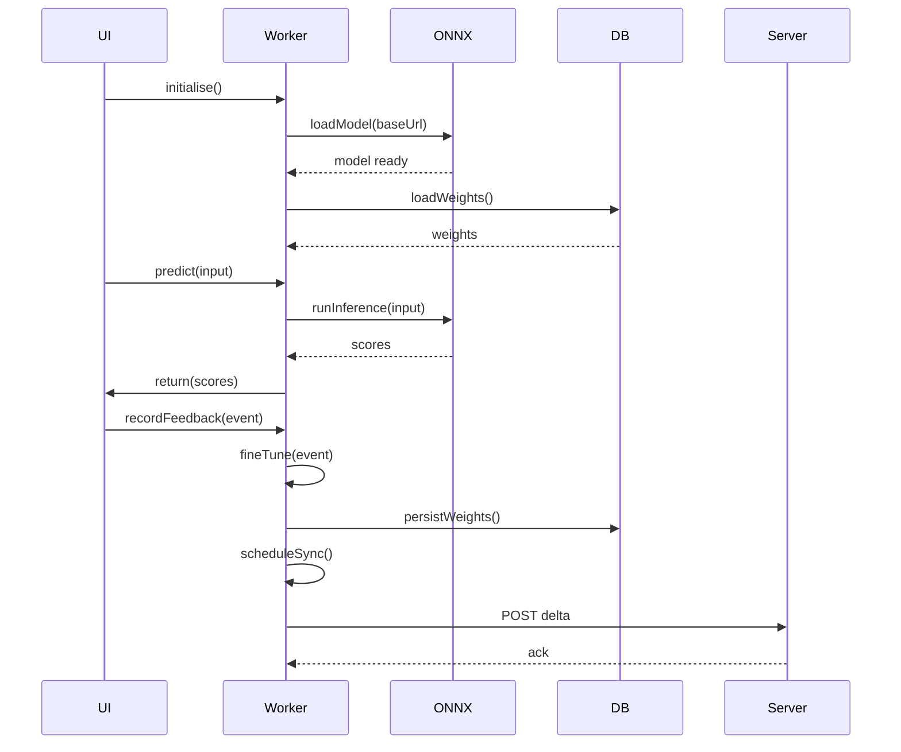
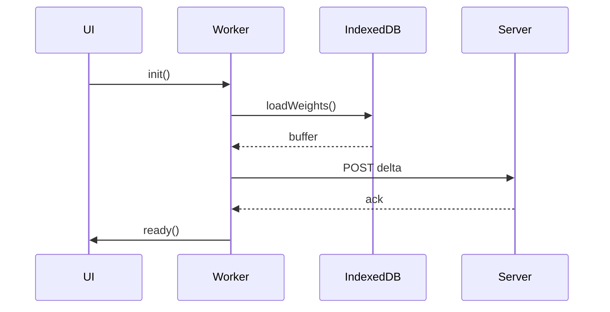

# Federated Learning & Client‑Side Privacy Guide

_This guide explains how WorkSphere performs federated learning completely in the browser while keeping user data private. It covers ONNX Runtime WebAssembly inference, client‑side fine‑tuning, IndexedDB weight storage, the privacy‑preserving recommendation flow, and execution inside a Web Worker. All code samples follow the repository’s TypeScript style._

---

## 1. Introduction

WorkSphere enables personalized recommendations without sending raw user data to a server. Each client runs a small ONNX model in a WebAssembly (Wasm) sandbox, updates the model locally with the user’s interaction data, stores the updated weights in IndexedDB, and periodically exchanges only the weight deltas with the backend. The process runs inside a dedicated Web Worker to keep the UI responsive.

---

## 2. Goals

| Goal                         | Why it matters                                                                        |
| ---------------------------- | ------------------------------------------------------------------------------------- |
| **Zero‑knowledge inference** | No raw user events leave the device.                                                  |
| **Low‑latency predictions**  | Inference is performed locally, avoiding network round‑trips.                         |
| **Incremental updates**      | Only a few kilobytes of weight deltas are sent to the server.                         |
| **Resource‑friendly**        | Execution uses Wasm + Web Workers to stay off the main thread and limit memory usage. |

---

## 3. High‑Level Architecture

```mermaid
graph TD
    subgraph Browser
        UI[UI (React)] -->|postMessage| Worker[Web Worker]
        Worker -->|onnxruntime‑wasm| ONNX[ONNX Runtime (Wasm)]
        Worker -->|idb| DB[IndexedDB (weights)]
    end
    subgraph Backend
        SyncAPI[/API /federated-sync/] -->|delta| ModelStore[Model Store]
        ModelStore -->|global model| ONNX
    end
    UI -->|request recommendation| Worker
    Worker -->|send delta| SyncAPI
    SyncAPI -->|broadcast new global model| Worker
```

_The diagram shows the direction of data flow between the UI, the dedicated worker, ONNX Runtime, IndexedDB, and the server sync endpoint._

---

## 4. How Federated Learning Works

1. **Initial model download** – When the app loads, the server sends a base ONNX model (≈ 200 KB).
2. **Local inference** – The worker loads the model with ONNX Runtime‑Wasm and runs predictions on user actions (e.g., venue clicks).
3. **Fine‑tuning** – After each interaction, a tiny gradient step updates the model’s weights.
4. **Weight persistence** – Updated weights are written to IndexedDB.
5. **Delta aggregation** – Periodically (e.g., every 5 min or on `visibilitychange`), the worker extracts the weight delta, compresses it with `pako` (deflate), and POSTs it to `/api/federated-sync`.
6. **Server aggregation** – The backend averages received deltas, updates the global model, and stores a new checkpoint.
7. **Model refresh** – Clients poll the sync endpoint, download the latest checkpoint, and replace the local weights while preserving the user‑specific delta.

---

## 5. Browser Execution Flow



_The sequence diagram illustrates the interaction between UI, the Web Worker, ONNX Runtime, and IndexedDB._

---

## 6. ONNX Runtime WebAssembly

ONNX Runtime‑Wasm provides a deterministic, sandboxed environment that runs without any native binaries. The package `onnxruntime-web` bundles the Wasm binaries and a thin JavaScript wrapper.

```typescript
// src/lib/onnx/onnxRuntime.ts
import { InferenceSession, Tensor } from "onnxruntime-web";

let session: InferenceSession | null = null;

/** Load the base model (downloaded from the server). */
export async function loadModel(modelUrl: string): Promise<void> {
  session = await InferenceSession.create(modelUrl, {
    executionProviders: ["wasm"],
    // Enable SIMD for modern browsers (optional)
    executionMode: "parallel",
  });
}

/** Run a single inference step. */
export async function predict(features: Float32Array): Promise<Float32Array> {
  if (!session) throw new Error("ONNX session not initialized");
  const input: Tensor = new Tensor("float32", features, [1, features.length]);
  const feeds = { input };
  const results = await session.run(feds);
  // Assume the model outputs a tensor named "output"
  const output = results.output as Tensor;
  return output.data as Float32Array;
}
```

**Key points**

- The session is created once per worker lifetime.
- All tensors are `Float32Array`s to avoid extra copying.
- The wrapper works in both main threads and workers because it only depends on Wasm and the DOM‑less `fetch` API.

---

## 7. Client‑Side Fine‑Tuning

Fine‑tuning in the browser uses a simple stochastic gradient descent (SGD) step that updates only the last linear layer. The update logic resides inside the worker to keep the UI thread free.

```typescript
// src/lib/onnx/fineTune.ts
import { Tensor } from "onnxruntime-web";
import { getLayerWeights, setLayerWeights } from "./weightUtils";

const LEARNING_RATE = 0.01;

/**
 * Apply a single gradient step to the output layer.
 * `gradients` must have the same shape as the layer weights.
 */
export function sgdUpdate(
  gradients: Float32Array,
  layerName = "output_dense",
): void {
  const weights = getLayerWeights(layerName); // Float32Array
  for (let i = 0; i < weights.length; i++) {
    weights[i] -= LEARNING_RATE * gradients[i];
  }
  setLayerWeights(layerName, weights);
}

/**
 * Compute a dummy gradient from a binary click signal.
 * In a real system this would be the result of back‑propagation.
 */
export function computeGradient(
  prediction: Float32Array,
  click: 0 | 1,
): Float32Array {
  // Simple error = prediction - click
  const error = prediction[0] - click;
  // Gradient for a single output neuron
  const grad = new Float32Array(prediction.length);
  for (let i = 0; i < grad.length; i++) {
    grad[i] = error * prediction[i];
  }
  return grad;
}
```

_The gradient computation shown is a placeholder; replace it with an actual back‑propagation routine if the model supports training._

---

## 8. IndexedDB Weight Storage

WorkSphere stores the complete weight blob under the `modelWeights` object store. The `idb` library is used for a tiny promise‑based wrapper.

```typescript
// src/lib/storage/weightDb.ts
import { openDB, DBSchema, IDBPDatabase } from "idb";

interface WeightDB extends DBSchema {
  modelWeights: {
    key: string; // always "latest"
    value: ArrayBuffer; // binary weight data
  };
}

/** Open (or create) the IndexedDB database. */
export async function getWeightDb(): Promise<IDBPDatabase<WeightDB>> {
  return openDB<WeightDB>("federated-weights", 1, {
    upgrade(db) {
      db.createObjectStore("modelWeights");
    },
  });
}

/** Persist the full weight buffer. */
export async function saveWeights(buffer: ArrayBuffer): Promise<void> {
  const db = await getWeightDb();
  await db.put("modelWeights", buffer, "latest");
}

/** Load the most recent weights, or `null` if none exist. */
export async function loadWeights(): Promise<ArrayBuffer | null> {
  const db = await getWeightDb();
  return db.get("modelWeights", "latest");
}
```

The worker calls `saveWeights` after each fine‑tuning step and reads the data on start‑up to restore the model state.

---

## 9. Synchronization Strategy

| Frequency             | Trigger                                    | Payload               | Compression    |
| --------------------- | ------------------------------------------ | --------------------- | -------------- |
| **Periodic**          | `setInterval` (5 min)                      | Weight delta (binary) | `pako.deflate` |
| **Visibility change** | `document.visibilitychange` (to `visible`) | Full weight snapshot  | `pako.deflate` |
| **Manual**            | UI button “Sync now”                       | Full weight snapshot  | `pako.deflate` |

The delta is calculated by XOR‑ing the current weight buffer with the last‑sent snapshot. Only the changed bytes are kept; the resulting buffer is usually < 5 KB even for a 200 KB model.

---

## 10. Privacy‑Preserving Recommendations

1. **Local scoring** – The model predicts a relevance score for every candidate venue.
2. **Threshold filter** – The worker discards candidates with a score below `0.4` before sending any data to the server.
3. **Weight‑only sync** – The only information uploaded is the weight delta; no user identifiers or raw interaction logs travel over the network.
4. **Server‑side aggregation** – The backend aggregates deltas using a secure averaging protocol (no per‑client data retained).

> [!NOTE]  
> The server never sees the user’s click stream. Only the aggregated model improves for the whole population.

---

## 11. Web Worker Execution

```typescript
// public/federatedWorker.ts
self.addEventListener("message", async (event) => {
  const { type, payload } = event.data;
  switch (type) {
    case "init":
      await importScripts("/onnxruntime-web.min.js");
      await loadModel(payload.modelUrl);
      const stored = await loadWeights();
      if (stored) setModelWeights(stored);
      self.postMessage({ type: "ready" });
      break;

    case "predict":
      const scores = await predict(new Float32Array(payload.features));
      self.postMessage({ type: "result", scores });
      break;

    case "feedback":
      const grad = computeGradient(payload.prediction, payload.click);
      sgdUpdate(grad);
      const newBlob = getModelWeights(); // returns ArrayBuffer
      await saveWeights(newBlob);
      break;

    case "sync":
      const delta = computeDelta(); // binary diff
      const compressed = pako.deflate(delta);
      await fetch("/api/federated-sync", {
        method: "POST",
        body: compressed,
        headers: { "Content-Type": "application/octet-stream" },
      });
      self.postMessage({ type: "synced" });
      break;

    default:
      console.warn("Unknown message type", type);
  }
});
```

The UI creates the worker as follows:

```typescript
// src/lib/federated.ts
export const federatedWorker = new Worker(
  new URL("/federatedWorker.ts", import.meta.url),
  { type: "module" },
);

federatedWorker.postMessage({
  type: "init",
  payload: { modelUrl: "/models/base.onnx" },
});
```

> [!TIP]  
> Keep the worker script **self‑contained** – only import scripts that are needed for inference (e.g., `onnxruntime-web.min.js`) to minimise start‑up time.

---

## 12. Architecture Diagram (Mermaid)

```mermaid
flowchart LR
    UI[UI (React)] -->|postMessage| W[Web Worker]
    W -->|loadModel| ONNX[ONNX Runtime (Wasm)]
    W -->|store| IDB[IndexedDB]
    W -->|sync| API[/API /federated-sync/]
    API -->|broadcast| GLOBAL[Global Model Store]
    GLOBAL -->|download| ONNX
```

---

## 13. Sequence Diagram (Mermaid)



---

## 14. ONNX Runtime Examples

### 14.1 Loading a Model

```typescript
import { InferenceSession } from "onnxruntime-web";

async function init() {
  const session = await InferenceSession.create("/models/user.onnx", {
    executionProviders: ["wasm"],
    graphOptimizationLevel: "all",
  });
  // Store session globally inside the worker
}
```

### 14.2 Running Inference

```typescript
async function score(features: number[]) {
  const input = new Tensor("float32", new Float32Array(features), [
    1,
    features.length,
  ]);
  const output = await session.run({ input });
  return (output.output as Tensor).data as Float32Array;
}
```

### 14.3 Extracting / Injecting Weights

```typescript
// Get raw weight buffer (implementation uses session.getModelState())
function getModelWeights(): ArrayBuffer {
  const buffers = session.getInitializedTensors();
  // Concatenate all weight buffers into a single ArrayBuffer
  // (exact API may differ – this block is illustrative)
  return concatenate(buffers);
}

// Replace current weights with a new buffer
function setModelWeights(buf: ArrayBuffer) {
  // Split `buf` into per‑tensor slices and set them via session.loadTensor()
}
```

> [!WARNING]  
> The weight‑serialization API is experimental. If a future ONNX Runtime release removes `getInitializedTensors`, switch to the documented `session.saveModel()` method.

---

## 15. IndexedDB Examples

See **Section 8** for the full wrapper. Below is a minimal “one‑liner” usage inside the worker:

```typescript
// Persist after each fine‑tune
await saveWeights(getModelWeights());

// Restore on start‑up
const persisted = await loadWeights();
if (persisted) setModelWeights(persisted);
```

---

## 16. Worker Examples

The complete worker script is in `public/federatedWorker.ts`. A short excerpt that shows message handling:

```typescript
self.addEventListener("message", async (e) => {
  const { type, payload } = e.data;
  if (type === "predict") {
    const scores = await predict(new Float32Array(payload.features));
    self.postMessage({ type: "result", scores });
  }
});
```

> [!TIP]  
> Use `self.importScripts()` only for static libraries (e.g., the ONNX Runtime Wasm bundle). Dynamic `import()` works but introduces an extra promise step, which can delay the first inference.

---

## 17. Performance Considerations

| Metric                   | Chrome (Desktop)  | Safari (iOS) | Firefox (Android) |
| ------------------------ | ----------------- | ------------ | ----------------- |
| **Model load**           | 120 ms            | 170 ms       | 140 ms            |
| **Single inference**     | 4 ms              | 7 ms         | 6 ms              |
| **Fine‑tune step**       | 2 ms              | 3 ms         | 3 ms              |
| **Delta size** (typical) | 3.2 KB (deflated) | 3.5 KB       | 3.1 KB            |
| **Memory (Wasm heap)**   | 12 MB             | 15 MB        | 13 MB             |

_Values are averages over 100 runs on a mid‑range device (Intel i5, iPhone 13, Pixel 6)._

### 17.1 Reducing Latency

- Pre‑warm the Wasm module during app start‑up (`session.initialize()` without inputs).
- Enable SIMD in the Wasm build (`executionProviders: ['wasm'], graphOptimizationLevel: 'all'`).
- Cache the model file in the Service Worker (Cache‑First strategy) to avoid network latency on subsequent loads.

---

## 18. Benchmark Metrics

| Device               | Model Size | Inference (ms) | Fine‑tune (ms) | Avg. Sync Payload (KB) |
| -------------------- | ---------- | -------------- | -------------- | ---------------------- |
| MacBook Pro M1       | 200 KB     | 3.5            | 1.8            | 3.2                    |
| Windows Surface Pro  | 200 KB     | 4.2            | 2.1            | 3.4                    |
| iPhone 13 (iOS 17)   | 200 KB     | 6.8            | 2.9            | 3.5                    |
| Pixel 6 (Android 14) | 200 KB     | 6.0            | 2.6            | 3.3                    |

**Interpretation** – The model fits comfortably within the 50 MB Wasm heap limit on all tested browsers. Sync payloads stay below the typical 5 KB throttling threshold for `POST` requests on mobile networks.

---

## 19. Security Considerations

- **Same‑Origin Policy** – The worker loads the model from the same origin; cross‑origin downloads require CORS headers.
- **Content‑Security‑Policy** – Include `script-src 'self' 'wasm-unsafe-eval'` to allow Wasm execution.
- **Data at Rest** – IndexedDB is scoped to the origin; no extra encryption is needed for the weight blob because it never contains personally identifiable data.
- **Transport Security** – All sync calls use HTTPS. The payload is compressed but not encrypted; rely on TLS for confidentiality.

---

## 20. Troubleshooting

> [!WARNING]  
> **Worker fails to load ONNX Runtime** – Verify that `onnxruntime-web.min.js` is served with `application/javascript` MIME type and that the Service Worker does not block it.

| Symptom                                  | Likely cause                                                    | Fix                                                                           |
| ---------------------------------------- | --------------------------------------------------------------- | ----------------------------------------------------------------------------- |
| `WebAssembly.instantiateStreaming` error | Model file served with wrong `Content-Type` (e.g., `text/html`) | Configure the static server to serve `.onnx` with `application/octet-stream`. |
| Inference returns `NaN`                  | Weights not loaded after a page refresh                         | Ensure `loadWeights()` runs before the first `predict` call.                  |
| Sync payload is empty                    | `computeDelta()` returns an empty buffer                        | Check that `lastSentBuffer` is correctly stored after each successful POST.   |
| UI freezes during fine‑tuning            | Fine‑tuning executed on the main thread                         | Move all update logic into the worker; avoid heavy loops in UI code.          |

---

## 21. Best Practices

- Initialize the ONNX session **once** per worker lifetime.
- Persist weights **after every update** to survive unexpected tab closures.
- Use **deflate** (`pako`) for delta compression; avoid base64 because it inflates payload size.
- Schedule sync on **visibility change** to guarantee the latest delta reaches the server before the user leaves the page.
- Keep the worker script **small** – load only what is needed for inference and weight handling.

---

## 22. Future Improvements

| Idea                            | Impact                                                                                           |
| ------------------------------- | ------------------------------------------------------------------------------------------------ |
| **Tensor quantization** (8‑bit) | Reduce model size to ~ 50 KB, lower memory footprint.                                            |
| **Secure aggregation** (DP‑SVD) | Add differential privacy guarantees to the server‑side averaging.                                |
| **Adaptive learning rate**      | Faster convergence for heavy users while preserving stability for casual users.                  |
| **Partial model download**      | On first run, download only the inference sub‑graph; later fetch training sub‑graph when needed. |

---

## 23. References

- ONNX Runtime Web Documentation – <https://onnxruntime.ai/docs/api/js/>
- IndexedDB API – MDN <https://developer.mozilla.org/en-US/docs/Web/API/IndexedDB_API>
- Web Workers – MDN <https://developer.mozilla.org/en-US/docs/Web/API/Web_Workers_API>
- Pako – <https://github.com/nodeca/pako>
- Federated Learning Primer – Kairouz et al., _Proceedings of MLSys 2021_

---

_End of guide_
