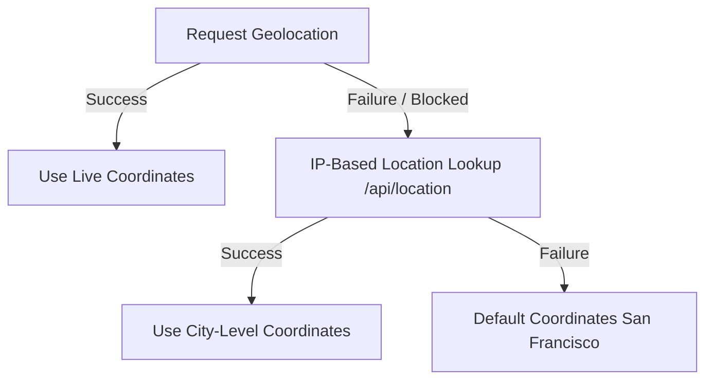

# Leaflet Map Coordinates Accuracy & Location Debugging Manual

## Overview

WorkSphere integrates **Leaflet maps** to render and discover workspaces dynamically. The core of this features relies on browser-based geolocation to center maps, calculate distances, and display nearby venues. 

This document serves as the guide for:
1. Understanding the Geolocation API and options configuration.
2. Troubleshooting browser location settings on Safari iOS and Android Chrome.
3. Customizing fallback coordinates when location access is blocked.

---

## 1. Location Request API

WorkSphere retrieves live user coordinates using the HTML5 Geolocation API.

### Geolocation Methods
The application calls browser geolocation methods under the global `navigator.geolocation` object:

*   **`getCurrentPosition()`**: Used for one-time retrieval of the device's current location (e.g. centering the map on load).
*   **`watchPosition()`**: Used for real-time tracking of the device's movement (e.g., updating user position on a live map).

### Options Configuration
The location query accepts a configuration object to tune accuracy and performance:

```ts
navigator.geolocation.getCurrentPosition(successCallback, errorCallback, {
  enableHighAccuracy: false, // Set to true for fine-grained GPS tracking
  timeout: 5000,             // Time in milliseconds before returning error
  maximumAge: 0              // Set to bypass cache and force fresh reading
});
```

| Config Option | Project Defaults | Recommendation |
| :--- | :--- | :--- |
| `enableHighAccuracy` | `false` | Set to `true` if exact building-level placement is required (uses GPS). Set to `false` (WiFi/Cellular) to optimize loading speed and battery. |
| `timeout` | `5000` | 5 seconds is standard. Setting it lower might result in frequent timeout errors on slow mobile networks. |
| `maximumAge` | Not set (uses 0) | Set to a value > 0 (e.g. 300000 for 5 mins) to use a cached position and bypass slow hardware wakeups. |

---

## 2. Browser Troubleshooting

### Safari iOS (iPhone / iPad)

#### Step 1: System-Level Access
1. Navigate to **Settings** → **Privacy & Security** → **Location Services**.
2. Ensure **Location Services** is switched **ON**.
3. Scroll down to select **Safari Websites** and set to **While Using the App**.

#### Step 2: Safari Website Settings
1. Open the website in Safari.
2. Tap the **AA** icon in the address bar.
3. Select **Website Settings** → **Location** → Set to **Allow**.

#### Step 3: Progressive Web App (PWA) Home Screen
If WorkSphere is added to the iOS Home Screen as a PWA:
1. PWAs have separate isolation on iOS.
2. Open the PWA, trigger the location action, and tap **Allow** on the native prompt.
3. If it does not prompt, delete the PWA from the home screen, clear Safari cache, and re-add the app.

---

### Android Chrome

#### Step 1: Device-Level Location
1. Swipe down the notifications shade and turn on **Location/GPS**.

#### Step 2: Chrome App Permissions
1. Long-press the **Chrome app icon** and tap the **(i) Info icon** (or go to Android Settings → Apps → Chrome).
2. Tap **Permissions** → **Location** → Select **Allow only while using the app** and toggle **Use precise location** on.

#### Step 3: Site-Specific Settings
1. Open Chrome and navigate to the application.
2. Tap the **Settings icon** (left of the address bar) → **Site settings**.
3. Under **Permissions**, tap **Location** and choose **Allow**.

---

## 3. Fallback Coordinate Configurations

When geolocation fails or permission is blocked, the application automatically handles coordinates using a layered fallback mechanism:



### Layer 1: IP-Based Lookup (`/api/location`)
When `navigator.geolocation` fails, WorkSphere queries the local proxy API to locate the user by their network IP address:
```ts
const response = await fetch("/api/location");
if (response.ok) {
  const data = await response.json();
  setLocation({ latitude: data.lat, longitude: data.lng });
}
```

### Layer 2: Hardcoded Global Fallback
If both geolocation and IP lookup fail, the map falls back to:
- **Default Latitude**: `37.7749` (San Francisco)
- **Default Longitude**: `-122.4194` (San Francisco)

### Customizing Defaults
To customize the default coordinates for your specific deployment, edit the state initialization in:
- `src/app/ai/page.tsx`
- `src/components/EnhancedChatbot.tsx`
- `src/components/VenueSubmissionModal.tsx`
