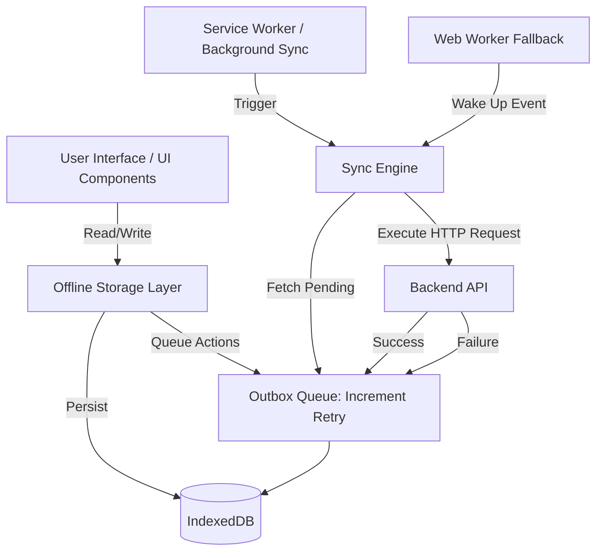
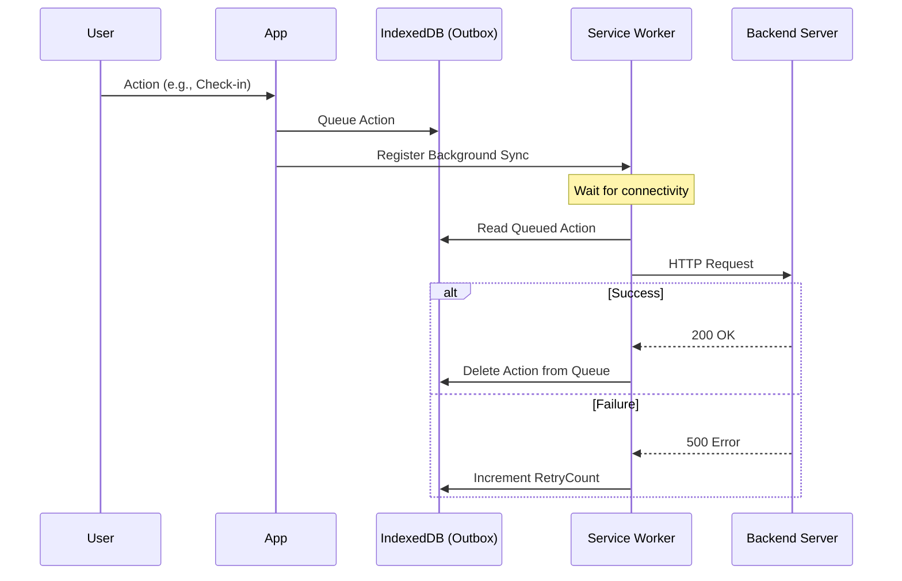

# Offline Storage and IndexedDB Sync Strategy

## Overview

The WorkSphere application implements a robust offline-first architecture to ensure users can continue browsing venues, interacting with favorites, managing their presence (check-ins), and viewing receipts even without network connectivity.

Offline storage is powered by IndexedDB and leverages the Service Worker's Background Sync API (with a foreground Web Worker fallback) to automatically synchronize locally queued actions once connectivity is restored. Yjs is also integrated to handle CRDT-based state mutations.

---

## High Level Architecture



---

## IndexedDB Database Structure

The application utilizes two distinct IndexedDB databases to separate core caching from specific synchronization queues.

### 1. `worksphere-offline` (Version 5)

Handles offline caching of venues, user state, image LRU caching, CRDT syncs, and general pending actions.

**Object Stores:**

- `venues` (Primary Key: `id`)
  - Indexes: `type`, `savedAt`
- `favorites` (Primary Key: `id`)
  - Indexes: `savedAt`
- `searches` (Primary Key: `query`)
  - Indexes: `timestamp`
- `pendingActions` (Primary Key: `id`, AutoIncrement: true)
- `imageCacheLRU` (Primary Key: `url`)
  - Indexes: `lastAccessed`
- `receiptExports` (Primary Key: `bookingId`)
  - Indexes: `status`, `createdAt`

### 2. `WorkSphereOfflineDB` (Version 2)

Dedicated outbox queues for specific user actions.

**Object Stores:**

- `favorites-outbox` (Primary Key: `id`, AutoIncrement: true)
- `checkins-outbox` (Primary Key: `id`, AutoIncrement: true)

---

## Store Schemas

### `venues` and `favorites` Store

| Field                    | Type   | Purpose                                     |
| ------------------------ | ------ | ------------------------------------------- |
| `id`                     | string | Unique identifier for the venue             |
| `name`                   | string | Name of the venue                           |
| `latitude` / `longitude` | number | Geolocation coordinates                     |
| `savedAt`                | number | Timestamp used for cache eviction / sorting |
| `type` / `category`      | string | Filtering criteria                          |

### `searches` Store

| Field       | Type   | Purpose                             |
| ----------- | ------ | ----------------------------------- |
| `query`     | string | The search text input (Primary Key) |
| `results`   | array  | Array of `OfflineVenue` objects     |
| `timestamp` | number | Timestamp of the search             |

### `pendingActions` Store

| Field                        | Type   | Purpose                                                            |
| ---------------------------- | ------ | ------------------------------------------------------------------ |
| `id`                         | number | Auto-incremented primary key                                       |
| `type`                       | string | Action type (e.g., `favorite`, `crdt-sync`, `conversation-rename`) |
| `venueId` / `conversationId` | string | Target entity identifier                                           |
| `data`                       | any    | Serialized payload or CRDT update                                  |
| `timestamp`                  | number | Time the action was queued                                         |

### `receiptExports` Store

| Field       | Type        | Purpose                                                   |
| ----------- | ----------- | --------------------------------------------------------- |
| `bookingId` | string      | Primary Key                                               |
| `filename`  | string      | File name for the exported PDF                            |
| `status`    | string      | Sync status (`pending`, `downloading`, `ready`, `failed`) |
| `pdf`       | ArrayBuffer | Binary content of the fetched PDF                         |

---

## Read / Write Flow

- **Writes**: Operations (like saving a venue) are wrapped using the Web Locks API (`navigator.locks.request`) to prevent concurrent transaction deadlocks across multiple browser tabs. Data is written to IndexedDB. If the action needs to sync to the server, it is simultaneously written to an outbox store.
- **Reads**: Functions like `getVenueOffline` request read-only transactions to fetch directly from IndexedDB.
- **Cache Lookup**: For search results, the query is looked up in the `searches` store. Results older than 24 hours are treated as stale and return `null`.
- **Persistence**: Cached data is kept indefinitely until explicitly evicted (e.g., keeping only the last 15 searches).

---

## Outbox Queue

Operations executed while offline are stored in outbox stores (`pendingActions`, `favorites-outbox`, `checkins-outbox`).

- **Queue Lifecycle**: Actions are appended locally. The Background Sync API or Web Worker attempts to flush them to the server.
- **Deduplication**: Rapid double-clicks are ignored by checking for existing pending actions of the same type and target before inserting.
- **Successful Sync**: Upon a successful HTTP response (Status 200 OK), the record is deleted from the outbox store.



---

## Retry Backoff Strategy

- **Maximum Retries**: The system explicitly enforces a `MAX_SYNC_RETRIES = 3` limit for queued actions (like favorites and receipts).
- **Failure Handling**: If an action exceeds the maximum retry count, it is marked as `failed` or removed from the queue, and the user is alerted via a `postMessage` event (`OFFLINE_SYNC_FAILED` or `RECEIPT_SYNC_FAILED`).
- **Circuit Breaker**: The foreground sync worker (`sync.worker.ts`) implements a circuit breaker. If repeated errors occur, it pauses the sync loop and logs a `CIRCUIT_BREAKER_OPEN` message.

---

## Online Synchronization

Synchronization is triggered through multiple redundant mechanisms to ensure reliability across all browsers (including iOS Safari):

1. **Background Sync API**: The Service Worker listens to the `sync` event (tags: `sync-crdt`, `sync-favorites`, `sync-conversations`, `receipt-export-sync`).
2. **Foreground Web Worker**: `sync.worker.ts` is spawned on page load to act as a fallback for browsers lacking Background Sync API support.
3. **Online Event**: The `window.addEventListener("online")` event wakes up the sync worker manually.
4. **App Startup**: The sync worker receives a `WAKE_UP` message immediately upon initialization.

---

## Transaction Handlers

Transactions utilize the Web Locks API for concurrency safety and use native IndexedDB Promises.

**Create / Update Transaction (Example: Queue Pending Action):**

```typescript
export async function queuePendingAction(action) {
  const database = await initOfflineDB();
  return new Promise((resolve, reject) => {
    const tx = database.transaction(["pendingActions"], "readwrite");
    const store = tx.objectStore("pendingActions");
    store.add({
      ...action,
      timestamp: Date.now(),
    });
    tx.oncomplete = () => resolve();
    tx.onerror = () => reject(tx.error);
  });
}
```

**Read / Batch Transaction (Example: Get Pending Edits):**

```typescript
export async function getPendingConversationEdits() {
  const database = await initOfflineDB();
  return new Promise((resolve, reject) => {
    const tx = database.transaction(["pendingActions"], "readonly");
    const store = tx.objectStore("pendingActions");
    const request = store.getAll();
    request.onsuccess = () => {
      resolve(request.result.sort((a, b) => a.timestamp - b.timestamp));
    };
    request.onerror = () => reject(request.error);
  });
}
```

**Delete (Example: Cleanup / Success):**

```typescript
export async function removePendingActionById(id) {
  const database = await initOfflineDB();
  return new Promise((resolve, reject) => {
    const tx = database.transaction(["pendingActions"], "readwrite");
    const store = tx.objectStore("pendingActions");
    store.delete(id);
    tx.oncomplete = () => resolve();
    tx.onerror = () => reject(tx.error);
  });
}
```

---

## Conflict Resolution

- **CRDT Integration**: Local user state mutations (e.g., `yFavorites`, `yRatings`) are powered by Yjs (`userDoc`). When online, Yjs base64-encoded `Uint8Array` diffs are synced to the server. Yjs inherently guarantees eventual consistency, meaning no manual conflict resolution algorithms are required.
- **Conversation Edits**: If multiple offline actions target the same entity (e.g., renaming a conversation, then deleting it), the queue intelligently drops stale actions. A `conversation-delete` action immediately purges any pending `conversation-rename` actions from the outbox prior to insertion.

---

## Data Migration Strategy

IndexedDB schemas are versioned. When `DB_VERSION` is incremented, the `onupgradeneeded` event fires.

- **Non-Destructive Upgrades**: New object stores or indexes are created smoothly using `db.objectStoreNames.contains()`.
- **Destructive Upgrades (Schema changes)**: Old object stores can be deleted and recreated.
- **Concurrent Tab Handling**: If an upgrade occurs while another tab holds an active connection, `db.onversionchange` is triggered, forcing the old connection to close and allowing the upgrade to proceed without blocking.

```javascript
request.onupgradeneeded = (event) => {
  const db = event.target.result;
  // Migration example
  if (db.objectStoreNames.contains("pending-actions")) {
    db.deleteObjectStore("pending-actions");
  }
  // Create unified store
  if (!db.objectStoreNames.contains("pendingActions")) {
    db.createObjectStore("pendingActions", {
      keyPath: "id",
      autoIncrement: true,
    });
  }
};
```

---

## Error Handling

- **Browser Quotas**: The Image Cache implements a custom LRU (Least Recently Used) mechanism. When `QuotaExceededError` occurs during caching, `enforceImageCacheQuota()` is aggressively triggered to evict the oldest cached responses before retrying.
- **Private Browsing Mode**: Safari Private Browsing silently blocks IndexedDB access, throwing a `SecurityError`. This error is caught during database initialization, and a UI `alert()` is shown via `showPrivateBrowsingAlert()` notifying the user that offline features are disabled.
- **Transaction Failures**: Standard Promise rejection maps to the `tx.onerror` / `request.onerror` callbacks to fail gracefully in the application UI without crashing.

---

## Performance Considerations

- **Indexing**: Frequent queries (e.g., finding searches by `timestamp` or venues by `savedAt`) use IndexedDB secondary indexes to avoid expensive array scans across the entire database.
- **Web Locks**: Heavy writes are encapsulated by `navigator.locks.request("worksphere-offline-storage-lock")` ensuring atomicity without locking the UI thread excessively.
- **Garbage Collection**: The `cleanupOldData` routine runs periodically to purge venues and searches older than a 7-day maximum age threshold, protecting against unlimited disk space usage.

---

## Security Considerations

- **No Encryption**: IndexedDB is stored in plaintext on the user's local filesystem. Highly sensitive user data is intentionally excluded from the offline stores.
- **Same-Origin Policy**: IndexedDB is sandboxed securely to the application's domain, protecting data from other sites.
- **Automated Purging**: When the `beforeunload` event fires, database connections are eagerly closed to avoid leaking open handles.

---

## Debugging Tips

1. **DevTools Inspection**: Open Chrome DevTools -> **Application** tab -> **IndexedDB**. You can inspect both `worksphere-offline` and `WorkSphereOfflineDB` manually.
2. **Clear Storage**: If the database is corrupted, use the "Clear site data" button in the Application tab to wipe IndexedDB and unregister the Service Worker.
3. **Simulating Offline**: Use the "Network" tab to throttle your connection to "Offline" to test outbox queueing and UI feedback indicators.

---

## Future Improvements

_Note: These are future ideas and are not currently implemented._

- Complete end-to-end encryption for the IndexedDB databases.
- Full background sync observability UI panel for users to view their outbox.
- Stricter exponential backoff intervals instead of flat retries.
