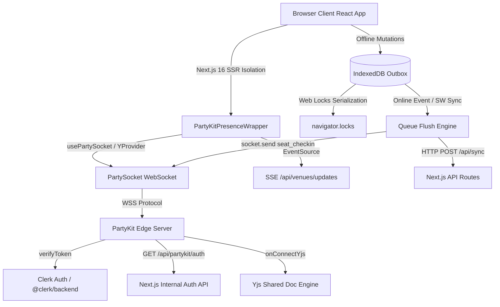
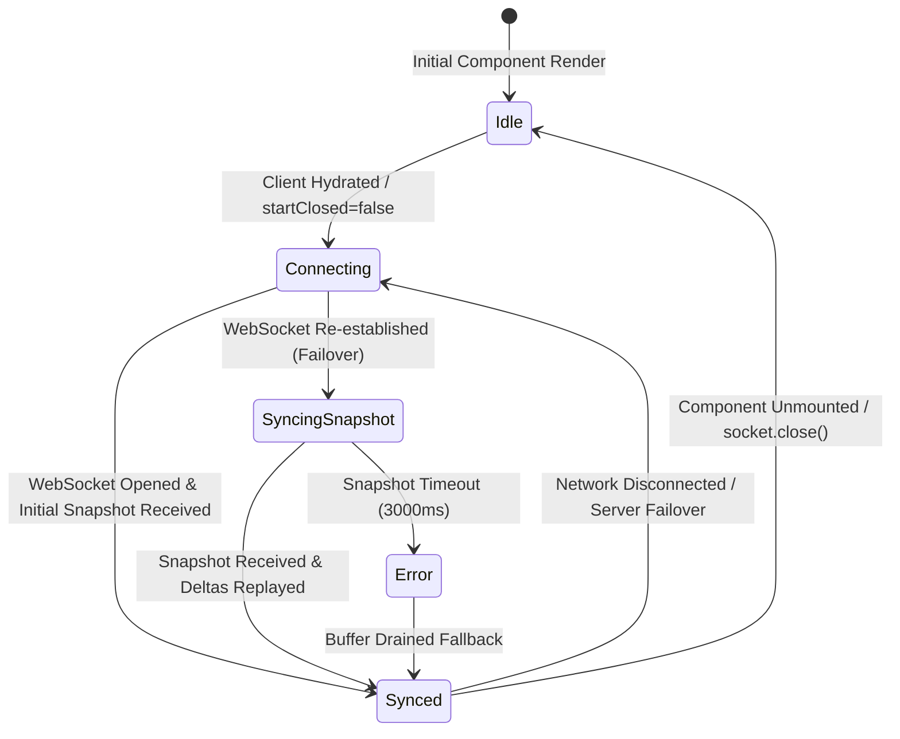
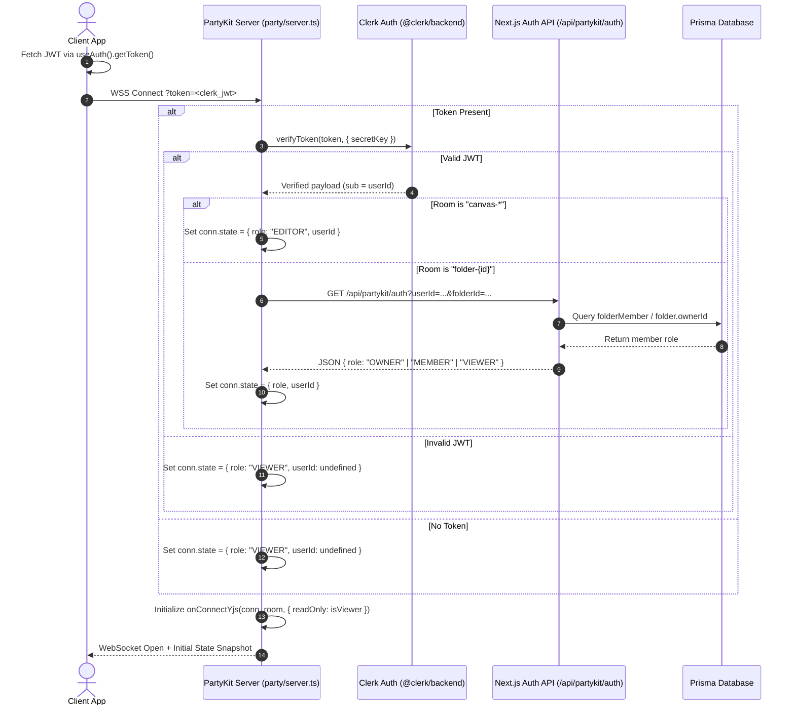
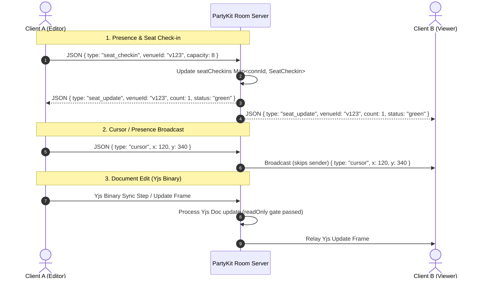
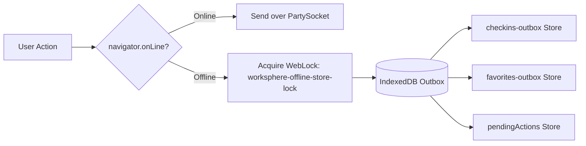
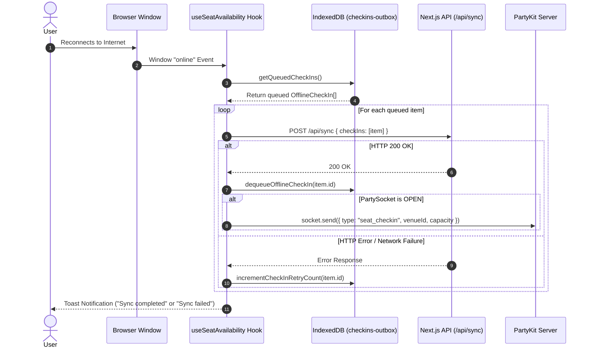
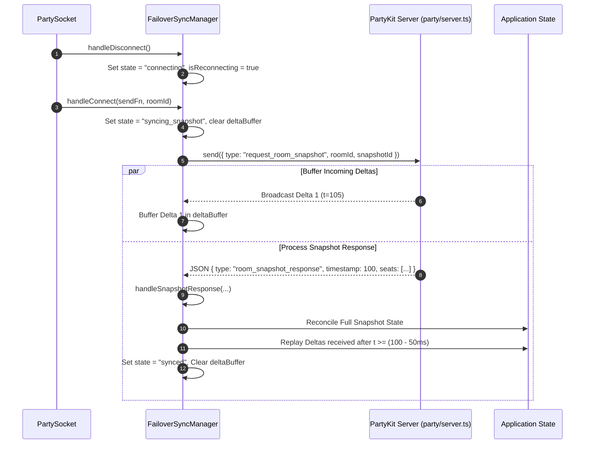

# PartyKit Reconnection & Resiliency Protocol

## Purpose

This document defines the architectural specification, connection lifecycle, state machine, reconnection behavior, offline queueing mechanisms, and state re-synchronization protocols for the real-time multiplayer and presence infrastructure in WorkSphere.

WorkSphere utilizes **PartyKit** (`partykit` / `partysocket` / `y-partykit`) alongside native Web APIs (WebSockets, IndexedDB, Web Locks API, Server-Sent Events) to deliver real-time collaboration across workspace folders, interactive map seat availability, collaborative whiteboards, WebRTC signaling, and multi-region edge node routing.

---

## Architecture Overview

WorkSphere's real-time architecture consists of three main tiers:

1. **PartyKit Server Layer** (`party/server.ts` & `party/multiRegionServer.ts`):
   - **`WorkspaceServer`**: Core PartyKit room handler running on Cloudflare Workers edge nodes. Coordinates Yjs CRDT document synchronization, real-time presence (cursor/typing), WebRTC signaling, room snapshot generation, and seat check-in state tracking.
   - **`MultiRegionWorkspaceServer`**: Extended edge server providing IP/header-based geolocation routing (`geoRouter.ts`), sub-30ms presence updates, and cross-region durable state synchronization (`stateSync.ts`).

2. **Client React Hooks & State Layer** (`src/hooks/` & `src/components/`):
   - **`useSeatAvailability`**: Manages real-time seat check-in/checkout presence over the dedicated `seat-availability` PartyKit room with offline queue fallback.
   - **`useCanvasWhiteboard`**: Manages collaborative whiteboard drawing state backed by `y-partykit/provider` (`YProvider`), Yjs Y.Doc, Y.UndoManager, and edge failover state synchronization (`FailoverSyncManager`).
   - **`useMultiRegion`**: Connects to multi-region PartyKit nodes and performs continuous RTT latency ping/pong monitoring.
   - **`useScreenShare`**: Utilizes PartyKit WebSocket rooms as a signaling transport for WebRTC P2P mesh screen sharing.
   - **`useRealTimeUpdates`**: Handles server-side rating and venue availability stream using Server-Sent Events (SSE) with application-managed exponential backoff.
   - **`PartyKitPresenceWrapper`**: React hydration guard preventing Next.js 16 App Router streaming SSR mismatches.

3. **Offline Storage & Resiliency Layer** (`src/lib/offlineStore.ts` & `src/lib/offlineStorage.ts`):
   - Persistent IndexedDB outboxes (`checkins-outbox`, `favorites-outbox`, `pendingActions`) for queueing mutations executed while offline.
   - Multi-tab transaction serialization via the **Web Locks API** (`navigator.locks.request`) to prevent IndexedDB transaction deadlocks.



---

## Connection Lifecycle

The WebSocket lifecycle in WorkSphere spans initialization, token verification, open handshake, message processing, close handling, and cleanup:

| Stage                | Responsible Component / Function         | Location                                                                         | Description                                                                                                                                                                    |
| :------------------- | :--------------------------------------- | :------------------------------------------------------------------------------- | :----------------------------------------------------------------------------------------------------------------------------------------------------------------------------- |
| **Initialization**   | `usePartySocket` / `YProvider`           | `src/hooks/useSeatAvailability.ts`<br>`src/hooks/useCanvasWhiteboard.ts`         | Configures host (`process.env.NEXT_PUBLIC_PARTYKIT_HOST`), room ID, and query parameters (`?token=...`). Uses `startClosed` flag during SSR.                                   |
| **SSR Isolation**    | `PartyKitPresenceWrapper`                | `src/components/chat/PartyKitPresenceWrapper.tsx`                                | Defers socket initialization until client-side hydration (`isMounted = true`) completes, isolating Next.js 16 SSR streaming.                                                   |
| **Authentication**   | `verifyToken` & `GET /api/partykit/auth` | `party/server.ts` (lines 33-85)<br>`src/app/api/partykit/auth/route.ts`          | Server extracts Clerk JWT token from URL params, verifies signature, queries internal Next.js auth endpoint for role (`OWNER`, `MEMBER`, `VIEWER`), and sets connection state. |
| **Connection Open**  | `onConnect` / `onOpen`                   | `party/server.ts` (lines 33-113)<br>`src/hooks/useSeatAvailability.ts` (line 80) | Server broadcasts current seat snapshot (`seat_snapshot`) and presence state. Client updates `isConnected` state to `true`.                                                    |
| **Message Exchange** | `onMessage` / `conn.addEventListener`    | `party/server.ts` (lines 115-180)<br>`src/hooks/useCanvasWhiteboard.ts`          | Exchanges JSON control frames (`seat_checkin`, `presence`, `cursor`, `webrtc-signal`, `request_room_snapshot`) and Yjs binary CRDT updates.                                    |
| **Connection Close** | `onClose`                                | `party/server.ts` (lines 184-186)<br>`src/hooks/useMultiRegion.ts` (line 48)     | Server executes `handleSeatCheckout(conn)` to automatically release seat reservations for disconnected clients.                                                                |
| **Reconnection**     | `partysocket` / `FailoverSyncManager`    | `src/lib/edge/failoverSync.ts`<br>`src/hooks/useCanvasWhiteboard.ts`             | Client auto-reconnects via `partysocket`. `FailoverSyncManager` requests full room snapshot and buffers post-reconnect deltas.                                                 |
| **Cleanup**          | Unmount cleanup in `useEffect`           | `src/hooks/useSeatAvailability.ts` (lines 207-217)                               | Disconnects provider/socket, closes peer connections, clears interval timers, and sends best-effort `seat_checkout` frame.                                                     |

---

## Connection State Machine

The client connection transitions through distinct states managed by `partysocket` and `FailoverSyncManager` (`src/lib/edge/failoverSync.ts`):



### Verified Connection States

- **`idle`**: Unmounted state prior to DOM hydration.
- **`connecting`**: Socket initialization or underlying TCP/TLS socket opening.
- **`synced`** (`connected`): Socket is open, authentication succeeded, and client state is fully synchronized.
- **`syncing_snapshot`**: Reconnected after drop/failover; client has requested a full room state snapshot and is buffering incoming deltas.
- **`error`**: Snapshot request timed out (default 3000ms), triggering fallback delta buffer draining.

---

## Authentication Flow

WorkSphere enforces role-based access control (RBAC) over PartyKit connections using Clerk JWTs and internal Next.js database role lookups:



### Server Role Enforcement

- **VIEWER Role Restrictions**:
  - `onConnectYjs` is initialized with `{ readOnly: true }` for VIEWERS, instructing `y-partykit` to drop all incoming CRDT mutations from the client.
  - In `onMessage` (`party/server.ts` line 167), non-presence/non-signaling broadcasts from `VIEWER` connections are explicitly dropped.

---

## Message Flow



---

## Reconnection Strategy

WorkSphere operates two distinct reconnection strategies depending on the transport protocol:

### 1. PartySocket WebSocket Reconnection (`partysocket`)

- WorkSphere relies on the built-in automatic reconnect loop supplied by `partysocket` (`partysocket` ^1.3.0).
- When a WebSocket disconnects, `partysocket` automatically handles socket re-creation and exponential backoff retry attempts under the hood.
- WorkSphere application code attaches to socket events (`onOpen`, `onClose`) and uses `FailoverSyncManager` to handle state resynchronization upon reconnection rather than re-implementing raw socket retries.

### 2. Server-Sent Events (SSE) Reconnection (`useRealTimeUpdates`)

- Located in `src/hooks/useRealTime.tsx` (lines 43-148), `useRealTimeUpdates` implements an explicit application-layer exponential backoff loop for the EventSource connection (`/api/venues/updates`):

```typescript
// Initial state
let currentBackoff = 1000; // 1 second

// Error Handler & Backoff Logic (src/hooks/useRealTime.tsx lines 88-105)
eventSource.onerror = () => {
  setIsConnected(false);
  eventSource?.close();

  // Exponential backoff: double the delay up to 30 seconds
  clearTimeout(reconnectTimeout);
  reconnectTimeout = setTimeout(connect, currentBackoff);
  currentBackoff = Math.min(30000, currentBackoff * 2);
};

// Reset on Successful Open (src/hooks/useRealTime.tsx line 69)
eventSource.onopen = () => {
  setIsConnected(true);
  currentBackoff = 1000; // Reset backoff delay on success
};
```

---

## Exponential Backoff Algorithm

### Verified Application SSE Backoff Parameters (`src/hooks/useRealTime.tsx`)

| Parameter              | Value                                                                                    | Evidence / Line                    |
| :--------------------- | :--------------------------------------------------------------------------------------- | :--------------------------------- |
| **Initial Delay**      | `1000` ms (1 second)                                                                     | `src/hooks/useRealTime.tsx:49`     |
| **Backoff Multiplier** | `2.0` (Doubles delay per attempt)                                                        | `src/hooks/useRealTime.tsx:104`    |
| **Maximum Delay Cap**  | `30000` ms (30 seconds)                                                                  | `src/hooks/useRealTime.tsx:104`    |
| **Jitter Calculation** | **Not Implemented** (Uses deterministic doubling: `Math.min(30000, currentBackoff * 2)`) | `src/hooks/useRealTime.tsx:104`    |
| **Reset Condition**    | Connection `onopen` or Browser `online` event                                            | `src/hooks/useRealTime.tsx:69,111` |

---

## Offline Outbox Queue

When the browser is offline (`navigator.onLine === false`), user actions are saved into IndexedDB outboxes rather than being dropped.

### Verified Outbox Stores



1. **`checkins-outbox`** (`src/lib/offlineStore.ts`):
   - Store Schema: KeyPath `id` (autoIncrement).
   - Record Interface: `{ id?, venueId: string, timestamp: number, retryCount?: number }`.
2. **`favorites-outbox`** (`src/lib/offlineStore.ts`):
   - Store Schema: KeyPath `id` (autoIncrement).
   - Record Interface: `{ id?, venueId: string, action: "ADD" | "REMOVE", timestamp: number, retryCount?: number }`.
3. **`pendingActions`** (`src/lib/offlineStorage.ts`):
   - Store Schema: KeyPath `id` (autoIncrement).
   - Record Interface: `{ id?, type: "crdt-sync" | "conversation-rename" | "conversation-delete" | ..., timestamp: number }`.

---

## Queue Persistence

- **Database Engine**: Native browser IndexedDB (`WorkSphereOfflineDB` v2 and `worksphere-offline` v4).
- **Multi-Tab Web Locks API Serialization** (`src/lib/offlineStore.ts` lines 20-38):
  To prevent IndexedDB transaction deadlocks across multiple open browser tabs during concurrent offline writes (#910), all outbox insertions are wrapped with `navigator.locks.request`:

```typescript
export async function withWebLock<T>(
  callback: () => Promise<T>,
  lockName = "worksphere-offline-store-lock",
): Promise<T> {
  if (
    typeof navigator !== "undefined" &&
    "locks" in navigator &&
    navigator.locks?.request
  ) {
    try {
      return await navigator.locks.request(lockName, async () => callback());
    } catch {
      return callback();
    }
  }
  return callback();
}
```

- **Deduplication**:
  - `queueOfflineCheckIn`: Scans existing records in `checkins-outbox` for an identical `venueId` before adding.
  - `queueOfflineFavorite`: Scans `favorites-outbox` for an identical `venueId` and `action`.
  - `queuePendingAction`: Deduplicates pending actions by `type` + `venueId`.

---

## Queue Flushing Logic

Queue flushing is triggered automatically when network connectivity is restored:



### Flush Error & Retry Policy

- **Maximum Retries**: `MAX_SYNC_RETRIES = 3` (`src/lib/offlineStore.ts` line 12).
- If sync fails for an item, `incrementCheckInRetryCount(item.id)` increments the attempt counter.
- User receives feedback via toast notifications ("Sync started", "Sync completed", "Sync failed").

---

## State Re-synchronization

State re-synchronization on edge node failover or reconnection is governed by the `FailoverSyncManager` class (`src/lib/edge/failoverSync.ts`).



### Key Re-synchronization Invariants

1. **Delta Buffering during Snapshot Fetch**: While state is `syncing_snapshot`, incoming incremental deltas are buffered in `deltaBuffer` instead of being applied immediately.
2. **Snapshot Reconciliation & Delta Replay**: On receipt of `room_snapshot_response`, local state is replaced with snapshot state. Deltas buffered after `snapshotTimestamp - 50ms` (allowing for minor clock skew) are replayed in order.
3. **Snapshot Timeout Safety Net**: If the server fails to return a snapshot within 3000ms (`snapshotTimeoutMs`), `FailoverSyncManager` logs a warning, drains the delta buffer, and transitions the state to `synced` to avoid blocking the UI indefinitely.

---

## Heartbeat Protocol

Heartbeat monitoring is implemented in `useMultiRegion` (`src/hooks/useMultiRegion.ts` lines 40-74):

- **Interval**: 5000 ms (5 seconds).
- **Ping Frame**: `{ type: "ping" }`.
- **Pong Frame**: Server responds with `{ type: "pong" }` (or `{ type: "region_info" }`).
- **Latency Calculation**: `roundTripTime = Date.now() - pingStartTimestamp`.
- **Latency Quality Thresholds**:
  - `< 15 ms`: `"excellent"`
  - `< 30 ms`: `"good"`
  - `< 50 ms`: `"fair"`
  - `>= 50 ms`: `"poor"`

```typescript
// Ping interval lifecycle (src/hooks/useMultiRegion.ts)
onOpen() {
  setIsConnected(true);
  latencyIntervalRef.current = setInterval(() => {
    pingStartRef.current = Date.now();
    socket.send(JSON.stringify({ type: "ping" }));
  }, 5000);
},
onClose() {
  setIsConnected(false);
  if (latencyIntervalRef.current) clearInterval(latencyIntervalRef.current);
}
```

---

## Failure Recovery

| Failure Scenario              | Recovery Mechanism              | Implementation Details                                                                                                                    |
| :---------------------------- | :------------------------------ | :---------------------------------------------------------------------------------------------------------------------------------------- |
| **Network Interruption**      | Auto-reconnect + Offline Outbox | `partysocket` reconnects underlying WS. Outbox queues check-ins in IndexedDB and flushes on `window.online`.                              |
| **Edge Server Failover**      | Snapshot Sync + Delta Replay    | `FailoverSyncManager.handleConnect` issues `request_room_snapshot` to the new edge node and replays post-snapshot deltas.                 |
| **Browser Tab Suspension**    | Tab Focus Health Check          | `useRealTimeUpdates` listens to `document.visibilitychange`. If `visibilityState === "visible"` and stream is closed, triggers reconnect. |
| **SSR / Hydration Mismatch**  | Client-Only Wrapper             | `PartyKitPresenceWrapper` prevents rendering WebSocket-dependent presence nodes until client hydration completes.                         |
| **Duplicate Snapshot Frames** | Snapshot ID Tracking            | `FailoverSyncManager` records `lastAppliedSnapshotId` and drops duplicate snapshot responses.                                             |

---

## Performance Considerations

- **Bitrate Adaptation for Screen Sharing**: `useScreenShare.ts` runs a 4000ms loop invoking `adaptVideoBitrate(pc)` (`src/lib/screenShareBitrate.ts`) to dynamically scale WebRTC video bitrate according to network conditions.
- **Yjs Garbage Collection**: Server initializes Yjs bindings with `{ gc: true }` (`party/server.ts` line 97) to clear deleted document history nodes and limit memory usage.
- **Search History Trimming**: `saveSearchOffline` caps cached search history at 15 queries (`MAX_SEARCH_HISTORY = 15` in `src/lib/offlineStorage.ts`).

---

## Browser Compatibility

- **WebSockets (`WebSocket`)**: Supported in all modern browsers.
- **IndexedDB (`indexedDB`)**: Supported in all modern browsers. Private Browsing in Safari restricts IndexedDB access; WorkSphere detects `SecurityError` on DB open and displays a user notification alert (`showPrivateBrowsingAlert`).
- **Web Locks API (`navigator.locks`)**: Used in `src/lib/offlineStore.ts` and `src/lib/offlineStorage.ts` for multi-tab transaction serialization. Provides fallback execution when `navigator.locks` is unsupported.
- **Service Worker Background Sync (`SyncManager`)**: Supported in Chromium browsers. Safari/Firefox fall back to foreground `window.online` event flushing (`flushConversationEditQueue`).

---

## Known Limitations

1. **Lack of Random Jitter in SSE Exponential Backoff**: The backoff loop in `useRealTime.tsx` doubles delay deterministically (`currentBackoff * 2`) without random jitter. In massive reconnection events, clients could attempt reconnects in synchronized thundering herd waves.
2. **Foreground Reconnect Delay on Mobile Safari**: Mobile WebKit places background tabs in suspended states where `setInterval` timers are throttled, delaying latency pings until tab focus returns.

---

## Future Improvements

1. **Add Full Jitter to SSE Reconnection Backoff**: Introduce randomized jitter (e.g. `currentBackoff * (0.8 + Math.random() * 0.4)`) to `useRealTime.tsx` to prevent thundering herd spikes during server restarts.
2. **WebSocket Outbox Transport**: Extend the IndexedDB outbox queue to support direct WebSocket message frame flushing in addition to the current HTTP `/api/sync` fallback endpoint.

---

## Repository Files Referenced

- `partykit.json`
- `party/server.ts`
- `party/multiRegionServer.ts`
- `src/hooks/useRealTime.tsx`
- `src/hooks/useSeatAvailability.ts`
- `src/hooks/useCanvasWhiteboard.ts`
- `src/hooks/useMultiRegion.ts`
- `src/hooks/useScreenShare.ts`
- `src/components/Map.tsx`
- `src/components/chat/PartyKitPresenceWrapper.tsx`
- `src/app/collections/[id]/page.tsx`
- `src/app/api/folders/[id]/refresh/route.ts`
- `src/app/api/partykit/auth/route.ts`
- `src/lib/offlineStore.ts`
- `src/lib/offlineStorage.ts`
- `src/lib/edge/failoverSync.ts`
- `src/lib/edge/geoRouter.ts`
- `src/lib/edge/stateSync.ts`
