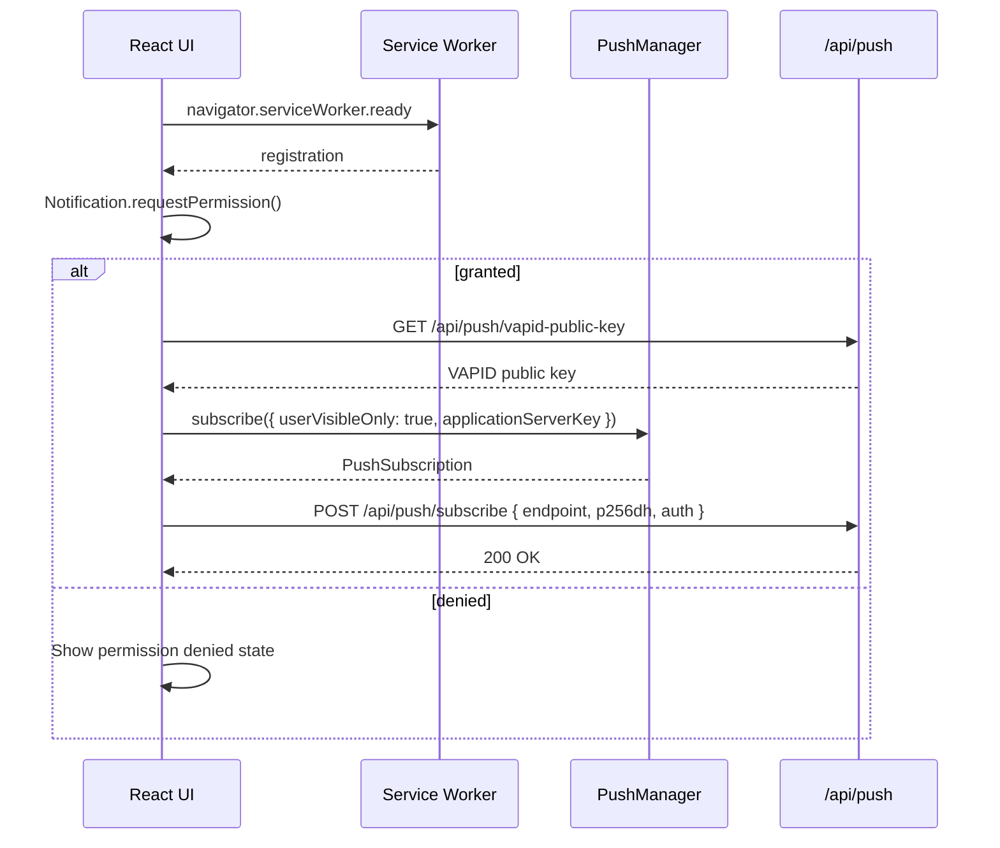

# Periodic Background Sync & Network Resiliency Playbook

_This playbook documents WorkSphere's Periodic Background Sync API implementation, Service Worker storage synchronization, push notification delivery, permission handling flows, fallback strategies for unsupported browsers, and step-by-step test procedures._

---

## 1. Introduction

WorkSphere uses the Periodic Background Sync API to keep workspace seat availability data fresh even when the app isn't actively open. Combined with one-shot Background Sync for offline action replay and Web Push for real-time notifications, this creates a layered network resiliency system that works across modern browsers — with graceful degradation for Safari and older Firefox.

---

## 2. Architecture Overview

```mermaid
graph TD
    subgraph Browser
        UI[React UI] -->|postMessage| SW[Service Worker]
        UI -->|register| PeriodicSync[Periodic Sync API]
        UI -->|register| OneShotSync[One-Shot Sync API]
        SW -->|fetch| API[/api/availability/delta]
        SW -->|IDB read/write| DeltaStore[availabilityDeltas IDB Store]
        SW -->|showNotification| Push[Push Notification]
    end
    subgraph Fallback Layer
        VisibilityChange[visibilitychange event] -->|register sync| OneShotSync
        OnlineEvent[online event] -->|register sync| OneShotSync
        ForegroundFlush[Foreground flush] -->|manual replay| API
    end
    subgraph Server
        API -->|delta diff| Agg[Aggregation]
        Agg -->|VAPID push| SW
    end
```

---

## 3. Sync Strategy Matrix

| Resource           | Primary Strategy                  | Fallback                                       | Browser Support           |
| ------------------ | --------------------------------- | ---------------------------------------------- | ------------------------- |
| Seat availability  | Periodic Background Sync (30 min) | One-shot sync on `visibilitychange` / `online` | Chromium only             |
| CRDT updates       | One-shot Background Sync          | Foreground flush on `online`                   | Chromium + Firefox        |
| Favorites          | One-shot Background Sync          | Web Worker with circuit breaker                | Chromium + Firefox        |
| Ratings            | One-shot Background Sync          | Foreground flush                               | Chromium + Firefox        |
| Conversation edits | One-shot Background Sync          | `flushConversationEditQueue()` on `online`     | All (foreground fallback) |
| Receipt exports    | One-shot Background Sync          | Manual retry in UI                             | Chromium + Firefox        |

---

## 4. Periodic Background Sync Implementation

### 4.1 Client-Side Registration (`usePWA.tsx`)

The `usePeriodicAvailabilitySync` hook attempts to register the Periodic Background Sync API, then falls back to one-shot sync for unsupported browsers.

```typescript
// src/hooks/usePWA.tsx — lines 626-717

const PERIODIC_AVAILABILITY_TAG = "workspace-availability";
const AVAILABILITY_SYNC_TAG = "availability-sync";
const SYNC_INTERVAL_MS = 30 * 60 * 1000; // 30 minutes

export function usePeriodicAvailabilitySync() {
  const { registration } = useServiceWorker();

  useEffect(() => {
    if (!registration) return;

    async function registerPeriodicSync() {
      try {
        const reg = registration as ServiceWorkerRegistration & {
          periodicSync?: {
            register: (
              tag: string,
              options?: { minInterval?: number },
            ) => Promise<void>;
          };
        };

        if (reg.periodicSync) {
          // Check permission before registering
          const status = await navigator.permissions.query({
            name: "periodic-background-sync" as PermissionName,
          });

          if (status.state === "granted") {
            await reg.periodicSync.register(PERIODIC_AVAILABILITY_TAG, {
              minInterval: SYNC_INTERVAL_MS,
            });
            return;
          }
        }
      } catch (error) {
        console.warn("[PWA] Periodic sync failed, falling back:", error);
      }

      // Fallback: one-shot sync on visibility/online events
      registerOneShotFallback();
    }

    registerPeriodicSync();
  }, [registration]);
}
```

### 4.2 Service Worker Event Handler (`sw.js`)

```javascript
// public/sw.js — lines 252-257

const PERIODIC_AVAILABILITY_TAG = "workspace-availability";

self.addEventListener("periodicsync", (event) => {
  if (event.tag === PERIODIC_AVAILABILITY_TAG) {
    event.waitUntil(syncAvailability());
  }
});
```

### 4.3 Availability Sync Logic (`sw.js`)

```javascript
// public/sw.js — lines 557-609

let isSyncingAvailability = false;

async function syncAvailability() {
  if (isSyncingAvailability) return;
  isSyncingAvailability = true;

  try {
    // 1. Fetch latest availability delta from server
    const response = await fetch("/api/availability/delta", {
      credentials: "include",
    });
    if (!response.ok) return;

    const { venues } = await response.json();
    if (!Array.isArray(venues) || venues.length === 0) return;

    // 2. Open IndexedDB and diff against last-known state
    const db = await openIndexedDB();
    const tx = db.transaction("availabilityDeltas", "readwrite");
    const store = tx.objectStore("availabilityDeltas");

    const notifications = [];

    for (const venue of venues) {
      const prev = await new Promise((resolve, reject) => {
        const req = store.get(venue.venueId);
        req.onsuccess = () => resolve(req.result || null);
        req.onerror = () => reject(req.error);
      });

      // 3. Detect if seats opened up (capacity freed)
      const openedUp =
        prev &&
        (venue.count < prev.currentCount ||
          (prev.currentStatus === "red" && venue.status !== "red") ||
          (prev.currentStatus === "yellow" && venue.status === "green"));

      // 4. Update stored state
      store.put({
        venueId: venue.venueId,
        venueName: venue.venueName,
        currentCount: venue.count,
        currentCapacity: venue.capacity,
        currentStatus: venue.status,
        timestamp: Date.now(),
      });

      if (openedUp) {
        notifications.push({
          venueId: venue.venueId,
          venueName: venue.venueName || "Workspace",
          availableSeats: venue.capacity - venue.count,
        });
      }
    }

    // 5. Show notifications for venues with available seats
    for (const n of notifications) {
      await self.registration.showNotification("Seat Available!", {
        body: `${n.availableSeats} seat(s) just opened at ${n.venueName}`,
        icon: "/icons/icon.svg",
        badge: "/icons/icon.svg",
        tag: `venue-availability-${n.venueId}`,
        renotify: true,
        requireInteraction: true,
        vibrate: [200, 100, 200, 100, 200],
        data: { url: `/venues/${n.venueId}` },
        actions: [
          { action: "open", title: "Open" },
          { action: "dismiss", title: "Dismiss" },
        ],
      });
    }
  } catch (error) {
    console.error("[SW] Availability sync failed:", error);
  } finally {
    isSyncingAvailability = false;
  }
}
```

---

## 5. One-Shot Background Sync Fallback

### 5.1 Registration Patterns

For browsers without Periodic Background Sync, WorkSphere registers one-shot sync events triggered by user activity.

**On visibility change:**

```typescript
// src/hooks/usePWA.tsx — lines 674-696

function registerOneShotFallback() {
  if (!("SyncManager" in window)) return;

  const onVisibilityChange = () => {
    if (document.visibilityState === "visible" && navigator.onLine) {
      navigator.serviceWorker.ready.then((readyReg) => {
        const syncReg = readyReg as ServiceWorkerRegistration & {
          sync?: { register: (tag: string) => Promise<void> };
        };
        syncReg.sync?.register(AVAILABILITY_SYNC_TAG);
      });
    }
  };

  const onOnline = () => {
    navigator.serviceWorker.ready.then((readyReg) => {
      const syncReg = readyReg as ServiceWorkerRegistration & {
        sync?: { register: (tag: string) => Promise<void> };
      };
      syncReg.sync?.register(AVAILABILITY_SYNC_TAG);
    });
  };

  document.addEventListener("visibilitychange", onVisibilityChange);
  window.addEventListener("online", onOnline);

  // Trigger immediately if page is visible
  onVisibilityChange();
}
```

**From IndexedDB operations (CRDT sync):**

```typescript
// src/lib/offlineStorage.ts — lines 466-477

request.onsuccess = () => {
  if ("serviceWorker" in navigator && "SyncManager" in window) {
    navigator.serviceWorker.ready.then((swRegistration) => {
      (swRegistration as any).sync.register("sync-crdt").catch((err: any) => {
        console.error("Background Sync registration failed:", err);
      });
    });
  }
  resolve();
};
```

### 5.2 Service Worker Sync Event Map

```javascript
// public/sw.js — lines 229-250

self.addEventListener("sync", (event) => {
  // CRDT real-time state sync
  if (event.tag === "sync-crdt") {
    event.waitUntil(syncCrdt());
  }

  // Legacy favorites queue
  if (event.tag === "sync-favorites") {
    event.waitUntil(syncFavorites());
  }

  // Ratings sync
  if (event.tag === "sync-ratings") {
    event.waitUntil(syncRatings());
  }

  // Conversation rename/delete sync
  if (event.tag === "sync-conversations") {
    event.waitUntil(syncConversations());
  }

  // PDF receipt download sync
  if (event.tag === "receipt-export-sync") {
    event.waitUntil(syncReceiptExports());
  }

  // One-shot availability sync (fallback for periodic)
  if (event.tag === AVAILABILITY_SYNC_TAG) {
    event.waitUntil(syncAvailability());
  }
});
```

---

## 6. Push Notification Flow

### 6.1 Subscription Lifecycle



### 6.2 Client Implementation (`usePushNotifications.ts`)

```typescript
// src/hooks/usePushNotifications.ts

const subscribe = useCallback(async () => {
  // 1. Request notification permission
  const permissionResult = await Notification.requestPermission();
  if (permissionResult !== "granted") return false;

  // 2. Get service worker registration
  const reg = await navigator.serviceWorker.ready;

  // 3. Check for existing subscription
  let subscription = await reg.pushManager.getSubscription();

  // 4. Create new subscription if none exists
  if (!subscription) {
    const keyRes = await fetch("/api/push/vapid-public-key");
    const { publicKey } = await keyRes.json();

    subscription = await reg.pushManager.subscribe({
      userVisibleOnly: true,
      applicationServerKey: urlBase64ToUint8Array(publicKey),
    });
  }

  // 5. Send subscription to server
  const subJson = subscription.toJSON();
  await fetch("/api/push/subscribe", {
    method: "POST",
    headers: { "Content-Type": "application/json" },
    body: JSON.stringify({
      endpoint: subJson.endpoint,
      p256dh: subJson.keys.p256dh,
      auth: subJson.keys.auth,
    }),
  });

  return true;
}, [isSupported, userId, getToken]);
```

### 6.3 Service Worker Push Handler

```javascript
// public/sw.js — lines 768-799

self.addEventListener("push", (event) => {
  if (!event.data) return;

  let data;
  try {
    data = event.data.json();
  } catch {
    data = { title: "WorkSphere", body: event.data.text() };
  }

  const isAvailability = data.tag?.startsWith("venue-availability-");

  event.waitUntil(
    self.registration.showNotification(data.title || "WorkSphere", {
      body: data.body || "New update from WorkSphere",
      icon: data.icon || "/icons/icon.svg",
      badge: data.badge || "/icons/icon.svg",
      vibrate: isAvailability
        ? [200, 100, 200, 100, 200] // Urgent pattern
        : [100, 50, 100], // Standard pattern
      tag: data.tag || "worksphere-notification",
      renotify: true,
      requireInteraction: isAvailability,
      data: { url: data.url || "/" },
      actions: [
        { action: "open", title: "Open" },
        { action: "dismiss", title: "Dismiss" },
      ],
    }),
  );
});
```

### 6.4 Notification Click Handler

```javascript
// public/sw.js — lines 800-827

self.addEventListener("notificationclick", (event) => {
  event.notification.close();

  if (event.action === "dismiss") return;

  const targetUrl = event.notification.data?.url || "/";

  event.waitUntil(
    self.clients
      .matchAll({ type: "window", includeUncontrolled: true })
      .then((clientList) => {
        // Focus existing window if URL matches
        for (const client of clientList) {
          if (client.url.includes(targetUrl) && "focus" in client) {
            client.postMessage({
              type: "NAVIGATE_PUSH",
              url: targetUrl,
            });
            return client.focus();
          }
        }
        // Open new window
        return self.clients.openWindow(targetUrl);
      }),
  );
});
```

---

## 7. Permission Handling Flows

### 7.1 Permission State Machine

```mermaid
stateDiagram-v2
    [*] --> Default : Initial state
    Default --> Granted : User clicks "Allow"
    Default --> Denied : User clicks "Block"
    Granted --> Default : User resets in browser settings
    Denied --> Default : User resets in browser settings

    state Granted {
        [*] --> Subscribed
        Subscribed --> Unsubscribed : User toggles off
        Unsubscribed --> Subscribed : User toggles on
    }
```

### 7.2 Permission Query Code

```typescript
// Check periodic background sync permission (Chromium only)
async function checkPeriodicSyncPermission(): Promise<PermissionState> {
  try {
    const status = await navigator.permissions.query({
      name: "periodic-background-sync" as PermissionName,
    });
    return status.state; // "granted" | "denied" | "prompt"
  } catch {
    return "denied"; // API not supported
  }
}

// Check push notification permission
function checkPushPermission(): NotificationPermission {
  if (!("Notification" in window)) return "denied";
  return Notification.permission; // "granted" | "denied" | "default"
}
```

### 7.3 Browser-Specific Permission Behavior

| Browser          | Periodic Sync Permission         | Push Permission                 | Notes                     |
| ---------------- | -------------------------------- | ------------------------------- | ------------------------- |
| Chrome 102+      | Auto-granted if installed as PWA | Prompt on `requestPermission()` | Requires HTTPS + manifest |
| Edge 102+        | Same as Chrome                   | Same as Chrome                  | Chromium-based            |
| Firefox 114+     | Not supported                    | Prompt on `requestPermission()` | One-shot sync available   |
| Safari 16+       | Not supported                    | Prompt on `requestPermission()` | No Background Sync at all |
| Samsung Internet | Not supported                    | Prompt                          | Use foreground fallback   |

### 7.4 Permission UI Components

```typescript
// Push notification toggle — src/components/PushNotificationToggle.tsx

function PushNotificationToggle() {
  const {
    isSupported,
    isSubscribed,
    permission,
    isLoading,
    subscribe,
    unsubscribe,
  } = usePushNotifications();

  if (!isSupported) return null;

  return (
    <button
      onClick={isSubscribed ? unsubscribe : subscribe}
      disabled={isLoading || permission === "denied"}
      title={
        permission === "denied"
          ? "Notifications blocked. Enable in browser settings."
          : isSubscribed
            ? "Disable notifications"
            : "Enable notifications"
      }
    >
      {isSubscribed ? <BellOff /> : <Bell />}
    </button>
  );
}
```

---

## 8. IndexedDB Schema for Sync State

### 8.1 `availabilityDeltas` Store

```javascript
// public/sw.js — lines 724-730

// Created during onupgradeneeded in openIndexedDB()
if (!db.objectStoreNames.contains("availabilityDeltas")) {
  const deltaStore = db.createObjectStore("availabilityDeltas", {
    keyPath: "venueId",
  });
  deltaStore.createIndex("timestamp", "timestamp", { unique: false });
}
```

**Record shape:**

```typescript
interface AvailabilityDelta {
  venueId: string;
  venueName: string;
  currentCount: number;
  currentCapacity: number;
  currentStatus: "green" | "yellow" | "red";
  timestamp: number; // Date.now()
}
```

### 8.2 `pendingActions` Store

```javascript
// public/sw.js — lines 696-702

if (!db.objectStoreNames.contains("pendingActions")) {
  db.createObjectStore("pendingActions", {
    keyPath: "id",
    autoIncrement: true,
  });
}
```

**Record shape:**

```typescript
interface PendingAction {
  id?: number;
  type:
    | "crdt-sync"
    | "favorite"
    | "unfavorite"
    | "ratings"
    | "rate"
    | "conversation-rename"
    | "conversation-delete";
  data?: unknown;
  venueId?: string;
  method?: string;
  timestamp: number;
}
```

### 8.3 `receiptExports` Store

```javascript
// public/sw.js — lines 716-722

if (!db.objectStoreNames.contains("receiptExports")) {
  const receiptStore = db.createObjectStore("receiptExports", {
    keyPath: "bookingId",
  });
  receiptStore.createIndex("status", "status", { unique: false });
  receiptStore.createIndex("createdAt", "createdAt", { unique: false });
}
```

---

## 9. Fallback Strategy for Unsupported Browsers

### 9.1 Layered Fallback Architecture

```
Layer 1: Periodic Background Sync (Chromium PWA)
    ↓ not supported
Layer 2: One-Shot Background Sync (Chromium + Firefox)
    ↓ not supported
Layer 3: Foreground Sync on visibility/online events
    ↓ not available
Layer 4: Manual sync button in UI
```

### 9.2 Foreground Flush Pattern

For Safari and browsers without Background Sync, WorkSphere replays queued actions when the app regains focus.

```typescript
// src/lib/offlineStorage.ts — conversation edits flush

export async function flushConversationEditQueue(): Promise<void> {
  if (!navigator.onLine) return;

  const db = await initOfflineDB();
  const tx = db.transaction(["pendingActions"], "readwrite");
  const store = tx.objectStore("pendingActions");

  const allActions = await new Promise((resolve, reject) => {
    const req = store.getAll();
    req.onsuccess = () => resolve(req.result);
    req.onerror = () => reject(req.error);
  });

  const conversationActions = allActions.filter(
    (a) => a.type === "conversation-rename" || a.type === "conversation-delete",
  );

  for (const action of conversationActions) {
    try {
      const url = `/api/conversations/${action.conversationId}`;
      await fetch(url, {
        method: action.type === "conversation-delete" ? "DELETE" : "PATCH",
        headers: { "Content-Type": "application/json" },
        body: action.data ? JSON.stringify(action.data) : undefined,
      });

      // Remove from pending queue
      store.delete(action.id);
    } catch {
      // Will retry on next foreground flush
    }
  }
}

// Register foreground flush on online event
if (typeof window !== "undefined") {
  window.addEventListener("online", () => {
    flushConversationEditQueue();
  });
}
```

### 9.3 Web Worker Sync with Circuit Breaker

For favorites sync, a dedicated Web Worker provides resilience beyond Background Sync.

```typescript
// src/workers/sync.worker.ts — circuit breaker pattern

const CB_MAX_FAILURES = 3;
const CB_OPEN_TIMEOUT_MS = 30_000;

type CircuitState = "CLOSED" | "OPEN" | "HALF_OPEN";

let circuitState: CircuitState = "CLOSED";
let failureCount = 0;
let lastFailureTime = 0;

function canAttemptSync(): boolean {
  if (circuitState === "CLOSED") return true;
  if (circuitState === "OPEN") {
    if (Date.now() - lastFailureTime > CB_OPEN_TIMEOUT_MS) {
      circuitState = "HALF_OPEN";
      return true;
    }
    return false;
  }
  return true; // HALF_OPEN: allow one test request
}

function recordSuccess(): void {
  circuitState = "CLOSED";
  failureCount = 0;
}

function recordFailure(): void {
  failureCount++;
  lastFailureTime = Date.now();
  if (failureCount >= CB_MAX_FAILURES) {
    circuitState = "OPEN";
  }
}
```

---

## 10. Cache Storage Strategies

| Cache Name               | Strategy      | Max Size | Eviction                    |
| ------------------------ | ------------- | -------- | --------------------------- |
| `worksphere-v3`          | Network-First | 50 MB    | Replace on update           |
| `worksphere-images-v4`   | Cache-First   | 20 MB    | True LRU via IDB timestamps |
| `worksphere-maptiles-v1` | Cache-First   | 30 MB    | Replace on version bump     |

### 10.1 LRU Image Cache

```javascript
// src/lib/swCacheLru.ts

export const MAX_CACHE_BYTES = 20 * 1024 * 1024; // 20 MB

export function estimateResponseSize(response: Response): number {
  const contentLength = response.headers.get("content-length");
  if (contentLength) return parseInt(contentLength, 10);
  return 50_000; // Default estimate
}

export async function trimCacheToMaxBytes(
  cacheName: string,
  maxBytes: number,
): Promise<void> {
  const cache = await caches.open(cacheName);
  const keys = await cache.keys();

  let totalSize = 0;
  const sizes: { request: Request; size: number }[] = [];

  for (const request of keys) {
    const response = await cache.match(request);
    if (response) {
      const size = estimateResponseSize(response);
      totalSize += size;
      sizes.push({ request, size });
    }
  }

  // Remove oldest entries until under limit
  sizes.sort((a, b) => a.size - b.size);
  while (totalSize > maxBytes && sizes.length > 0) {
    const oldest = sizes.shift()!;
    await cache.delete(oldest.request);
    totalSize -= oldest.size;
  }
}
```

---

## 11. Test Procedures

### 11.1 Periodic Background Sync Testing

**Prerequisites:** Chrome 102+, HTTPS localhost or deployed site, PWA installed.

1. **Verify registration:**

   ```
   DevTools → Application → Service Workers → Periodic Background Sync
   ```

   Confirm `workspace-availability` appears with `minInterval: 1800000`.

2. **Force trigger (DevTools):**

   ```
   DevTools → Application → Service Workers → "Periodic Sync" button
   ```

3. **Verify sync execution:**

   ```
   DevTools → Console → filter "[SW]"
   ```

   Look for `syncAvailability()` log output.

4. **Verify IndexedDB update:**

   ```
   DevTools → Application → IndexedDB → worksphere-offline → availabilityDeltas
   ```

   Confirm records have recent timestamps.

5. **Verify notification:**
   Check that "Seat Available!" notification appears when a venue's status changes.

### 11.2 One-Shot Background Sync Testing

1. **Simulate offline:**

   ```
   DevTools → Network → Throttle → Offline
   ```

2. **Perform action (e.g., favorite a venue):**
   Action should queue to IndexedDB `pendingActions`.

3. **Go back online:**

   ```
   DevTools → Network → No throttling
   ```

4. **Verify sync fires:**

   ```
   DevTools → Console → filter "Background Sync registration"
   ```

5. **Verify action replayed:**
   Check server logs for the API call.

### 11.3 Push Notification Testing

1. **Subscribe to push:**

   ```
   DevTools → Application → Service Workers → Push
   → Enter payload: {"title":"Test","body":"Hello","tag":"test"}
   → Click "Push"
   ```

2. **Verify notification appears:**
   System notification should display with correct title, body, and actions.

3. **Verify click handling:**
   Click "Open" → app should focus/open to correct URL.

4. **Test VAPID key exchange:**
   ```
   DevTools → Network → filter "/api/push/vapid-public-key"
   → Verify 200 response with public key
   ```

### 11.4 Offline Fallback Testing

1. **Go fully offline** (Airplane mode or DevTools offline).

2. **Navigate to any page:**
   Should see the precached `/offline` page with retry button.

3. **Click "Retry":**
   Should attempt `HEAD /api/location` and show connection status.

4. **Verify cached content:**
   Previously visited venue pages should load from cache.

### 11.5 Permission Flow Testing

1. **Reset permissions:**

   ```
   DevTools → Application → Permissions → Reset all permissions
   ```

2. **Test denied flow:**
   Click notification toggle → should show "blocked" state with instructions.

3. **Test granted flow:**
   Click notification toggle → should subscribe and show enabled state.

4. **Test iOS Safari flow:**
   Should show `IOSInstallOverlay` with manual home screen instructions.

### 11.6 Cross-Browser Testing Matrix

| Feature             | Chrome | Firefox | Safari     | Edge | Samsung |
| ------------------- | ------ | ------- | ---------- | ---- | ------- |
| Periodic Sync       | ✅     | ❌      | ❌         | ✅   | ❌      |
| One-Shot Sync       | ✅     | ✅      | ❌         | ✅   | ❌      |
| Push Notifications  | ✅     | ✅      | ✅ (16.4+) | ✅   | ✅      |
| Cache API           | ✅     | ✅      | ✅         | ✅   | ✅      |
| IndexedDB           | ✅     | ✅      | ✅         | ✅   | ✅      |
| Foreground Fallback | ✅     | ✅      | ✅         | ✅   | ✅      |

---

## 12. Debugging Checklist

| Symptom                           | Check                                                                |
| --------------------------------- | -------------------------------------------------------------------- |
| Periodic sync not registering     | Is PWA installed? Check `periodic-background-sync` permission state  |
| Sync event not firing             | Verify service worker is active; check `sync` tag matches            |
| Push notification not showing     | Verify `Notification.permission === "granted"`; check `push` handler |
| Offline actions not syncing       | Check `pendingActions` IDB store; verify `SyncManager` support       |
| Duplicate syncs                   | Check `isSyncing*` guard flags in `sw.js`                            |
| Stale availability data           | Verify `availabilityDeltas` store timestamps; check `minInterval`    |
| Notification click not navigating | Verify `notificationclick` handler; check `NAVIGATE_PUSH` message    |

---

## 13. Related Documentation

- [PWA Service Worker Guide](./PWA_SERVICE_WORKER_GUIDE.md)
- [Service Worker Push Specification](./SERVICE_WORKER_PUSH_SPECIFICATION.md)
- [Background Sync Debug](./BACKGROUND_SYNC_DEBUG.md)
- [PWA Sync Debug](./PWA_SYNC_DEBUG.md)
- [PWA Push Debug](./PWA_PUSH_DEBUG.md)
- [PWA Testing Guidelines](./PWA_TESTING_GUIDELINES.md)
- [Web Workers Sync Infrastructure](./WEB_WORKERS_SYNC_INFRASTRUCTURE.md)
- [CRDT Realtime Sync Protocol](./CRDT_REALTIME_SYNC_PROTOCOL.md)
