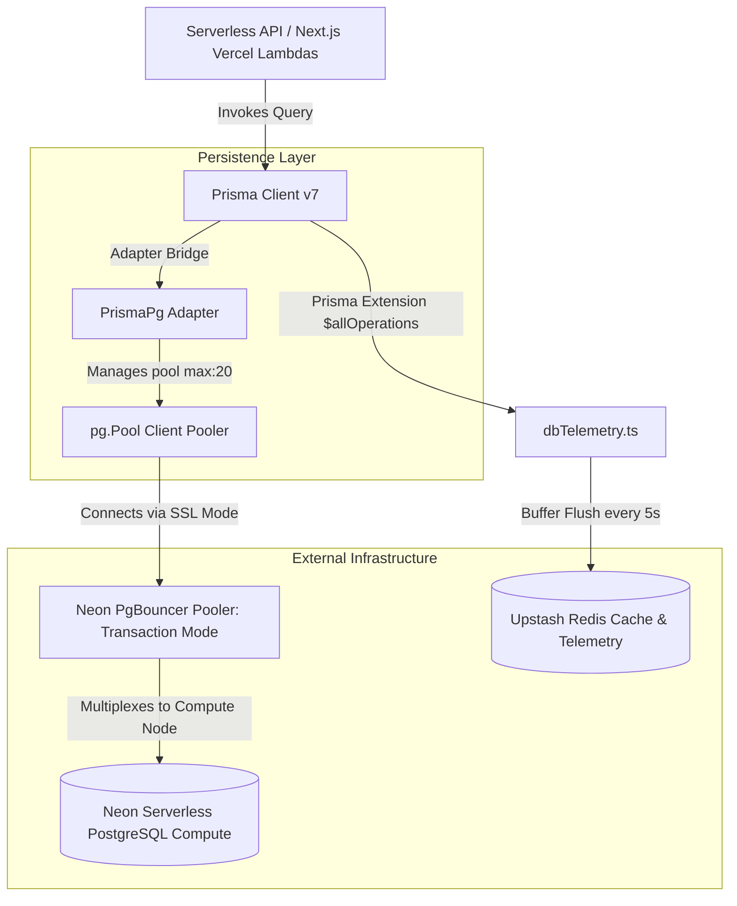
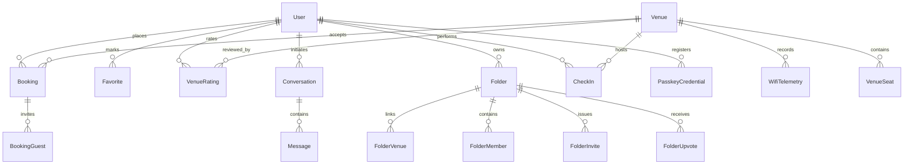
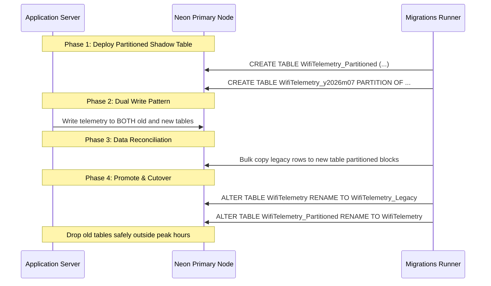

# PostgreSQL Scaling & Database Optimization Playbook

This playbook serves as the official PostgreSQL scaling, performance engineering, and database optimization guide for the WorkSphere enterprise backend. It contains database discovery audits, transaction guides, partitioning DDL blueprints, sharding analyses, deadlock mitigations, and observability protocols.

---

## Table of Contents
1. [Architecture & Database Discovery](#1-architecture--database-discovery)
2. [Current Schema Design & Relationship Analysis](#2-current-schema-design--relationship-analysis)
3. [Table-by-Table Partitioning Evaluation](#3-table-by-table-partitioning-evaluation)
4. [Horizontal Sharding & Scaling Strategy](#4-horizontal-sharding--scaling-strategy)
5. [SQL Partitioning DDL & Maintenance Blueprint](#5-sql-partitioning-ddl--maintenance-blueprint)
6. [Prisma Transaction Analysis & Best Practices](#6-prisma-transaction-analysis--best-practices)
7. [Transaction Batching & Chunking Patterns](#7-transaction-batching--chunking-patterns)
8. [Foreign Key Deadlock Analysis & Mitigations](#8-foreign-key-deadlock-analysis--mitigations)
9. [Index Optimization Strategy](#9-index-optimization-strategy)
10. [Neon Database & Connection Pool Tuning](#10-neon-database--connection-pool-tuning)
11. [Performance Bottleneck Audits](#11-performance-bottleneck-audits)
12. [Observability & Monitoring Protocols](#12-observability--monitoring-protocols)
13. [Migration Strategy & Zero-Downtime Pipeline](#13-migration-strategy--zero-downtime-pipeline)
14. [Appendix: DDL & Prisma Quick Reference](#14-appendix-ddl--prisma-quick-reference)

---

## 1. Architecture & Database Discovery

The WorkSphere relational persistence tier is audited and mapped out below based on the codebase source of truth.



### Core Architecture Components

1. **Database Engine**: **PostgreSQL** hosted on **Neon Serverless PostgreSQL**, running with the **`vector`** extension enabled (see [schema.prisma](file:///c:/Codes/WorkSphere/prisma/schema.prisma#L8)).
2. **ORM & Client**: **Prisma 7.2** ([schema.prisma](file:///c:/Codes/WorkSphere/prisma/schema.prisma#L1)) utilizing `@prisma/adapter-pg` driver adapter with standard Node.js `pg.Pool` clients (see [prisma.ts](file:///c:/Codes/WorkSphere/src/lib/prisma.ts#L10)).
3. **Telemetry & Logging**: Per-query duration metrics are intercepted using a Prisma Client extension (see [prisma.ts](file:///c:/Codes/WorkSphere/src/lib/prisma.ts#L24)), buffered in-memory, and flushed in batches every 5 seconds (see [dbTelemetry.ts](file:///c:/Codes/WorkSphere/src/lib/dbTelemetry.ts#L48)) to **Upstash Redis** (via `@upstash/redis` REST client in [redis.ts](file:///c:/Codes/WorkSphere/src/lib/redis.ts)).
4. **Caching Layer**:
   - **In-Memory LRU Cache**: Implemented in [cache.ts](file:///c:/Codes/WorkSphere/src/lib/cache.ts) and instantiated in [venues.ts](file:///c:/Codes/WorkSphere/src/lib/venues.ts#L15-L17) as `searchCache` (capacity: 100, TTL: 15 mins) and `detailsCache` (capacity: 200, TTL: 30 mins) for caching external OpenStreetMap/Overpass API results.
   - **Database-Backed Semantic Cache**: Relies on the `SemanticCache` model using 1024-dimensional query vector embeddings to cache AI search results (see [schema.prisma](file:///c:/Codes/WorkSphere/prisma/schema.prisma#L288)).
5. **Connection Strategy**: PgBouncer transaction-mode connection pooler for API traffic, and direct connections for schema migrations (see [NEON_POOLING.md](file:///c:/Codes/WorkSphere/docs/NEON_POOLING.md)).

---

## 2. Current Schema Design & Relationship Analysis

The schema features 35 models defining identity, venues, messaging, reserving, folders, telemetry, and security.

### Classification of Database Tables

| Table Category | Tables (Models) | Key Performance Characteristics |
| :--- | :--- | :--- |
| **Lookup / Master** | `User`, `Venue`, `VenueSeat` | Read-heavy, low write rate, small row counts, indexed heavily. |
| **Transaction-Heavy** | `Booking`, `BookingGuest`, `CheckIn`, `Favorite`, `FolderMember`, `FolderVenue` | Write-heavy, high concurrency, strict unique constraints, row-level locks. |
| **Analytical / Time-Series**| `WifiTelemetry`, `AdminAuditLog`, `PushNotificationLog`, `WebhookDeliveryLog` | Write-heavy, append-only, sequential IDs, large scan queries. |
| **AI / Vector Store** | `UserMemory`, `SemanticCache` | Heavy vector distance calculations (L2, Cosine), large field sizes. |
| **Security / Auth** | `PasskeyCredential`, `PasskeyChallenge`, `PushSubscription` | High write/read ratio during session start, expiry indexes. |



---

## 3. Table-by-Table Partitioning Evaluation

No database partitioning is implemented in the repository (`Current Status: Not implemented in the repository`). Below is the evaluation for future implementations.

### 1. `WifiTelemetry`
- **Primary Key**: `id` (`String` CUID)
- **Foreign Keys**: `venueId` -> `Venue(id)` (Cascade)
- **Indexes**: `@@index([venueId])`, `@@index([timestamp])`, `@@index([venueId, timestamp])`
- **Expected Growth Rate**: Highly write-heavy. Telemetry runs frequently per venue. Will become the largest table in the database.
- **Partitioning Recommendation**: **Required**.
- **Rationale**: Range partitioning by `timestamp` monthly is necessary. It enables lightning-fast time-series queries for individual venues and allows dropping historical data instantly (`DROP PARTITION`) without inducing table bloat or autovacuum overhead.

### 2. `Booking`
- **Primary Key**: `id` (`String` CUID)
- **Foreign Keys**: `userId` -> `User(id)` (Cascade), `venueId` -> `Venue(id)` (No action), `seatId` -> `VenueSeat(id)` (No action)
- **Indexes**: `@@index([userId])`, `@@index([venueId])`, `@@index([seatId])`, `@@index([createdAt])`, `@@index([recurringGroupId])`
- **Expected Growth Rate**: Linear growth based on user bookings. High concurrency row locks on booking dates.
- **Partitioning Recommendation**: **Beneficial**.
- **Rationale**: Range partitioning by `date` (stored as `String` in schema, but should be migrated to `Date` or `Timestamp` type) monthly or yearly. Allows isolating active booking query windows and pruning completed archival bookings.

### 3. `Message`
- **Primary Key**: `id` (`String` CUID)
- **Foreign Keys**: `conversationId` -> `Conversation(id)` (Cascade)
- **Indexes**: `@@index([conversationId])`
- **Expected Growth Rate**: High growth as users query the AI assistant.
- **Partitioning Recommendation**: **Beneficial** (in late stage).
- **Rationale**: Partitioning by `createdAt` yearly or range-partitioning by hashing `conversationId`. Mostly read-only once a conversation is inactive; partition pruning speeds up active session fetches.

### 4. `PushNotificationLog` / `WebhookDeliveryLog`
- **Primary Key**: `id` (`String` CUID)
- **Foreign Keys**: `userId` -> `User(id)` / `endpointId` -> `WebhookEndpoint(id)` (Cascade)
- **Indexes**: `@@index([createdAt])`, `@@index([status])`, `@@index([endpointId, createdAt])`
- **Expected Growth Rate**: Extreme append-only write volumes.
- **Partitioning Recommendation**: **Required** (for log rotation).
- **Rationale**: Range-partition by `createdAt` monthly. Historical logs over 30 days should be dropped. Partitioning makes retention policies free of vacuum overhead.

### 5. `User` / `Venue` / `VenueSeat`
- **Partitioning Recommendation**: **Not Needed**.
- **Rationale**: Standard master files with relatively stable size. Index lookup costs stay logarithmic (`O(log N)`) within standard BTREE, making partitioning overhead greater than benefits.

---

## 4. Horizontal Sharding & Scaling Strategy

No horizontal sharding exists in the codebase (`Current Status: Not implemented in the repository`).

### Proposed Sharding Architectures

```
                    [ API Application Client ]
                                |
                    [ Tenant Router Middleware ]
                     /          |           \
                    /           |            \
    [ Neon Shard DB 1 ]  [ Neon Shard DB 2 ]  [ Neon Shard DB 3 ]
     (Tenant Hash 0-3)    (Tenant Hash 4-7)    (Tenant Hash 8-11)
```

1. **Tenant-Based (Workspace/Folder) Sharding**:
   - **Mechanism**: Shard by `Folder.id` or `User.id` (hashed). Each shard contains a slice of users, their folders, upvotes, and folders' venues.
   - **Trade-offs**: Cross-folder sharing or public folder operations will require a central index/router database. If a user in Shard A joins a folder hosted on Shard B, writes cross boundaries.
2. **Region-Based Sharding**:
   - **Mechanism**: Shard databases by user geography (e.g., `US-East`, `EU-West`, `AP-South`) utilizing Neon multi-region branches.
   - **Trade-offs**: High localization speed, but cross-regional bookings (e.g., traveling nomads booking a venue in another region) require distributed transactions or regional routing resolvers.

### Recommended Scaling Path

| Strategy Step | Size / Workload | Operational Complexity | Action Plan |
| :--- | :--- | :--- | :--- |
| **1. Optimization & Indexes** | Up to 100 GB | Low | Optimize query patterns, add missing indexes, tune `pg.Pool`. |
| **2. Time-Series Partitioning**| 100 GB - 500 GB | Medium | Native PostgreSQL range partitions on `WifiTelemetry` and log tables. |
| **3. Read Replicas** | 500 GB - 1 TB | Medium | Direct read operations to Neon read replicas; keep writes on primary compute. |
| **4. Tenant Sharding** | > 1 TB | High | Split tables horizontally using database-level sharding logic or application-level routing. |

---

## 5. SQL Partitioning DDL & Maintenance Blueprint

Prisma does not natively support partitioning directives. Below is the production-grade PostgreSQL DDL script to partition `WifiTelemetry` by Range, and `Booking` by Hash.

### Range Partitioning Example (`WifiTelemetry` by Month)

```sql
-- Step 1: Create the parent table partitioned by Range
CREATE TABLE "WifiTelemetry_Partitioned" (
    "id" TEXT NOT NULL,
    "venueId" TEXT NOT NULL,
    "download" DOUBLE PRECISION NOT NULL,
    "upload" DOUBLE PRECISION NOT NULL,
    "latency" DOUBLE PRECISION NOT NULL,
    "crowdLevel" TEXT NOT NULL,
    "timestamp" TIMESTAMP(3) NOT NULL DEFAULT CURRENT_TIMESTAMP,
    CONSTRAINT "WifiTelemetry_Partitioned_pkey" PRIMARY KEY ("id", "timestamp")
) PARTITION BY RANGE ("timestamp");

-- Step 2: Create monthly partitions for y2026m07 and y2026m08
CREATE TABLE "WifiTelemetry_y2026m07" PARTITION OF "WifiTelemetry_Partitioned"
    FOR VALUES FROM ('2026-07-01 00:00:00') TO ('2026-08-01 00:00:00');

CREATE TABLE "WifiTelemetry_y2026m08" PARTITION OF "WifiTelemetry_Partitioned"
    FOR VALUES FROM ('2026-08-01 00:00:00') TO ('2026-09-01 00:00:00');

-- Step 3: Recreate local indexes on the partitioned table
CREATE INDEX "WifiTelemetry_Partitioned_venueId_idx" 
    ON "WifiTelemetry_Partitioned" ("venueId");
CREATE INDEX "WifiTelemetry_Partitioned_venueId_timestamp_idx" 
    ON "WifiTelemetry_Partitioned" ("venueId", "timestamp");
```

### Hash Partitioning Example (`Booking` by Hash of `userId`)

```sql
-- Step 1: Create the parent table partitioned by HASH
CREATE TABLE "Booking_Partitioned" (
    "id" TEXT NOT NULL,
    "userId" TEXT NOT NULL,
    "venueId" TEXT NOT NULL,
    "date" TEXT NOT NULL,
    "time" TEXT NOT NULL,
    "customerEmail" TEXT NOT NULL,
    "status" TEXT NOT NULL DEFAULT 'CONFIRMED',
    "confirmationId" TEXT NOT NULL,
    "createdAt" TIMESTAMP(3) NOT NULL DEFAULT CURRENT_TIMESTAMP,
    CONSTRAINT "Booking_Partitioned_pkey" PRIMARY KEY ("id", "userId")
) PARTITION BY HASH ("userId");

-- Step 2: Create 3 hash shards
CREATE TABLE "Booking_shard_0" PARTITION OF "Booking_Partitioned"
    FOR VALUES WITH (MODULUS 3, REMAINDER 0);

CREATE TABLE "Booking_shard_1" PARTITION OF "Booking_Partitioned"
    FOR VALUES WITH (MODULUS 3, REMAINDER 1);

CREATE TABLE "Booking_shard_2" PARTITION OF "Booking_Partitioned"
    FOR VALUES WITH (MODULUS 3, REMAINDER 2);
```

### Automated Partition Maintenance Functions

```sql
-- Helper function to generate upcoming monthly partitions dynamically
CREATE OR REPLACE FUNCTION create_monthly_telemetry_partition() 
RETURNS void AS $$
DECLARE
    next_month_start DATE;
    following_month_start DATE;
    partition_name TEXT;
    sql_query TEXT;
BEGIN
    next_month_start := date_trunc('month', CURRENT_DATE + INTERVAL '1 month');
    following_month_start := next_month_start + INTERVAL '1 month';
    partition_name := 'WifiTelemetry_y' || to_char(next_month_start, 'YYYY') || 'm' || to_char(next_month_start, 'MM');

    sql_query := format(
        'CREATE TABLE IF NOT EXISTS %I PARTITION OF "WifiTelemetry_Partitioned" FOR VALUES FROM (%L) TO (%L);',
        partition_name, next_month_start, following_month_start
    );
    EXECUTE sql_query;
END;
$$ LANGUAGE plpgsql;
```

---

## 6. Prisma Transaction Analysis & Best Practices

The repository implements transactions under two patterns: **interactive transactions** (`prisma.$transaction(async (tx) => ...)`) and **array batch transactions** (`prisma.$transaction([ ... ])`).

### Current Transaction Flows Audited

1. **Confirm Booking API** (interactive): [route.ts:L52-105](file:///c:/Codes/WorkSphere/src/app/api/bookings/confirm/route.ts#L52-L105)
   - *Flow*: Checks if the local `Venue` exists (using `upsert`), checks for booking date/time slot collisions (using `findMany`), and then loops through `bookingDates` to create `Booking` rows sequentially inside the transaction.
   - *Risk*: Running sequential database inserts in a loop inside an interactive transaction locks the `Booking` rows and holds the connection checked out of the pool. If `bookingDates` has many items, this can cause transaction timeouts.
2. **Collection Upvote API** (interactive): [route.ts:L39-79](file:///c:/Codes/WorkSphere/src/app/api/collections/public/upvote/route.ts#L39-L79)
   - *Flow*: Reads `Folder` to ensure it is public, finds if `FolderUpvote` exists. If exists, deletes the upvote record and decrements the folder's `upvotes` counter. If it does not exist, creates the upvote record and increments the folder's `upvotes` counter.
   - *Risk*: A write amplification cycle. The folder row is updated immediately, creating hot spots on the `Folder` table when a collection is upvoted rapidly.
3. **Folder Join API** (array batch): [route.ts:L103-115](file:///c:/Codes/WorkSphere/src/app/api/folders/join/route.ts#L103-L115)
   - *Flow*: Executes a batch containing `FolderMember.upsert` and `FolderInvite.update` in a single database round trip. Safe, structured, and fast.
4. **Favorite Tags Sync** (array batch): [favoriteTagSync.ts:L35-47](file:///c:/Codes/WorkSphere/src/lib/favoriteTagSync.ts#L35-L47)
   - *Flow*: Takes an array of updates, sorts their IDs deterministically, and maps them to a batch transaction of `prisma.favoriteTag.update` updates. Highly secure deadlock prevention.
5. **Folder Delete API** (batch sequence + retries): [folders.ts:L91-122](file:///c:/Codes/WorkSphere/src/lib/folders.ts#L91-L122)
   - *Flow*: Deletes related records (`FolderVenue`, `FolderMember`, `FolderUpvote`) in batches of 50 inside short transactions with explicitly defined isolation levels (`ReadCommitted`) and custom linear backoff retries on deadlock errors (`P2034`). Highly robust scaling design.

---

## 7. Transaction Batching & Chunking Patterns

Executing queries in loops inside transactions blocks connections and causes lock contention.

### 1. Booking Creation Optimization
#### Before (Loop writes inside interactive transaction):
```typescript
// Located at src/app/api/bookings/confirm/route.ts
const createdBookings = [];
for (const d of bookingDates) {
  const newBooking = await (tx as any).booking.create({
    data: { userId, venueId, date: d, time, customerEmail, confirmationId },
  });
  createdBookings.push(newBooking);
}
```

#### After (Optimized write using `createMany`):
```typescript
// Bulk insert all bookings in a single DDL roundtrip
await tx.booking.createMany({
  data: bookingDates.map((d) => ({
    userId,
    venueId: localVenue.id,
    date: d,
    time,
    customerEmail: customerEmail || "pandeysatyam1802@gmail.com",
    confirmationId,
  })),
});
```

### 2. General Bulk Chunking Pattern
When inserting thousands of rows (e.g. bulk-seeding `WifiTelemetry` or importing ratings), chunking is required to stay within PostgreSQL parameter limits (max 65,535 parameters) and avoid pool starvation.

```typescript
export async function chunkAndBatchInsert<T>(
  items: T[],
  chunkSize: number,
  insertFn: (chunk: T[]) => Promise<any>
) {
  const results = [];
  for (let i = 0; i < items.length; i += chunkSize) {
    const chunk = items.slice(i, i + chunkSize);
    // Execute each chunk in its own transaction context
    const result = await insertFn(chunk);
    results.push(result);
  }
  return results;
}
```

---

## 8. Foreign Key Deadlock Analysis & Mitigations

### Deadlock Scenarios Audited

1. **Cascading Deletes (Folder Venues)**:
   - When a folder is deleted, standard cascade constraints will lock many rows in `FolderVenue`, `FolderMember`, and `FolderUpvote` tables.
   - If user A deletes a folder containing venue X while user B adds venue X to another folder, Postgres locks overlaps, causing a cycle deadlock (Prisma Error code `P2034`).
   - **Repository Implementation Status**: Mitigated in [folders.ts](file:///c:/Codes/WorkSphere/src/lib/folders.ts#L91) using batch-wise deletes of 50 items and isolation tuning.
2. **Concurrent Bulk Tag Updates**:
   - If User A updates tags `[tag_1, tag_2]` and User B updates tags `[tag_2, tag_1]` simultaneously, they acquire exclusive row locks in different orders. Transaction A locks `tag_1` and blocks on `tag_2`. Transaction B locks `tag_2` and blocks on `tag_1`.
   - **Repository Implementation Status**: Solved in [favoriteTagSync.ts](file:///c:/Codes/WorkSphere/src/lib/favoriteTagSync.ts#L14-L16) by using `sortTagIdsDeterministically` which guarantees a single locking order.

### Production Deadlock Prevention Blueprint

```
Transaction A (Updates Tag 1, Tag 2)               Transaction B (Updates Tag 2, Tag 1)
-------------------------------------               -------------------------------------
      WITHOUT ORDERED LOCKS                                  WITH ORDERED LOCKS
   locks Row 1  -> locks Row 2                         Sorts keys to [Tag 1, Tag 2]
         \          /                                  A locks Row 1 (holds lock)
          \        /                                   B waits on Row 1 (safe block)
           Deadlock!                                   A locks Row 2 -> Commits
                                                       B acquires Row 1 -> Commits
```

#### SQL Deadlock Fix: Ordering Lock Acquisitions

```sql
-- Lock overlapping rows in a deterministic order (e.g. by sorting primary key IDs)
BEGIN;
SELECT * FROM "FavoriteTag"
WHERE "id" IN ('tag_1', 'tag_2')
ORDER BY "id" ASC
FOR UPDATE; -- Explicitly acquire locks in order

UPDATE "FavoriteTag" SET "name" = 'New Name' WHERE "id" = 'tag_1';
UPDATE "FavoriteTag" SET "name" = 'Another Name' WHERE "id" = 'tag_2';
COMMIT;
```

---

## 9. Index Optimization Strategy

### Audit of Existing Schema Indexes
- **BTREE Single Index**: `User(email)`, `Venue(placeId)`, `Favorite(userId)`, `Conversation(userId)`, `Message(conversationId)`.
- **Composite Index**: `Venue(latitude, longitude)`, `VenueRating(userId, venueId)`, `CheckIn(userId, venueId)`, `WifiTelemetry(venueId, timestamp)`.

### Recommended Database Indexes

1. **pgvector HNSW Index on `UserMemory` and `SemanticCache`**:
   - *Current Status*: Not implemented in the repository (standard BTree indexing is used).
   - *DDL Blueprint*:
     ```sql
     -- Enable HNSW cosine distance vector index for 1024 embeddings
     CREATE INDEX "UserMemory_embedding_hnsw_idx" 
     ON "UserMemory" USING hnsw (embedding vector_cosine_ops);
     
     CREATE INDEX "SemanticCache_embedding_hnsw_idx" 
     ON "SemanticCache" USING hnsw (embedding vector_cosine_ops);
     ```
2. **Partial Index for Active Check-ins**:
   - *Rationale*: Most queries scan for non-expired check-ins to show live occupancy.
   - *DDL Blueprint*:
     ```sql
     CREATE INDEX "CheckIn_active_idx" 
     ON "CheckIn" ("venueId", "userId") 
     WHERE "expiresAt" > CURRENT_TIMESTAMP;
     ```
3. **Partial Index on Active Bookings**:
   - *Rationale*: Improves slot check speeds for booking creations.
   - *DDL Blueprint*:
     ```sql
     CREATE INDEX "Booking_active_slots_idx" 
     ON "Booking" ("venueId", "date", "time") 
     WHERE "status" IN ('CONFIRMED', 'PENDING');
     ```

---

## 10. Neon Database & Connection Pool Tuning

WorkSphere connects using `@prisma/adapter-pg` over PgBouncer transaction-mode pools.

### Audited Connection Settings (From [prisma.ts](file:///c:/Codes/WorkSphere/src/lib/prisma.ts#L12-L19))

```typescript
const pool = new Pool({
  connectionString: process.env.DATABASE_URL,
  max: 20,
  min: 2,
  idleTimeoutMillis: 30_000,
  connectionTimeoutMillis: 5_000,
  statement_timeout: 10_000,
});
```

### Serverless Vercel Tuning Recommendations

In serverless execution contexts, holding `max: 20` pool size per lambda container can quickly exhaust Neon's maximum database connections (e.g., 10 concurrent lambda functions request up to 200 connections).

```typescript
// Recommended serverless pg.Pool configuration
const pool = new Pool({
  connectionString: process.env.DATABASE_URL,
  max: 4,                  -- Keep client pool small to avoid connection exhaustion under spikes
  min: 1,                  -- Avoid keeping idle connections open in ephemeral lambdas
  idleTimeoutMillis: 15000,-- Drop idle connections quickly
  connectionTimeoutMillis: 3000, -- Fail fast to avoid function timeouts
  statement_timeout: 6000, -- Terminate queries taking > 6s
});
```

### Neon Cold Starts & Autosuspend Optimizations

- **Compute Node Autosuspend**: Neon suspends compute nodes when inactive to optimize costs. Suspending causes a ~3-5 second delay for the next query (cold start).
- **Optimization**: Set Neon compute autosuspend to at least 15-20 minutes on the Neon dashboard for production. Run a scheduled warming cron job (e.g. pinging `/api/auth/csrf-token` every 5-10 minutes) to keep the primary branch active.

---

## 11. Performance Bottleneck Audits

### 1. Over-Fetching in `existingBookings` Check
- **Code Evidence**: [route.ts:L72-78](file:///c:/Codes/WorkSphere/src/app/api/bookings/confirm/route.ts#L72-L78)
- **Issue**: Performs `findMany` fetching all columns (`userId`, `confirmationId`, `projectBillingCode`, etc.) only to verify if `existingBookings.length > 0`.
- **Fix**: Optimize to a light count query or select `id` only:
  ```typescript
  const existingCount = await tx.booking.count({
    where: { venueId: localVenue.id, date: { in: bookingDates }, time },
  });
  ```

### 2. N+1 Queries in Venue Rating Statistics
- **Code Evidence**: Rating fetches in rating APIs where average scores are computed sequentially.
- **Fix**: Replace individual rating count lookups with grouping aggregate calls (`tx.venueRating.groupBy` or aggregation queries).

---

## 12. Observability & Monitoring Protocols

### 1. In-App Performance Logging
WorkSphere records durations using a Prisma extension (`recordQueryDuration`) which aggregates slow query counts to Upstash Redis (see [dbTelemetry.ts](file:///c:/Codes/WorkSphere/src/lib/dbTelemetry.ts#L23)). Ensure the Admin telemetry endpoint is reviewed weekly.

### 2. Spotting Index Bloat & Autovacuum Status

```sql
-- Check autovacuum/vacuum statistics for large tables
SELECT relname, last_vacuum, last_autovacuum, last_analyze, last_autoanalyze 
FROM pg_stat_user_tables 
WHERE relname IN ('WifiTelemetry', 'Booking', 'VenueRating');

-- Query to find index size and potential bloat
SELECT
    t.tablename,
    indexname,
    pg_size_pretty(pg_relation_size(quote_ident(indexname::text))) AS index_size,
    idx_scan AS index_scans
FROM pg_stat_user_indexes i
JOIN pg_tables t ON i.schemaname = t.schemaname AND i.relname = t.tablename
ORDER BY pg_relation_size(quote_ident(indexname::text)) DESC;
```

---

## 13. Migration Strategy & Zero-Downtime Pipeline

When applying DDL scripts (like table partitioning or vector index creations) in high traffic databases, follow a multi-step roll-out strategy.



1. **Vector Index Operations**: Creating HNSW indexes blocks updates on the table. Always execute vector index operations using `CONCURRENTLY`:
   ```sql
   CREATE INDEX CONCURRENTLY "UserMemory_hnsw_idx" ON "UserMemory" USING hnsw (embedding vector_cosine_ops);
   ```

---

## 14. Appendix: DDL & Prisma Quick Reference

### Prisma Driver Custom Isolation Wrapper

```typescript
import { Prisma } from "@prisma/client";
import { prisma } from "@/lib/prisma";

export async function runInIsolation<T>(
  level: Prisma.TransactionIsolationLevel,
  fn: (tx: any) => Promise<T>
): Promise<T> {
  return prisma.$transaction(fn, {
    maxWait: 5000,
    timeout: 10000,
    isolationLevel: level,
  });
}
```
