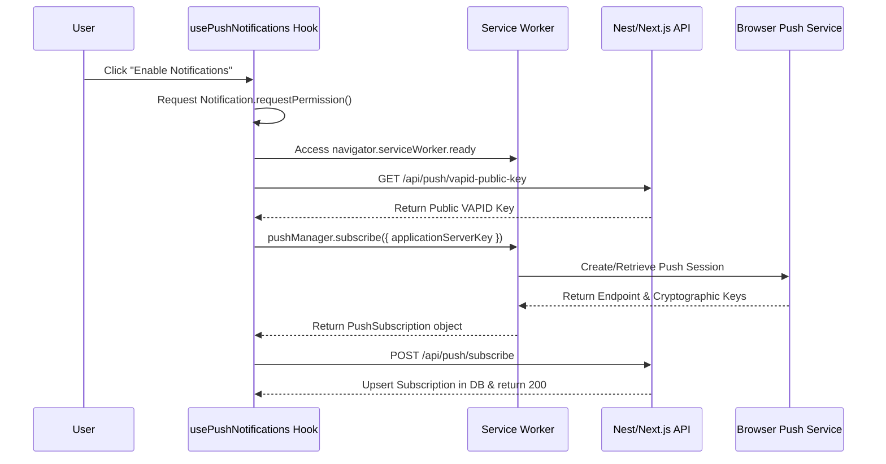

# WorkSphere Push Notifications Developer Guide

This guide details how Web Push notifications are configured, registered, stored, sent, and rotated in the WorkSphere application, along with client-side registration details and OS-specific troubleshooting.

---

## 1. Web Push API Configuration & Architecture

WorkSphere uses the Web Push standard to deliver server-to-client notifications asynchronously. The push system relies on **VAPID (Voluntary Application Server Identification)** keys to identify the application server to the browser's push service (e.g. Mozilla Push Service for Firefox, Google FCM for Chrome, Apple Push Notification service for Safari).

### Environment Configuration

The following variables must be configured in your application environment:

```bash
# Public VAPID Key (exposed to the browser client)
NEXT_PUBLIC_VAPID_PUBLIC_KEY=your_public_vapid_key_base64

# Private VAPID Key (kept secure on the server)
VAPID_PRIVATE_KEY=your_private_vapid_key_base64

# VAPID Subject (contact info URL or mailto link)
VAPID_SUBJECT=mailto:admin@worksphere.app
```

---

## 2. VAPID Keypair Generation & Rotation

### Generation using `web-push` CLI

You can generate a fresh VAPID keypair at any time using the `web-push` CLI directly:

```bash
npx web-push generate-vapid-keys
```

This will print the generated public and private keys in base64 format:

```text
========================================
Public Key:
BO3...[base64-string]...
Private Key:
xyZ...[base64-string]...
========================================
```

### Programmatic Key Generation

You can also generate keys programmatically in Node.js using our helper function in [pushNotifications.ts](file:///c:/Users/shrut/OneDrive/Desktop/WorkSphere/src/lib/pushNotifications.ts):

```typescript
import { generateVapidKeys } from "@/lib/pushNotifications";
const keys = generateVapidKeys();
console.log("Public:", keys.publicKey);
console.log("Private:", keys.privateKey);
```

### Key Rotation Playbook

When rotating VAPID keys, you must coordinate updating both client and server:

1. Generate a new keypair.
2. Update the environment variables in your server configuration hosting the environment.
3. Deploy the updated server environment.
4. **Important**: Since existing push subscriptions are signed with the _old_ public key, browser clients must unsubscribe and re-subscribe using the new public key. Our hook [usePushNotifications.ts](file:///c:/Users/shrut/OneDrive/Desktop/WorkSphere/src/hooks/usePushNotifications.ts) automatically detects key mismatches during registration and refreshes the user's browser push credentials.

---

## 3. Client Registration & Service Worker Flow

The push subscription registration flow is coordinated between the React frontend hook and the Service Worker:



### Service Worker Event Interception

The background listener inside [sw.js](file:///c:/Users/shrut/OneDrive/Desktop/WorkSphere/public/sw.js) handles push delivery and interaction:

1. **`push` Listener**: Intercepts background push messages, decodes the payload, and calls `self.registration.showNotification()` with custom options (such as title, body, badge, vibrate pattern, and action buttons).
2. **`notificationclick` Listener**: Closes the notification overlay and focuses/navigates the browser client to the action link provided in the payload data (e.g. `/venues/[venueId]`).

---

## 4. Subscription Storage & Payload Encryption

### database Schema

Subscriptions are persisted in the database via Prisma under the `PushSubscription` model:

```prisma
model PushSubscription {
  id         String   @id @default(uuid())
  userId     String
  endpoint   String   @unique
  p256dh     String
  auth       String
  userAgent  String?
  createdAt  DateTime @default(now())
  lastUsedAt DateTime @default(now())
}
```

- **`endpoint`**: The unique URL generated by the browser's push service to deliver push payloads.
- **`p256dh`**: The client's public cryptographic key used for payload encryption.
- **`auth`**: The shared authorization secret key used to sign the encrypted payload.

### Payload Encryption & Dispatch

Payload encryption is handled server-side in [pushNotifications.ts](file:///c:/Users/shrut/OneDrive/Desktop/WorkSphere/src/lib/pushNotifications.ts) using the standard `web-push` library. The payload is encrypted with the subscriber's public keys before sending:

```typescript
import webPush from "web-push";

const pushSubscription = {
  endpoint: sub.endpoint,
  keys: {
    p256dh: sub.p256dh,
    auth: sub.auth,
  },
};

const payload = JSON.stringify({
  title: "Seat Available!",
  body: "Downtown Creative Coworking has a hot desk ready.",
  url: "/venues/mock-1",
});

await webPush.sendNotification(pushSubscription, payload);
```

---

## 5. Expired Subscription Cleanup

Browsers occasionally invalidate push subscriptions (e.g., when a user clears site data, resets permissions, or the browser push server expires credentials).

To prevent database bloat and wasteful API round-trips, the dispatch loop catches errors returned by the push service:

1. If the push service rejects a message with HTTP status code `404` (Not Found) or `410` (Gone), the subscription is marked as stale.
2. Stale endpoints are collected and pruned in bulk from the database:

```typescript
const staleEndpoints: string[] = [];

for (const sub of subscriptions) {
  try {
    await webPush.sendNotification(pushSubscription, notificationPayload);
  } catch (error) {
    const statusCode = (error as any).statusCode;
    if (statusCode === 404 || statusCode === 410) {
      staleEndpoints.push(sub.endpoint);
    }
  }
}

if (staleEndpoints.length > 0) {
  await prisma.pushSubscription.deleteMany({
    where: { endpoint: { in: staleEndpoints } },
  });
}
```

---

## 6. OS & Browser Troubleshooting

### iOS Safari

iOS has unique security and platform constraints that can cause push registrations to fail or block:

- **Must be Added to Home Screen**: Safari does not support web push notifications in the standard browser tabs. Users **MUST** add WorkSphere to their Home Screen using the share menu ("Add to Home Screen") to launch it as a standalone progressive web app (PWA).
- **Requires User Interaction**: Permission prompts (`Notification.requestPermission()`) must be triggered by an explicit click/tap event. Standard script-load requests will be silently blocked.
- **Manifest Configuration**: The `manifest.json` file in `/public` must contain a valid `display: standalone` property.
- **Safari Advanced Settings**: Ensure that "Notifications" is enabled in standard iOS settings under Settings > Safari > Advanced > Feature Flags > Push Notifications.

### Android Chrome

Android has background processing optimizations that can disrupt notification delivery:

- **Site Permission Reset**: If notifications are denied, go to Chrome Settings > Site Settings > Notifications > Allowed list, select your site, and click "Allow".
- **App-Level OS Settings**: Verify that Android System Settings under Apps > Chrome > Notifications has allowed notifications.
- **Battery Saver / Background Limits**: Some Android skins (e.g., MIUI, EMUI) aggressively kill Service Worker background sockets. Suggest users whitelist Chrome / WorkSphere from aggressive battery optimization to ensure instant delivery.
