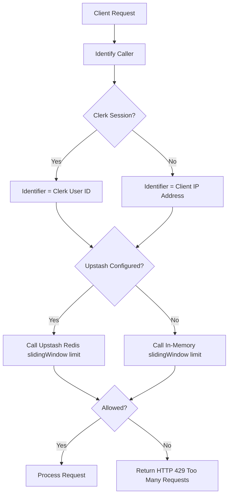

# API Rate Limiting & Security Guide

This guide explains how rate limiting is implemented in WorkSphere to protect application endpoints from abuse, denial-of-service (DoS) attacks, brute-force requests, and third-party API budget exhaustion.

It covers:

- Setting up Upstash Redis for distributed rate limiting
- Understanding the rate limiter's request flow and in-memory fallback
- Route-specific rate limits (e.g., chat and authentication APIs)
- Handling rate limit exceptions (HTTP 429, retry headers)
- Modifying limits and adding protection to new routes

---

## 1. Upstash Redis Setup

WorkSphere uses **Upstash Redis** as its primary distributed cache store for rate limiting because it provides a serverless REST-based client. This avoids persistent TCP socket connections, making it compatible with serverless runtimes.

### Creating an Upstash Redis Database

1. Sign up or log in to the **[Upstash Console](https://console.upstash.com/)**.
2. Click **Create Database**.
3. Choose a database name (e.g., `worksphere-redis`) and select your preferred cloud provider and region.
4. Click **Create** to provision the database.

### Obtaining REST Credentials

Once the database is created, scroll down to the **REST API** section in your database dashboard.
Copy the following two credential strings:

- **UPSTASH_REDIS_REST_URL**: The HTTPS REST endpoint URL.
- **UPSTASH_REDIS_REST_TOKEN**: The authentication token.

### Required Environment Variables

Add these credentials to your `.env.local` file (or your hosting provider's secret management dashboard in production):

```env
# Upstash Redis Configuration
UPSTASH_REDIS_REST_URL="https://your-database-endpoint.upstash.io"
UPSTASH_REDIS_REST_TOKEN="your_upstash_rest_token_here"
```

### Connecting the Application

The rate-limiting utility is implemented in [rateLimit.ts](file:///c:/Users/HP/Downloads/WorkSphere-main%20%281%29/WorkSphere-main/src/lib/rateLimit.ts). The client connection is established dynamically when environment variables are present:

1. **Lazy Initialization**: It imports `@upstash/ratelimit` and `@upstash/redis` dynamically at runtime. This prevents build-time compilation errors when Redis credentials are not configured.
2. **Algorithm**: It uses the **Sliding Window** rate-limiting algorithm (`Ratelimit.slidingWindow(limitPerMinute, "1 m")`) to block bursts of requests smoothly over a rolling 1-minute window.
3. **In-Memory Fallback**: If `UPSTASH_REDIS_REST_URL` or `UPSTASH_REDIS_REST_TOKEN` is missing, the system automatically falls back to a clean in-memory map store (`memRateLimit`), maintaining basic protection in local development or offline sandboxes.

---

## 2. API Rate Limiting

### Request Flow & Enforcement Logic

When a request hits a protected API endpoint, the system follows this workflow:



1. **Caller Identification**: The route handler retrieves the caller's unique identifier.
   - For authenticated users, it uses their Clerk `userId`.
   - For anonymous users, it extracts their public IP address via the `x-forwarded-for` or `x-real-ip` request headers.
2. **Key Prefixing**: To isolate rate-limiting counts across different routes, the caller identifier is prefixed with the target route's scope (e.g., `forgot-password:<ip>` or `chat:<userId>`).
3. **Evaluation**: The helper `rateLimit(identifier, limit)` evaluates the request count against the threshold. If it exceeds the limit, an HTTP 429 response is returned immediately, skipping execution of database queries, LLM API calls, or email dispatch.

### Supported Route Limits

Below is the complete list of rate-limited routes implemented in the codebase:

| Endpoint                         | Method |  Default Limit   | Purpose                                                                 |
| :------------------------------- | :----: | :--------------: | :---------------------------------------------------------------------- |
| `POST /api/chat`                 | `POST` | **20 req / min** | Protects the Groq LLM API from query abuse and token credit exhaustion. |
| `POST /api/auth/forgot-password` | `POST` | **3 req / min**  | Prevents email spam, account enumeration, and dictionary attacks.       |
| `POST /api/auth/resend-otp`      | `POST` | **3 req / min**  | Limits outbound OTP codes to protect SMS/email carrier budgets.         |
| `POST /api/auth/reset-password`  | `POST` | **5 req / min**  | Prevents brute-forcing user credentials during password recovery.       |
| `POST /api/auth/verify-otp`      | `POST` | **5 req / min**  | Prevents credential-stuffing and guess attacks against OTP codes.       |

> [!IMPORTANT]
> **Venue Search Route Limits**
> Currently, the main venue search endpoint `GET /api/venues` is **not** rate-limited in the codebase. If public abuse becomes a concern, developers should wrap this endpoint in the rate-limiting middleware. See [Securing the Venue Search Route](#securing-the-venue-search-route) below for details.

---

## 3. Fallback & Response Handling

### Behavior When Limits Are Exceeded

When a client exceeds the request limit, the API halts request execution and responds with:

- **HTTP Status**: `429 Too Many Requests`
- **Response Headers**:
  - `Retry-After`: The number of seconds the client must wait before their quota resets.
  - `X-RateLimit-Limit`: The total request threshold for the 1-minute window.
  - `X-RateLimit-Remaining`: The remaining request allowance (always `0` when blocked).
- **JSON Payload**: Contains a descriptive error and the retry wait time in seconds.

#### Example Chat Route Response (`POST /api/chat`):

```json
{
  "error": "Rate limit exceeded. Please wait before sending more messages.",
  "retryAfter": 12
}
```

#### Example Auth Route Response (`POST /api/auth/forgot-password`):

```json
{
  "error": "Too many password reset requests. Please wait before trying again.",
  "retryAfter": 45
}
```

---

## 4. Best Practices

### Modifying Rate-Limit Values

To adjust the rate limits for an existing route, open the corresponding route file and update the limit parameter passed to `rateLimit(identifier, limit)`.

For instance, to increase the chat rate limit from `20` to `30` in `src/app/api/chat/route.ts`:

```diff
- if (!(await rateLimit(identifier, 20))) {
+ if (!(await rateLimit(identifier, 30))) {
```

Make sure to update the matching limit parameter in the accompanying metadata function call so that the `Retry-After` calculation stays synchronized:

```diff
- const info = getRateLimitInfo(identifier); // Defaults to 10 if not specified
+ const info = getRateLimitInfo(identifier, 30);
```

### Securing the Venue Search Route

To introduce rate limiting to the `GET /api/venues` route, modify `src/app/api/venues/route.ts` as follows:

```typescript
import { rateLimit, getRateLimitInfo } from "@/lib/rateLimit";

export async function GET(req: NextRequest) {
  // 1. Identify the caller
  const forwarded = req.headers.get("x-forwarded-for");
  const ip = forwarded?.split(",")[0].trim() || "anonymous";
  const identifier = `venue-search:${ip}`;

  // 2. Enforce a rate limit of 60 requests per minute
  const allowed = await rateLimit(identifier, 60);

  if (!allowed) {
    const info = getRateLimitInfo(identifier, 60);
    const retryAfter = info?.resetTime
      ? Math.ceil((info.resetTime - Date.now()) / 1000)
      : 60;

    return NextResponse.json(
      {
        error: "Too many venue search requests. Please try again later.",
        retryAfter,
      },
      {
        status: 429,
        headers: {
          "Retry-After": String(retryAfter),
          "X-RateLimit-Limit": "60",
          "X-RateLimit-Remaining": "0",
        },
      },
    );
  }

  // 3. Continue with search validation and Prisma query logic...
}
```
