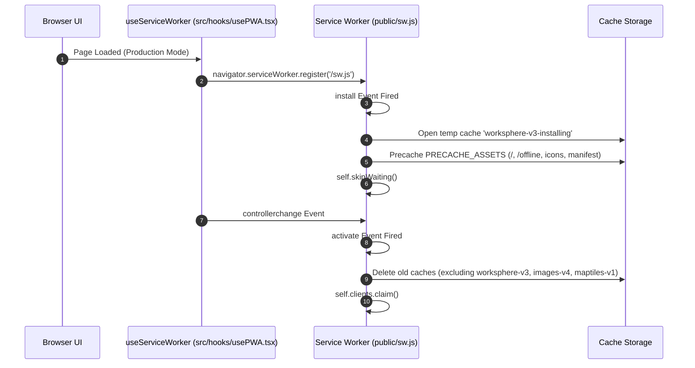
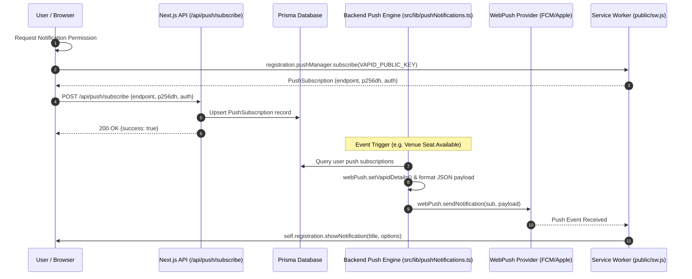
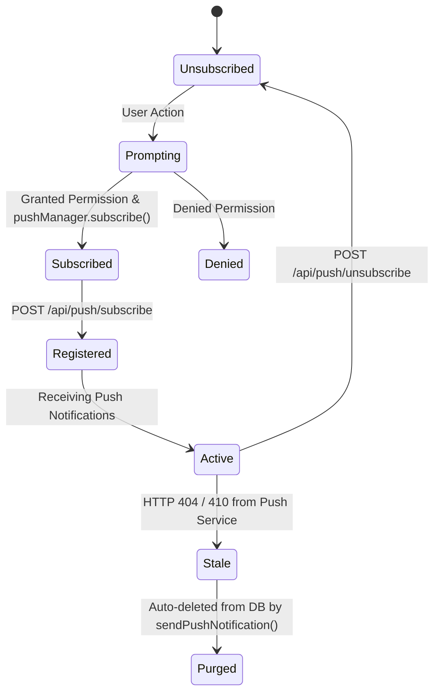
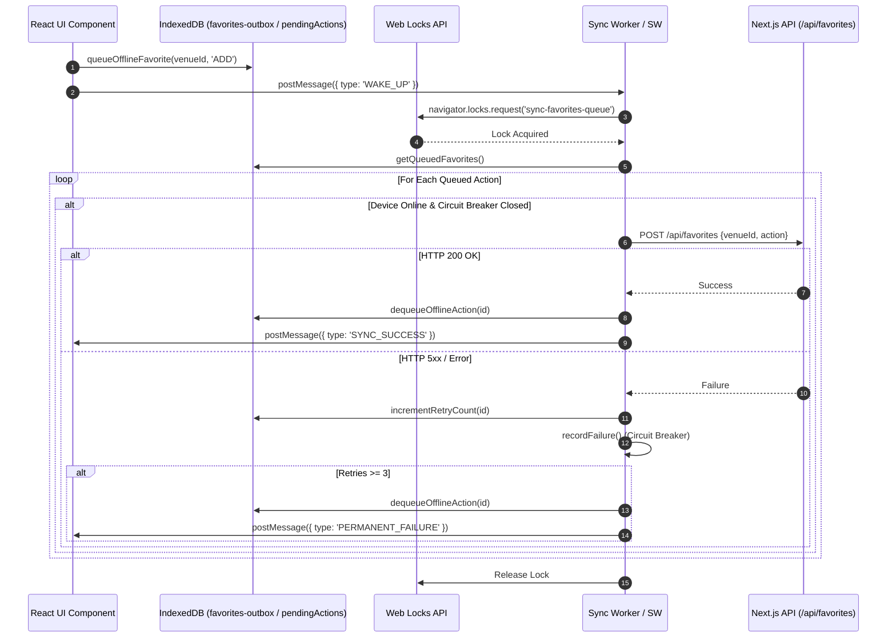
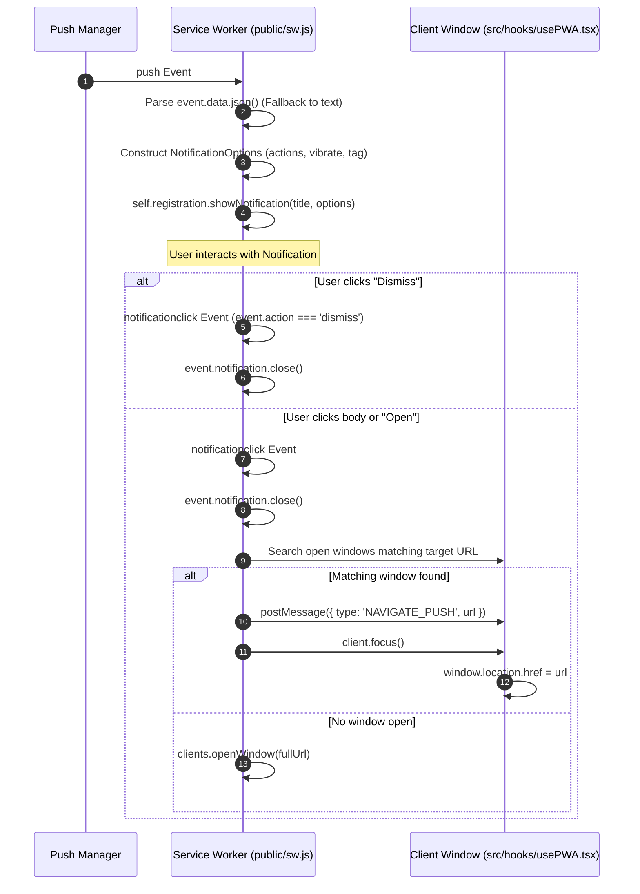
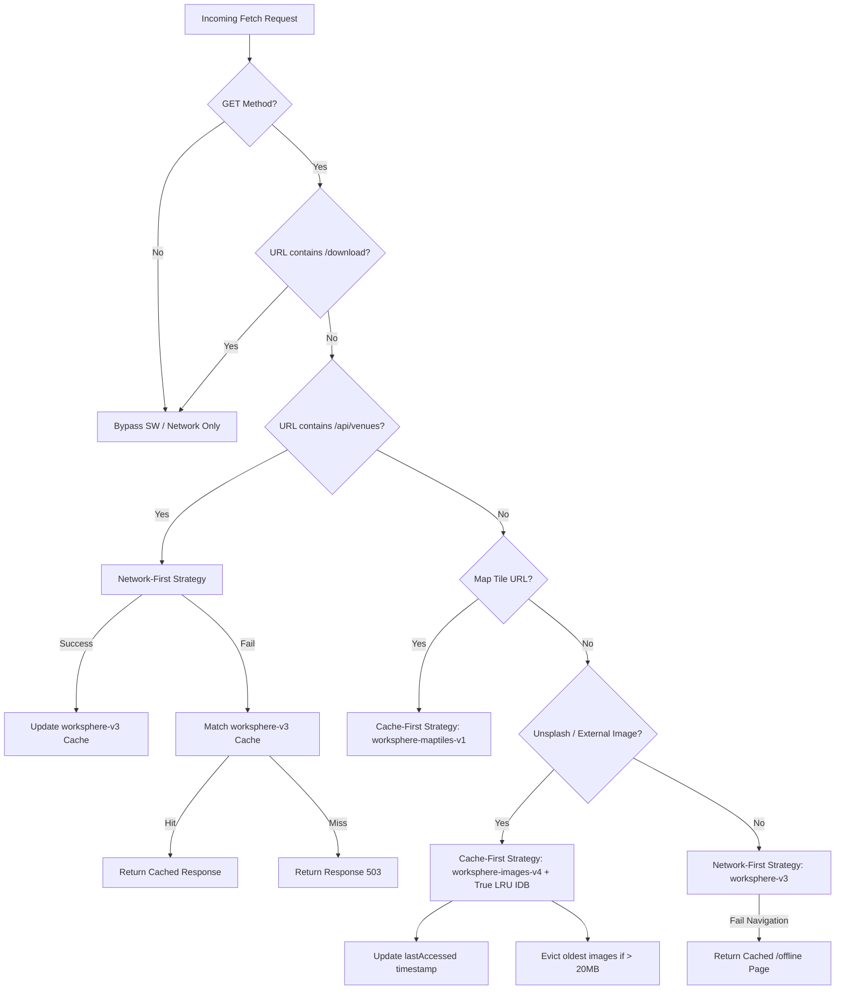

# Service Worker Push Specification

## Purpose

This document provides a comprehensive technical specification of the Progressive Web App (PWA), Service Worker, WebPush notification, and Background Sync architecture for **WorkSphere**. It details the frontend service worker lifecycle, offline caching strategies, background synchronization queues, push notification workflows, VAPID key negotiation, payload encryption, and cross-browser compatibility mechanics derived strictly from the WorkSphere codebase.

---

## Architecture Overview

WorkSphere employs a hybrid offline and real-time notification architecture comprising five primary operational layers:

```mermaid
graph TD
    Client["Client Browser (React / Next.js)"]
    SW["Service Worker (public/sw.js)"]
    SyncWorker["Sync Web Worker (src/workers/sync.worker.ts)"]
    IDB[("IndexedDB: worksphere-offline & WorkSphereOfflineDB")]
    Backend["Next.js Backend API (/api/push, /api/favorites, /api/sync)"]
    PushService["Browser Push Service (FCM / APNs / Mozilla Push)"]
    DB[("Prisma Database (PushSubscription & PushNotificationLog)")]

    Client -->|Registers / Controller listener| SW
    Client -->|Spawns parallel sync| SyncWorker
    SW -->|Network-First / Cache-First| Client
    SW -->|Sync & LRU Eviction| IDB
    SyncWorker -->|Web Locks Outbox Queue| IDB
    SyncWorker -->|HTTP Retry / Backoff| Backend
    Backend -->|WebPush (AES128GCM + VAPID)| PushService
    Backend -->|Upsert / Delete Subscriptions| DB
    PushService -->|Encrypted Push Event| SW
```

1. **Service Worker (`public/sw.js`)**: Serves as the primary network proxy, caching engine, push notification listener, and native Background Sync event handler.
2. **Dedicated Sync Worker (`src/workers/sync.worker.ts`)**: Operates in parallel with the client window, executing outbox synchronization with exponential backoff and circuit-breaker protection when native background sync is constrained.
3. **Offline Storage (`src/lib/offlineStore.ts` & `public/sw.js`)**: Multi-versioned IndexedDB databases (`worksphere-offline` v5 and `WorkSphereOfflineDB` v2) managing outbox queues (`pendingActions`, `favorites-outbox`, `checkins-outbox`, `receiptExports`) and image LRU metadata (`imageCacheLRU`).
4. **Backend Push Engine (`src/lib/pushNotifications.ts`)**: Server-side WebPush dispatcher configured via the `web-push` NPM package, utilizing VAPID authentication for message delivery.
5. **Database Models (`prisma/schema.prisma`)**: Prisma schemas tracking user subscriptions (`PushSubscription`) and delivery logs (`PushNotificationLog`).

---

## Service Worker Lifecycle

The service worker lifecycle in WorkSphere is managed in `public/sw.js` and registered via `src/hooks/usePWA.tsx`.



### 1. Registration Phase

- **Location**: `src/hooks/usePWA.tsx` (lines 92–145)
- **Environment Gate**: Service Worker registration runs strictly in production (`process.env.NODE_ENV === "production"`). In development mode, existing registrations are unregistered to avoid hot-module reload evaluation errors.
- **Update Check**: Calls `reg.update()` on every page load to check for byte-level service worker updates.

### 2. Install Event

- **Location**: `public/sw.js` (lines 16–35)
- **Precache Strategy**: Opens a isolated temporary cache named `${CACHE_NAME}-installing` (`worksphere-v3-installing`) and pre-caches core application shell assets:
  - `/`
  - `/offline`
  - `/icons/icon.svg`
  - `/manifest.json`
- **Immediate Takeover**: Invokes `self.skipWaiting()` immediately upon asset pre-caching (and inside error handlers) to prevent the service worker from getting stuck in an `installing` state.

### 3. Activate Event

- **Location**: `public/sw.js` (lines 38–70)
- **Cache Invalidation**: Iterates over existing Cache Storage buckets and purges stale caches whose names do not match active constants:
  - `CACHE_NAME`: `"worksphere-v3"`
  - `IMAGE_CACHE_NAME`: `"worksphere-images-v4"`
  - `MAP_TILE_CACHE_NAME`: `"worksphere-maptiles-v1"`
- **Client Control**: Executes `self.clients.claim()` immediately so that active browser tabs are controlled without requiring a manual page refresh.

---

## Registration Flow

The registration sequence guarantees seamless update detection and client window synchronization:

1. **Feature Detection**: `useServiceWorker` checks `"serviceWorker" in navigator`.
2. **Registration**: Invokes `navigator.serviceWorker.register("/sw.js")`.
3. **Controller Change Listener**: Registers a listener for `controllerchange`. When a new worker skips waiting and claims control, `window.location.reload()` is invoked once to ensure asset synchronization.
4. **Update Event Listener**: Listens to `reg.onupdatefound` to log when new content is being installed for offline usage.

---

## Push Notification Flow

WorkSphere implements WebPush notifications for seat availability alerts and background receipt download confirmations.



### Frontend Subscription Handler

- Application code requests permission via `Notification.requestPermission()`.
- Obtains subscription through `registration.pushManager.subscribe({ userVisibleOnly: true, applicationServerKey })`.
- Sends key payload `{ endpoint, p256dh, auth }` to `/api/push/subscribe`.

### Backend Registration Endpoint

- **Location**: `src/app/api/push/subscribe/route.ts`
- **Authentication**: Requires authenticated user session via Clerk (`auth()`).
- **Rate Limiting**: Enforces rate limiting (`push-subscribe:${userId}`, max 10 requests per window) via `@upstash/ratelimit`.
- **Persistence**: Performs an `upsert` in `prisma.pushSubscription` using `endpoint` as the unique key:
  - `userId`: Clerk User ID
  - `endpoint`: Push service endpoint URL
  - `p256dh`: Elliptic curve public key
  - `auth`: Authentication secret
  - `userAgent`: Client user-agent string

### Backend Unsubscribe Endpoint

- **Location**: `src/app/api/push/unsubscribe/route.ts`
- Rate-limited and authenticated; removes matching endpoint records via `prisma.pushSubscription.deleteMany`.

---

## WebPush Architecture & VAPID Key Negotiation

WorkSphere relies on Voluntary Application Server Identification (VAPID) for WebPush identification:

- **Library**: `web-push` (`^3.6.7`)
- **Key Storage**:
  - `NEXT_PUBLIC_VAPID_PUBLIC_KEY`: Exposed to frontend for `pushManager.subscribe()`.
  - `VAPID_PRIVATE_KEY`: Server-side secret key for signing push headers.
  - `VAPID_SUBJECT`: Contact URI (defaults to `mailto:admin@worksphere.app`).
- **Initialization**: `configureVapid()` in `src/lib/pushNotifications.ts` validates key presence and invokes `webPush.setVapidDetails(VAPID_SUBJECT, VAPID_PUBLIC_KEY, VAPID_PRIVATE_KEY)`.
- **Key Generation Utility**: `generateVapidKeys()` exports `webPush.generateVAPIDKeys()`.

---

## Push Subscription Lifecycle



1. **Creation**: User grants browser notification permissions; keys stored in Prisma DB.
2. **Usage Tracking**: Each successful delivery updates `lastUsedAt` timestamp in `prisma.pushSubscription`.
3. **Invalidation & Cleanup**: When `webPush.sendNotification()` encounters `statusCode === 404` or `statusCode === 410` (indicating subscription expiry or unregistration), the stale endpoint is queued into `staleEndpoints` and batch-deleted from PostgreSQL via `prisma.pushSubscription.deleteMany`.
4. **Audit Logging**: Every dispatch creates a record in `prisma.pushNotificationLog` with status (`SENT` or `FAILED`).

---

## Payload Format

Push notification payloads are sent as JSON strings generated by `src/lib/pushNotifications.ts` and consumed by `public/sw.js`.

### TypeScript Interface (`src/lib/pushNotifications.ts`)

```typescript
export interface PushPayload {
  title: string;
  body: string;
  url?: string;
  icon?: string;
  badge?: string;
  tag?: string;
  data?: Record<string, unknown>;
}
```

### JSON Schema

```json
{
  "$schema": "http://json-schema.org/draft-07/schema#",
  "title": "PushPayload",
  "type": "object",
  "properties": {
    "title": { "type": "string" },
    "body": { "type": "string" },
    "url": { "type": "string", "default": "/" },
    "icon": { "type": "string", "default": "/icons/icon.svg" },
    "badge": { "type": "string", "default": "/icons/icon.svg" },
    "tag": { "type": "string", "default": "worksphere-notification" },
    "data": { "type": "object" }
  },
  "required": ["title", "body"]
}
```

### Example Seat Availability Payload

```json
{
  "title": "Seat Available!",
  "body": "Central Perk Cafe now has 3 seats available.",
  "url": "/venues/cm801xyz",
  "icon": "/icons/icon.svg",
  "badge": "/icons/icon.svg",
  "tag": "venue-availability-cm801xyz",
  "data": {
    "venueId": "cm801xyz",
    "venueName": "Central Perk Cafe",
    "availableSeats": 3
  }
}
```

---

## Payload Encryption

- **Standard**: RFC 8291 / RFC 8188 (`aes128gcm`).
- **Implementation**: Handled server-side by the `web-push` NPM library using the subscription's `p256dh` public key and `auth` secret token.
- **Client Decryption**: Browsers natively handle payload decryption before dispatching the `push` event into the Service Worker context. The Service Worker accesses decrypted data directly via `event.data.json()`.

---

## Background Sync Architecture

WorkSphere implements a resilient, dual-layer background sync architecture:

1. **Native Service Worker `sync` Handler (`public/sw.js`)**: Listens to system sync tags (`sync-crdt`, `sync-favorites`, `sync-ratings`, `sync-conversations`, `receipt-export-sync`).
2. **Client-side Dedicated Web Worker (`src/workers/sync.worker.ts`)**: Operates in the background when active tabs exist, providing deterministic outbox synchronization, exponential backoff, circuit breaking, and Web Lock concurrency controls.



---

## Queue Implementation

IndexedDB object stores are distributed across two databases:

| Database                   | Store Name         | Key Path    | AutoIncrement | Purpose                                             |
| -------------------------- | ------------------ | ----------- | ------------- | --------------------------------------------------- |
| `worksphere-offline` (v5)  | `venues`           | `id`        | False         | Offline venue caching                               |
| `worksphere-offline` (v5)  | `favorites`        | `id`        | False         | Offline favorites cache                             |
| `worksphere-offline` (v5)  | `searches`         | `query`     | False         | Recent search history                               |
| `worksphere-offline` (v5)  | `pendingActions`   | `id`        | True          | Unified queue for CRDT, ratings, conversation edits |
| `worksphere-offline` (v5)  | `imageCacheLRU`    | `url`       | False         | True LRU metadata for external image eviction       |
| `worksphere-offline` (v5)  | `receiptExports`   | `bookingId` | False         | PDF receipt generation & sync status                |
| `WorkSphereOfflineDB` (v2) | `favorites-outbox` | `id`        | True          | Client-side queued favorite toggle actions          |
| `WorkSphereOfflineDB` (v2) | `checkins-outbox`  | `id`        | True          | Client-side queued venue check-ins                  |

### Multi-Tab Concurrency Control

- **Web Locks API**: `withWebLock()` in `src/lib/offlineStore.ts` wraps store operations in `navigator.locks.request("worksphere-offline-store-lock")`.
- **Worker Lock**: `sync.worker.ts` requests `navigator.locks.request("sync-favorites-queue", { ifAvailable: true })` to ensure only one tab or worker processes outbox items concurrently.

---

## Retry Strategy & Circuit Breaker

### Exponential Backoff with Jitter

- **Location**: `src/workers/sync.worker.ts` (lines 121–138)
- **Base Delay**: `1000ms` (`BASE_DELAY_MS`)
- **Max Delay**: `60000ms` (`MAX_DELAY_MS`)
- **Formula**: $\text{delay} = \min(\text{MAX\_DELAY}, \text{BASE\_DELAY} \times 2^{\text{attempt}}) + \text{rand}(0, 1000)\text{ms}$
- **Offline Guard**: Backoff delays and retry counters are frozen when `navigator.onLine === false` to avoid penalizing offline queued items.

### Circuit Breaker Specification

- **Threshold**: 3 consecutive failures (`CB_MAX_FAILURES = 3`).
- **States**:
  - `CLOSED`: Normal operation.
  - `OPEN`: Triggered after 3 consecutive errors; pauses sync processing for 30 seconds (`CB_OPEN_TIMEOUT_MS = 30000`).
  - `HALF_OPEN`: Transition state after 30 seconds to allow a test request.
- **Permanent Failure Handling**: `MAX_SYNC_RETRIES = 3`. Once an item fails 3 times on the server, it is removed from IndexedDB and a `PERMANENT_FAILURE` message is posted to the window, triggering the `<OfflineSyncNotice />` toast UI.

---

## Notification Lifecycle



### Event Handlers (`public/sw.js`)

- `push`: Parses JSON data, formats vibration patterns (`[200, 100, 200, 100, 200]` for venue availability; `[100, 50, 100]` for default), sets actions `[Open, Dismiss]`, and calls `showNotification()`.
- `notificationclick`: Closes notification, ignores `"dismiss"`, focuses existing open client matching URL via `postMessage({ type: "NAVIGATE_PUSH" })`, or calls `clients.openWindow(fullUrl)`.

---

## Offline Behavior & Cache Strategies

WorkSphere routes network requests through granular target-specific caching logic in `public/sw.js`:



### Active Cache Strategies

1. **Network-First (`/api/venues`)**: Fetches latest data from server; updates `worksphere-v3` cache on 200 OK. Serves cached copy if network fails.
2. **Cache-First (Map Tiles)**: Intercepts `tile.openstreetmap.org` and `basemaps.cartocdn.com`. Serves from `worksphere-maptiles-v1` immediately; fetches and caches on miss.
3. **Cache-First with True LRU Eviction (External Images)**: Caches `images.unsplash.com` into `worksphere-images-v4`. Updates IndexedDB `imageCacheLRU` timestamps. Enforces strict 20MB limit (`MAX_IMAGE_CACHE_BYTES`).
4. **Network-First with Offline Navigation Fallback (Local Assets)**: Caches local GET requests. If network is unreachable and `event.request.mode === "navigate"`, returns the pre-cached `/offline` HTML page.

---

## Browser Compatibility

| Browser / OS                  | SW Support | Push API         | Background Sync | PWA Install    | Compatibility Notes / Workarounds                                                                                                                                                        |
| ----------------------------- | ---------- | ---------------- | --------------- | -------------- | ---------------------------------------------------------------------------------------------------------------------------------------------------------------------------------------- |
| **Chrome Desktop / Android**  | Full       | Full             | Full            | Full           | Native `beforeinstallprompt` supported. Full background sync support.                                                                                                                    |
| **Firefox Desktop / Android** | Full       | Full             | Partial         | Partial        | Standard service worker and push delivery supported.                                                                                                                                     |
| **Edge**                      | Full       | Full             | Full            | Full           | Chromium core guarantees full feature parity with Chrome.                                                                                                                                |
| **Safari (macOS)**            | Full       | Full             | Limited         | Partial        | Push supported via web-push VAPID standards.                                                                                                                                             |
| **iOS Safari (iPhone/iPad)**  | Full       | Full (iOS 16.4+) | Limited         | Custom Overlay | Requires Home Screen installation for WebPush. Handled via `<IOSInstallOverlay />`. Storage capped at ~50MB (image cache quota tuned to 20MB). IndexedDB restricted in Private Browsing. |

---

## Security Considerations

1. **VAPID Keys**: Private keys stored in server environment variables (`VAPID_PRIVATE_KEY`); never exposed to client bundles.
2. **Rate Limiting**: Critical push subscription routes (`/api/push/subscribe` and `/api/push/unsubscribe`) are protected via Upstash Redis rate limiters.
3. **Payload Decryption**: Cryptographic key exchange handled securely via `p256dh` and `auth` parameters using standard `aes128gcm` RFC 8291 encoding.
4. **IndexedDB Web Locks**: Multi-tab access is serialized via Web Locks API (`worksphere-offline-store-lock`) to avoid transaction deadlocks or storage corruption.
5. **Safari Private Browsing**: Gracefully handled by catching `SecurityError` during IndexedDB initialization and prompting the user via `showPrivateBrowsingAlert()`.

---

## Performance Considerations

1. **Image Cache Quota Management**: Dedicated LRU algorithm prevents Cache Storage from exceeding 20MB, avoiding OS-level PWA eviction on iOS devices.
2. **Bypass Endpoint Exclusions**: Routes containing `/download` bypass service worker interception to prevent binary stream locking and memory bloat.
3. **Stale Endpoint Purging**: HTTP 404/410 errors during push notification delivery trigger immediate DB deletion of invalid endpoints.
4. **Circuit Breaker Throttle**: Prevents endless network request loops during server outages by forcing a 30-second backoff after 3 consecutive failures.

---

## Known Limitations

1. **iOS Safari Push Dependency**: WebPush on iOS requires the PWA to be manually added to the Home Screen (`display-mode: standalone`).
2. **Safari Private Browsing**: IndexedDB access is completely disabled by Safari in Private Browsing mode, preventing offline outbox queuing.
3. **Background Sync Timing**: Native `sync` events are controlled by the browser engine and may be delayed based on OS battery saver or network conditions.

---

## Future Improvements

1. **Periodic Background Sync**: Implement `periodicSync` API for silent background pre-fetching of venue availability during low-power windows.
2. **Web Push Action Handler Expansion**: Expand inline notification reply actions for messaging features directly inside push notification banners.
3. **WASM-assisted Encryption Validation**: Integrate client-side payload validation using WebAssembly modules prior to queuing.
