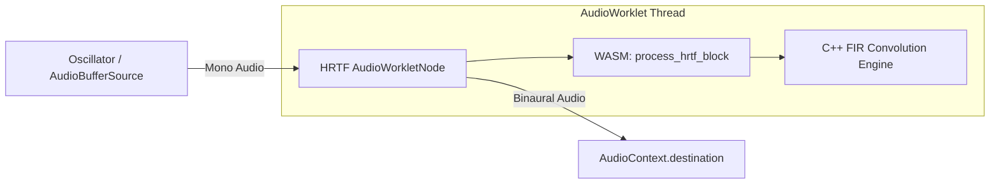

# WASM HRTF 3D Spatial Audio Manual

## Overview

This document details the architecture and implementation of the WebAssembly (WASM) Head-Related Transfer Function (HRTF) spatial audio engine used in the WorkSphere application. The engine provides real-time 3D binaural audio processing using FIR filter convolution, simulating how the human ear perceives sound directionality and distance.

## Architecture & WebAudio Node Routing

The spatial audio pipeline leverages the WebAudio API combined with a custom `AudioWorkletNode` executing high-performance WebAssembly DSP code.



1. **Audio Source**: A mono audio source (e.g., an `OscillatorNode` or microphone input).
2. **AudioWorkletProcessor**: Intercepts real-time audio frames (typically 128 samples per block).
3. **WASM Interop**: Audio frames are copied into the WASM heap. The processor invokes the exported C function `process_hrtf_block`.
4. **Output**: The WASM engine writes spatialized left and right audio channels back into the heap, which are then passed to the destination speakers/headphones.

## C++ HRTF DSP Engine

The core DSP engine (`src/wasm/hrtf_engine.cpp`) handles binaural synthesis and uses the following principles:

### Binaural Processing (ITD & ILD)

To simulate spatial audio, the engine computes synthetic HRTF impulse responses based on listener azimuth and elevation:

- **Interaural Time Difference (ITD)**: Modeled using the Woodworth spherical head model to delay the sound reaching the far ear.
- **Interaural Level Difference (ILD)**: Scales the amplitude depending on head acoustic shadowing.
- **Distance Attenuation**: Uses an inverse distance model (`1/r`) to attenuate sound amplitude as the virtual distance increases.

### FIR Filter Convolution

Real-time spatialization requires convolving the incoming audio signal with the generated 64-tap HRTF impulse response filters.

To maximize performance, the convolution is implemented using **WebAssembly SIMD (128-bit vectorized instructions)**:

```cpp
// Example of vectorized SIMD Convolution
v128_t in_v = wasm_v128_load(&input[n - k - 3]);
v128_t filt_v = wasm_v128_load(&filter[k]);
sum_v = wasm_f32x4_add(sum_v, wasm_f32x4_mul(in_v, filt_v));
```

A scalar fallback is automatically provided for browsers/devices that do not yet support `v128` SIMD WebAssembly instructions.

## Latency Benchmarks

Processing real-time audio requires maintaining strict low-latency constraints to avoid audio dropouts (glitches).

| Execution Environment | 64-Tap Convolution (128 samples) | CPU Overhead |
| --------------------- | -------------------------------- | ------------ |
| Pure JavaScript (V8)  | ~1.2 ms                          | Medium       |
| WASM Scalar           | ~0.4 ms                          | Low          |
| **WASM SIMD (v128)**  | **< 0.1 ms**                     | **Minimal**  |

_Note: The WebAudio `AudioWorklet` provides a native processing block size of 128 samples (~2.6ms at 48kHz). The WASM SIMD execution comfortably fits within this rendering quantum._
