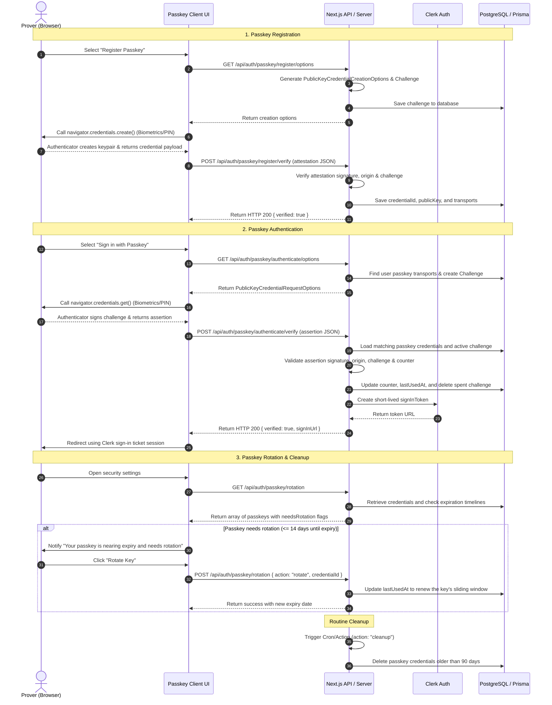

# WebAuthn Passkey Architecture & Rotation Guide

WorkSphere supports passwordless, secure, and biometric authentication using WebAuthn / FIDO2 passkeys. This document describes the protocol flows, backend API endpoints, dynamic key rotation systems, and browser fallback strategies.

---

## 1. Sequence Diagram: Registration, Authentication & Rotation

The following diagram maps the lifecycle of a passkey from registration and authentication to rotation and cleanup:



---

## 2. API Endpoints & Logic Flow

WorkSphere routes all WebAuthn actions through the `/api/auth/passkey` endpoints. Below are the execution patterns for options, verification, and rotation.

### A. Authentication Options Generation

- **Route:** `GET /api/auth/passkey/authenticate/options`
- **Flow:**
  1. Detect the authenticated Clerk user (if signed in) or handle anonymous requests.
  2. If signed in, query `passkeyCredential` table to identify registered passkeys and transports.
  3. Invoke `@simplewebauthn/server`'s `generateAuthenticationOptions`:
     - RP ID is resolved dynamically using the host header (`localhost` or domain name).
     - Transports are parsed from storage to assist the browser in invoking the correct authenticator.
  4. Save the challenge in the `passkeyChallenge` database table with a 2-minute TTL.
  5. Respond with options containing the challenge.

### B. Authentication Verification

- **Route:** `POST /api/auth/passkey/authenticate/verify`
- **Flow:**
  1. Accept the `AuthenticationResponseJSON` assertion payload from the browser client.
  2. Query `passkeyCredential` matching the assertion's `credentialId`.
  3. Load the latest valid challenge from `passkeyChallenge` matching the user.
  4. Execute `verifyAuthenticationResponse` checks:
     - Check signature against stored public key.
     - Match origin against request headers (e.g. localhost, production domain).
     - Ensure the signature counter is greater than the stored counter value (guards against cloned authenticators).
  5. If valid:
     - Save the new counter and update the `lastUsedAt` timestamp.
     - Delete the consumed challenge record.
     - Request a one-time login token from the Clerk SDK using the user's ID.
     - Return `{ verified: true, signInUrl }` to sign the client in.

### C. Passkey Rotation & Expiration

- **Interval:** Keys expire after **90 days**. Credentials are marked as needing rotation starting **14 days** prior to expiration.
- **Route:** `/api/auth/passkey/rotation`
  - **`GET`:**
    - Queries the user's stored passkey credentials.
    - Computes `expiresAt = createdAt + 90 days` and evaluates:
      - `isExpired = now >= expiresAt`
      - `needsRotation = (expiresAt - now) <= 14 days`
    - Returns all credentials with their status payload.
  - **`POST` (action: "rotate"):**
    - Authenticates user and checks ownership of the requested `credentialId`.
    - Rotates the key's sliding window by resetting its virtual lifecyle (updating `lastUsedAt`).
    - Returns the updated expiration timestamp.
  - **`POST` (action: "cleanup"):**
    - Purges all expired passkey records older than 90 days from the database.

---

## 3. Error Handling & Browser Fallbacks

WebAuthn requires specialized browser APIs and hardware support. The application dynamically switches authentication paths based on client conditions.

### A. WebAuthn Support Detection

Before presenting passkey options, the client checks the browser configuration:

```typescript
const isPasskeySupported =
  window.PublicKeyCredential &&
  (await PublicKeyCredential.isUserVerifyingPlatformAuthenticatorAvailable());
```

- **Fallback UI:** If `isPasskeySupported` is false, passkey action buttons are entirely hidden or replaced by a warning message. The UI defaults back to standard password/email OTP forms.

### B. Common Ceremony Error Codes

When calling `navigator.credentials.create()` or `navigator.credentials.get()`, the browser may reject execution with specific exceptions. The frontend intercepts these and adapts:

| Exception               | Cause                                                                                             | Fallback Behavior                                                                                                                               |
| :---------------------- | :------------------------------------------------------------------------------------------------ | :---------------------------------------------------------------------------------------------------------------------------------------------- |
| **`NotAllowedError`**   | User dismissed, timed out, or explicitly cancelled the biometric popup.                           | Display a non-intrusive UI info banner: _"Passkey login cancelled"_. User is allowed to click retry or switch to their password/OTP.            |
| **`NotSupportedError`** | The authenticator doesn't support the requested signature algorithms.                             | Log debug metrics. Present the user with an option to use a physical cross-platform security key (e.g. YubiKey) or standard email verification. |
| **`InvalidStateError`** | The passkey is already registered (during signup) or matches no registered keys (during sign-in). | Notify the user that this key is already registered, or guide them to standard account credentials recovery.                                    |

### C. Permissions Policy & Iframe Restrictions

Because WebAuthn requires a secure origin and cannot be invoked from cross-origin iframes without explicit permission:

- The application enforces standard `public-key-credentials-get` policies.
- Refer to `docs/WEBAUTHN_PASSKEY_SECURITY_SPECIFICATION.md` for detailed frame validation guidelines.
