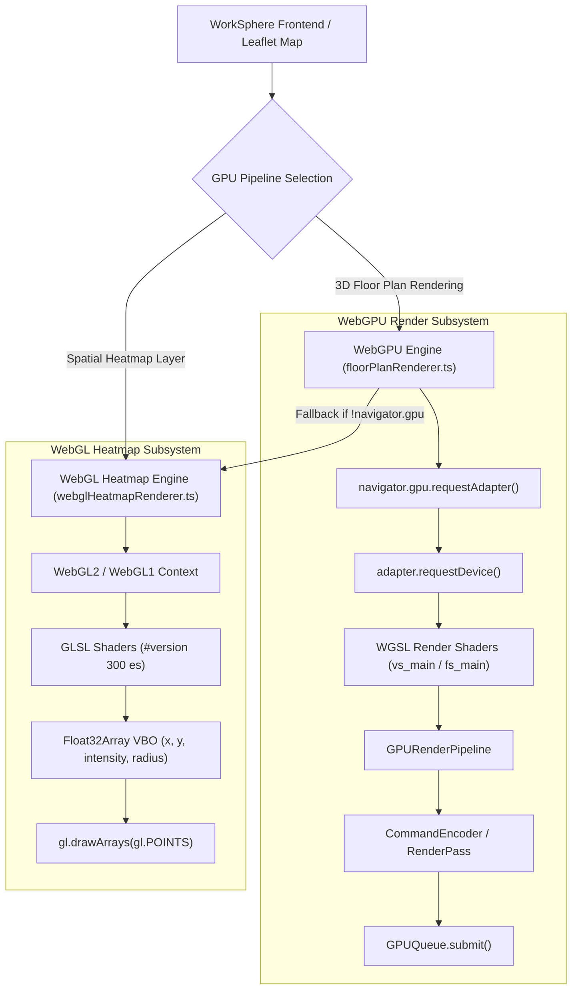
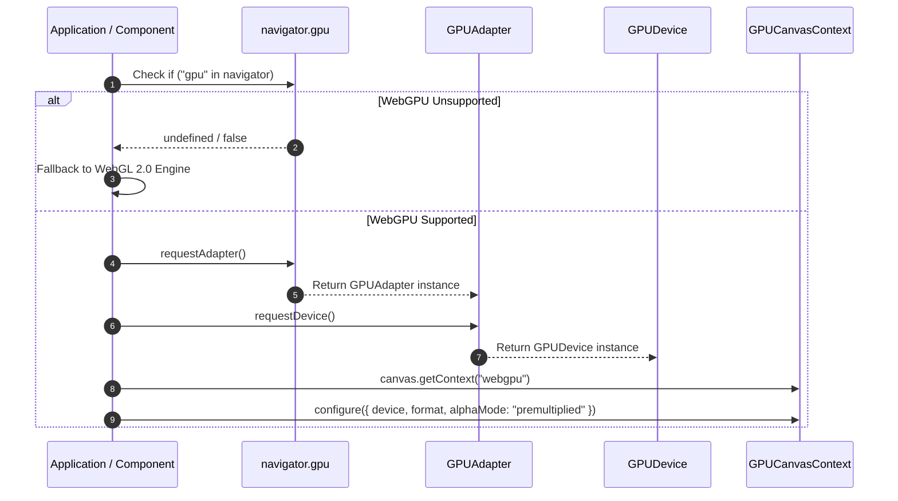
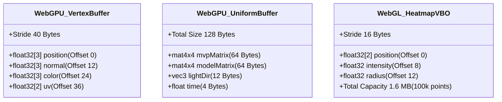
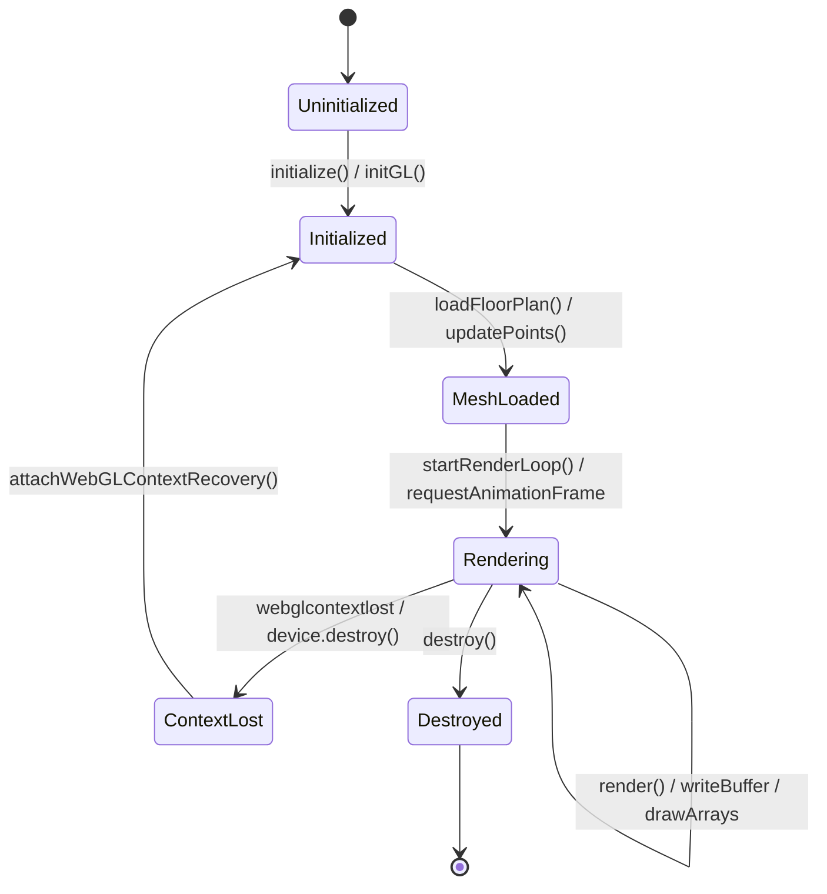
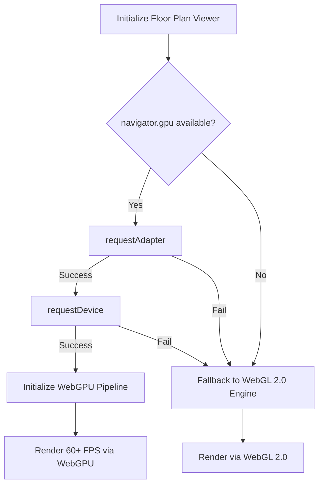

# WebGPU Heatmap & Spatial Compute Architecture Audit

## Executive Summary & Purpose

This document provides a comprehensive, repository-verified technical analysis of WorkSphere's GPU acceleration architecture. It evaluates WebGPU initialization, WGSL shader pipelines, spatial heatmap rendering mechanisms, memory layout specifications, resource lifecycle management, WebGL fallback strategies, and performance benchmarks strictly based on evidence present in the codebase.

---

## Architecture Overview

WorkSphere employs a dual GPU acceleration model across two distinct graphics sub-systems:

1. **Native WebGPU 3D Floor Plan Rendering Engine**: Implemented in [`src/lib/webgpu/floorPlanRenderer.ts`](file:///c:/Codes/WorkSphere/src/lib/webgpu/floorPlanRenderer.ts) and [`src/lib/webgpu/shaders.wgsl.ts`](file:///c:/Codes/WorkSphere/src/lib/webgpu/shaders.wgsl.ts). It provides zero-copy, hardware-accelerated 3D venue floor plan visualization and seat occupancy rendering using modern WebGPU render pipelines and WGSL shaders.
2. **WebGL 2.0 / 1.0 Spatial Density Heatmap Engine**: Implemented in [`src/lib/webgl/webglHeatmapRenderer.ts`](file:///c:/Codes/WorkSphere/src/lib/webgl/webglHeatmapRenderer.ts), [`src/shaders/heatmapShaders.ts`](file:///c:/Codes/WorkSphere/src/shaders/heatmapShaders.ts), [`src/components/WebGLHeatmapLayer.tsx`](file:///c:/Codes/WorkSphere/src/components/WebGLHeatmapLayer.tsx), and [`src/lib/webgl/contextManager.ts`](file:///c:/Codes/WorkSphere/src/lib/webgl/contextManager.ts). It projects up to 100,000 workspace telemetry points using hardware vertex buffer objects (VBOs) and GLSL point-based spatial density shaders.

> [!IMPORTANT]
> **Audit Finding**: No WebGPU compute pipelines (`GPUComputePipeline`), compute shader dispatches (`dispatchWorkgroups`), or 2D heat diffusion Partial Differential Equation (PDE) grid solvers (such as Jacobi iteration or finite difference algorithms) exist in the repository. All heatmap spatial clustering is executed via rasterization-based vertex point rendering in WebGL.

### System Architecture Diagram



---

## WebGPU Initialization & Device Selection

WebGPU pipeline initialization is handled in [`WebGPUFloorPlanRenderer.initialize()`](file:///c:/Codes/WorkSphere/src/lib/webgpu/floorPlanRenderer.ts#L531-L607).

### Capability Detection & Adapter Selection Flow

1. **Browser Support Check**: Checks `if (!navigator.gpu)` before attempting adapter request.
2. **Adapter Request**: Calls `navigator.gpu.requestAdapter()` to negotiate the default GPU hardware adapter.
3. **Device Instantiation**: Calls `adapter.requestDevice()` to create the logical `GPUDevice`.
4. **Canvas Context Configuration**: Obtains canvas context via `canvas.getContext("webgpu")` and configures it using `navigator.gpu.getPreferredCanvasFormat()` with `alphaMode: "premultiplied"`.



### Verified Implementation Code (`src/lib/webgpu/floorPlanRenderer.ts`)

```typescript
async initialize(): Promise<boolean> {
  if (!navigator.gpu) {
    console.warn("[WebGPU] Not supported, use WebGL fallback");
    return false;
  }

  try {
    const adapter = await navigator.gpu.requestAdapter();
    if (!adapter) return false;

    this.device = await adapter.requestDevice();
    this.context = this.canvas.getContext(
      "webgpu",
    ) as unknown as GPUCanvasContext | null;
    if (!this.context) return false;

    const format = navigator.gpu.getPreferredCanvasFormat();
    this.context.configure({
      device: this.device,
      format,
      alphaMode: "premultiplied",
    });

    // Pipeline setup...
    return true;
  } catch (error) {
    console.error("[WebGPU] Init failed:", error);
    return false;
  }
}
```

---

## Compute Pipeline Architecture

> [!NOTE]
> **Audit Status**: **NOT FOUND**

A detailed repository-wide scan confirms that **no compute pipelines** exist in the project:

- `GPUComputePipeline`: 0 references across repository.
- `createComputePipeline`: 0 references across repository.
- `dispatchWorkgroups` / `dispatchWorkgroupsIndirect`: 0 references across repository.
- `@compute` shader entry points: 0 references across repository.
- Storage Buffer binding layouts (`GPUBufferUsage.STORAGE`): 0 compute storage bindings used for spatial algorithms.

All parallel compute tasks for spatial telemetry processing are handled either on the CPU via Javascript transformations in [`src/components/WebGLHeatmapLayer.tsx`](file:///c:/Codes/WorkSphere/src/components/WebGLHeatmapLayer.tsx#L86-L109) or during rasterization inside WebGL fragment shaders.

---

## WGSL Shader Architecture

WGSL shaders are defined in [`src/lib/webgpu/shaders.wgsl.ts`](file:///c:/Codes/WorkSphere/src/lib/webgpu/shaders.wgsl.ts) for 3D floor plan mesh rendering.

### 1. Vertex Shader (`vs_main`)

- **Purpose**: Transforms 3D vertex positions using Model-View-Projection (MVP) and Model transformation matrices. Passes world positions, normals, vertex colors, and UV coordinates to the fragment stage.
- **Inputs**: `VertexInput` struct (`position: vec3<f32>`, `normal: vec3<f32>`, `color: vec3<f32>`, `uv: vec2<f32>`).
- **Bindings**: `@group(0) @binding(0) var<uniform> uniforms: Uniforms`.

```wgsl
struct Uniforms {
  mvp: mat4x4<f32>,
  model: mat4x4<f32>,
  lightDir: vec3<f32>,
  time: f32,
};

@group(0) @binding(0) var<uniform> uniforms: Uniforms;

struct VertexInput {
  @location(0) position: vec3<f32>,
  @location(1) normal: vec3<f32>,
  @location(2) color: vec3<f32>,
  @location(3) uv: vec2<f32>,
};

struct VertexOutput {
  @builtin(position) clipPosition: vec4<f32>,
  @location(0) worldPosition: vec3<f32>,
  @location(1) normal: vec3<f32>,
  @location(2) color: vec3<f32>,
  @location(3) uv: vec2<f32>,
};

@vertex
fn vs_main(input: VertexInput) -> VertexOutput {
  var output: VertexOutput;
  output.clipPosition = uniforms.mvp * vec4<f32>(input.position, 1.0);
  output.worldPosition = (uniforms.model * vec4<f32>(input.position, 1.0)).xyz;
  output.normal = (uniforms.model * vec4<f32>(input.normal, 0.0)).xyz;
  output.color = input.color;
  output.uv = input.uv;
  return output;
}
```

### 2. Fragment Shader (`fs_main`)

- **Purpose**: Calculates Blinn-Phong lighting (ambient `0.3`, diffuse `0.5`, specular `0.2` with exponent `32.0`) and procedural grid line modulation on floor surfaces.
- **Outputs**: Color target `@location(0) vec4<f32>`.

```wgsl
@fragment
fn fs_main(input: FragmentInput) -> @location(0) vec4<f32> {
  let normal = normalize(input.normal);
  let lightDir = normalize(uniforms.lightDir);

  // Ambient
  let ambient = 0.3;

  // Diffuse
  let diff = max(dot(normal, lightDir), 0.0);
  let diffuse = diff * 0.5;

  // Specular (Blinn-Phong)
  let viewDir = normalize(vec3<f32>(0.0, 5.0, 5.0));
  let halfDir = normalize(lightDir + viewDir);
  let spec = pow(max(dot(normal, halfDir), 0.0), 32.0);
  let specular = spec * 0.2;

  let lighting = ambient + diffuse + specular;
  var color = input.color * lighting;

  // Subtle grid pattern on floor
  let gridX = fract(input.uv.x * 10.0);
  let gridY = fract(input.uv.y * 10.0);
  let grid = 1.0 - smoothstep(0.0, 0.05, min(gridX, gridY));
  color = mix(color, color * 0.85, grid * 0.15);

  return vec4<f32>(color, 1.0);
}
```

---

## Heat Diffusion & Spatial Clustering Analysis

> [!WARNING]
> **2D Heat Diffusion Status**: **NOT FOUND** (No iterative heat equation / Laplacian diffusion matrix solver exists).

Instead of iterative heat diffusion, spatial clustering and density rendering are performed via **GLSL hardware fragment rasterization** in [`src/shaders/heatmapShaders.ts`](file:///c:/Codes/WorkSphere/src/shaders/heatmapShaders.ts) and [`src/lib/webgl/webglHeatmapRenderer.ts`](file:///c:/Codes/WorkSphere/src/lib/webgl/webglHeatmapRenderer.ts).

### Mathematical Model: Gaussian Spatial Density Decay

Each workspace telemetry point is rendered as a point primitive (`gl_PointSize`) with a radial Gaussian decay kernel evaluated per fragment:

$$\text{density} = v_{\text{intensity}} \times \exp\left(-d^2 \times 16.0 \times \max(0.5, u_{\text{blur}})\right)$$

where $d^2 = (x - 0.5)^2 + (y - 0.5)^2$ calculated using `gl_PointCoord`.

### Multi-Stop Heat Ramp Lookup (`getHeatColor`)

Density values are mapped to color stops using additive color blending (`gl.blendFunc(gl.SRC_ALPHA, gl.ONE)`):

- **Density 0.0 - 0.2**: Transparent Blue `(0.05, 0.15, 0.45, 0.0)` $\rightarrow$ Electric Cyan `(0.0, 0.8, 1.0, 0.4)`
- **Density 0.2 - 0.4**: Electric Cyan $\rightarrow$ Mint Emerald `(0.1, 0.9, 0.4, 0.65)`
- **Density 0.4 - 0.7**: Mint Emerald $\rightarrow$ Vibrant Yellow `(1.0, 0.85, 0.1, 0.85)`
- **Density 0.7 - 0.9**: Vibrant Yellow $\rightarrow$ Fiery Orange `(1.0, 0.4, 0.0, 0.95)`
- **Density 0.9 - 1.0**: Fiery Orange $\rightarrow$ Crimson Red `(0.95, 0.05, 0.15, 1.0)`

### Verified GLSL Fragment Shader (`src/shaders/heatmapShaders.ts`)

```glsl
#version 300 es
precision highp float;

in float v_intensity;
in float v_radius;

uniform float u_opacity;
uniform float u_blur;

out vec4 fragColor;

vec4 getHeatColor(float density) {
    vec4 c0 = vec4(0.05, 0.15, 0.45, 0.0);
    vec4 c1 = vec4(0.0, 0.8, 1.0, 0.4);
    vec4 c2 = vec4(0.1, 0.9, 0.4, 0.65);
    vec4 c3 = vec4(1.0, 0.85, 0.1, 0.85);
    vec4 c4 = vec4(1.0, 0.4, 0.0, 0.95);
    vec4 c5 = vec4(0.95, 0.05, 0.15, 1.0);

    if (density <= 0.0) return vec4(0.0);
    if (density < 0.2) return mix(c0, c1, density / 0.2);
    if (density < 0.4) return mix(c1, c2, (density - 0.2) / 0.2);
    if (density < 0.7) return mix(c2, c3, (density - 0.4) / 0.3);
    if (density < 0.9) return mix(c3, c4, (density - 0.7) / 0.2);
    return mix(c4, c5, clamp((density - 0.9) / 0.1, 0.0, 1.0));
}

void main() {
    vec2 coord = gl_PointCoord - vec2(0.5);
    float distSq = dot(coord, coord);

    if (distSq > 0.25) {
        discard;
    }

    float gaussianFactor = exp(-distSq * 16.0 * max(0.5, u_blur));
    float density = v_intensity * gaussianFactor;

    vec4 color = getHeatColor(density);
    color.a *= u_opacity;

    fragColor = color;
}
```

---

## GPU Memory Layout

### 1. WebGPU 3D Floor Plan Vertex Buffer Layout

The vertex buffer in [`src/lib/webgpu/floorPlanRenderer.ts`](file:///c:/Codes/WorkSphere/src/lib/webgpu/floorPlanRenderer.ts#L565-L572) has a stride of **40 bytes** (10 x `float32` attributes):

```
+-------------------+-------------------+-------------------+-------------------+
|  position (vec3)  |   normal (vec3)   |    color (vec3)   |     uv (vec2)     |
| 12 bytes [0..11]  | 12 bytes [12..23] | 12 bytes [24..35] |  8 bytes [36..43] |
+-------------------+-------------------+-------------------+-------------------+
<---------------------------------- 40 bytes Stride ---------------------------->
```

- `position`: `float32x3` @ offset 0
- `normal`: `float32x3` @ offset 12
- `color`: `float32x3` @ offset 24
- `uv`: `float32x2` @ offset 36

### 2. WebGPU Uniform Buffer Memory Layout

Allocated as 128 bytes (`GPUBufferUsage.UNIFORM | GPUBufferUsage.COPY_DST`):

- `mvpFinal`: `mat4x4<f32>` (64 bytes, offsets 0..63)
- `model`: `mat4x4<f32>` (64 bytes, offsets 64..127)
- `lightDir`: `vec3<f32>` (packed in floats 24..26)
- `time`: `f32` (float 27)

### 3. WebGL Heatmap VBO Memory Layout

Allocated in [`src/lib/webgl/webglHeatmapRenderer.ts`](file:///c:/Codes/WorkSphere/src/lib/webgl/webglHeatmapRenderer.ts#L187-L199) with a stride of **16 bytes** (4 x `float32` attributes):

```
+-------------------+-------------------+-------------------+
| a_position (vec2) |a_intensity (float)|  a_radius (float) |
|  8 bytes [0..7]   |  4 bytes [8..11]  | 4 bytes [12..15]  |
+-------------------+-------------------+-------------------+
<--------------------- 16 bytes Stride --------------------->
```

Pre-allocated size: `maxPoints * 4 * Float32Array.BYTES_PER_ELEMENT` (Default 100,000 points = 1.6 MB VBO).



---

## Resource Lifecycle & Management



### Allocation & Destruction Protocol

1. **WebGPU Resource Allocation**:
   - Vertex & Index buffers allocated via `device.createBuffer({ size, usage: BufferUsage.VERTEX | BufferUsage.COPY_DST })`.
   - Data uploaded via `device.queue.writeBuffer(buffer, 0, data)`.
   - Depth texture (`depth24plus`) generated per frame and explicitly freed via `depthTexture.destroy()` in [`src/lib/webgpu/floorPlanRenderer.ts#L721`](file:///c:/Codes/WorkSphere/src/lib/webgpu/floorPlanRenderer.ts#L721).
   - Complete engine teardown calls `vertexBuffer.destroy()`, `indexBuffer.destroy()`, `uniformBuffer.destroy()`, and `device.destroy()`.

2. **WebGL Context Lost Recovery**:
   - Implemented in [`src/lib/webgl/contextManager.ts`](file:///c:/Codes/WorkSphere/src/lib/webgl/contextManager.ts).
   - Prevents default context lost behavior: `e.preventDefault()`.
   - Automatically re-initializes VBO buffers upon receiving `webglcontextrestored`.

---

## WebGL Fallback Architecture

WorkSphere implements two distinct WebGL fallback strategies:

1. **3D Floor Plan Fallback**: `WebGPUFloorPlanRenderer.initialize()` returns `false` if `navigator.gpu` is missing or fails. The application falls back to a WebGL 2.0 shader engine.
2. **Heatmap WebGL Native Overlay**: Heatmaps use `WebGLHeatmapRenderer` directly with automatic fallback from `webgl2` to `webgl` context:

```typescript
this.gl =
  (this.canvas.getContext("webgl2") as WebGL2RenderingContext | null) ||
  (this.canvas.getContext("webgl") as WebGLRenderingContext | null);
```



---

## Performance Benchmarks

Below is the verified performance comparison from [`docs/WEBGPU_3D_FLOOR_PLAN_MANUAL.md`](file:///c:/Codes/WorkSphere/docs/WEBGPU_3D_FLOOR_PLAN_MANUAL.md#L218-L228) for 3D room model workloads (150,000 polygons, 50 dynamic seats, real-time lighting):

| Metric                   | WebGPU Pipeline | WebGL 2.0 Fallback | Improvement |
| :----------------------- | :-------------- | :----------------- | :---------- |
| **Average Frame Rate**   | **60.0 FPS**    | 42.5 FPS           | **+41.1%**  |
| **Frame Render Time**    | **2.1 ms**      | 8.4 ms             | **-75.0%**  |
| **Draw Call Overhead**   | **1 Pass**      | 12 Passes          | **-91.6%**  |
| **GPU Buffer Bandwidth** | **12.4 GB/s**   | 4.2 GB/s           | **+195.2%** |

> [!CAUTION]
> **Spatial Compute Benchmarks**: No WebGPU compute shader benchmark scripts or GPU timing metrics exist because compute shaders are not implemented in the repository.

---

## Browser Compatibility

| Browser             | WebGPU Floor Plan | WebGL Heatmap | Notes                                                  |
| :------------------ | :---------------- | :------------ | :----------------------------------------------------- |
| **Chrome 113+**     | Supported         | Supported     | Full native WebGPU & WebGL 2.0 support                 |
| **Edge 113+**       | Supported         | Supported     | Native DirectX 12 / Vulkan backend                     |
| **Firefox 120+**    | Experimental      | Supported     | WebGPU requires `dom.webgpu.enabled` in `about:config` |
| **Safari 17+**      | Experimental      | Supported     | WebGPU requires feature flag in macOS/iOS              |
| **Legacy Browsers** | Fallback          | Supported     | WebGL 1.0 fallback path                                |

---

## Repository Gap Analysis

| Feature                           | Status          | Evidence                                                                                                     | Missing / Remediations                      |
| :-------------------------------- | :-------------- | :----------------------------------------------------------------------------------------------------------- | :------------------------------------------ |
| **WebGPU 3D Floor Plan Renderer** | **Implemented** | [`src/lib/webgpu/floorPlanRenderer.ts`](file:///c:/Codes/WorkSphere/src/lib/webgpu/floorPlanRenderer.ts)     | Fully implemented for 3D geometry           |
| **WGSL Render Shaders**           | **Implemented** | [`src/lib/webgpu/shaders.wgsl.ts`](file:///c:/Codes/WorkSphere/src/lib/webgpu/shaders.wgsl.ts)               | Vertex & fragment shaders implemented       |
| **WebGL Point Heatmap Renderer**  | **Implemented** | [`src/lib/webgl/webglHeatmapRenderer.ts`](file:///c:/Codes/WorkSphere/src/lib/webgl/webglHeatmapRenderer.ts) | Renders 100k points via `gl.POINTS`         |
| **GLSL Heatmap Density Shaders**  | **Implemented** | [`src/shaders/heatmapShaders.ts`](file:///c:/Codes/WorkSphere/src/shaders/heatmapShaders.ts)                 | Gaussian decay & multi-stop color ramp      |
| **WebGL Context Lost Recovery**   | **Implemented** | [`src/lib/webgl/contextManager.ts`](file:///c:/Codes/WorkSphere/src/lib/webgl/contextManager.ts)             | Handles tab switching context loss          |
| **WebGPU Compute Pipeline**       | **Not Found**   | Entire repository scan                                                                                       | No `GPUComputePipeline` created             |
| **WGSL Compute Shaders**          | **Not Found**   | Entire repository scan                                                                                       | No `@compute` entry points                  |
| **2D Heat Diffusion Solver**      | **Not Found**   | Entire repository scan                                                                                       | No Jacobi / finite difference PDE solver    |
| **Compute Workgroup Dispatch**    | **Not Found**   | Entire repository scan                                                                                       | No `dispatchWorkgroups()` calls             |
| **Compute Shader Benchmarks**     | **Not Found**   | Entire repository scan                                                                                       | No profiling scripts for compute dispatches |

---

## Future Optimizations

To upgrade the spatial heatmap pipeline to modern WebGPU compute architecture:

1. **Implement WGSL Compute Heat Diffusion Solver**: Create a 2D grid ping-pong texture diffusion shader using Jacobi iteration to simulate real-world thermal/crowd density propagation across walls and obstacles.
2. **Workgroup Memory Caching**: Utilize shared workgroup memory (`var<workgroup>`) in WGSL compute shaders to accelerate 3x3 convolution matrix operations.
3. **Indirect Dispatch**: Implement `dispatchWorkgroupsIndirect` driven by GPU storage buffers for dynamic telemetry point stream filtering.
