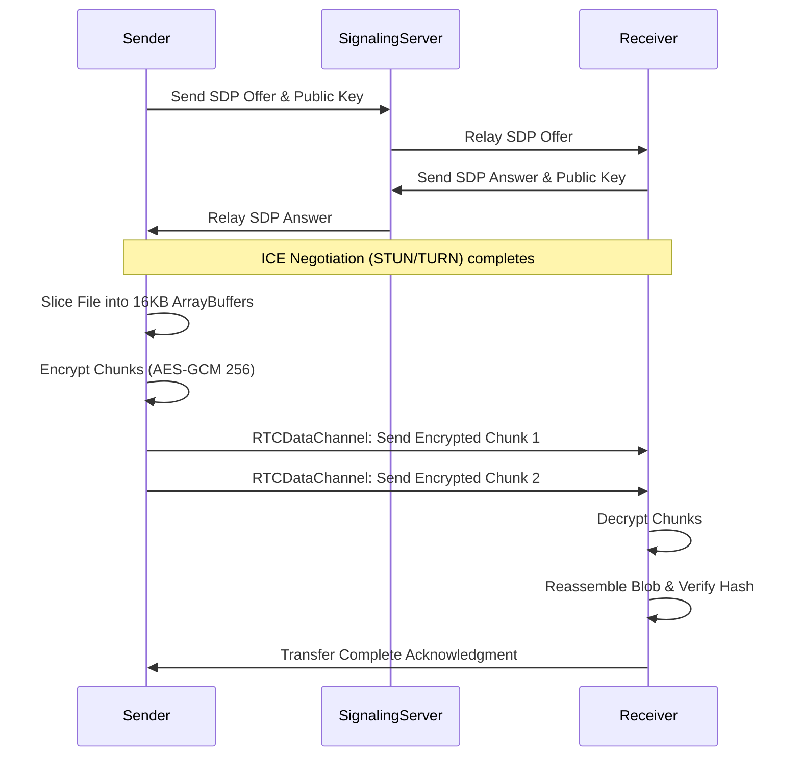

# Distributed WebRTC Mesh Networking & Peer File Sharing Protocol

## Overview

This document outlines the architecture for peer-to-peer (P2P) file sharing within the WorkSphere platform. It utilizes WebRTC `RTCDataChannel` for direct peer connections, falling back to TURN servers when strict NATs prevent direct STUN negotiation. All file payloads are strictly end-to-end encrypted (E2EE) using AES-GCM 256-bit encryption.

---

## 1. Connection & ICE Negotiation (STUN/TURN)

Before a data channel can be established, peers must discover each other and negotiate routing via the Interactive Connectivity Establishment (ICE) protocol over our WebSocket signaling server.

1. **STUN (Session Traversal Utilities for NAT):** Peers attempt to discover their public IP addresses. If both peers have open or full-cone NATs, a direct mesh connection is established.
2. **TURN (Traversal Using Relays around NAT):** If peers are behind symmetric NATs or corporate firewalls, traffic is relayed via our authorized TURN servers.
3. **Signaling:** SDP (Session Description Protocol) Offers/Answers and ICE Candidates are exchanged out-of-band via secure WebSockets prior to WebRTC connection execution.

## 2. E2EE Encryption & Key Exchange

WebRTC enforces DTLS (Datagram Transport Layer Security) by default, but WorkSphere applies an additional application-layer AES-GCM encryption step for file payloads.

- **Algorithm:** AES-GCM (Advanced Encryption Standard - Galois/Counter Mode).
- **Key Size:** 256-bit.
- **Initialization Vector (IV):** 12 bytes (96 bits), uniquely generated per file transfer using `crypto.getRandomValues()`.
- **Key Exchange:** The symmetric AES key is securely derived or exchanged out-of-band via the authenticated signaling socket before the file transfer begins. The WebRTC data channel never transmits the raw AES key.

## 3. ArrayBuffer Chunking Rules

WebRTC data channels cannot handle massive files in a single transmission. Files must be sliced into binary `ArrayBuffer` chunks.

- **Maximum Chunk Size:** `16384 bytes` (16 KB) per chunk to ensure cross-browser compatibility and prevent buffer overflow.
- **Buffer Management:** The sender must monitor the `RTCDataChannel.bufferedAmount`. If the buffer exceeds `65536 bytes` (64 KB), transmission must pause until the `bufferedamountlow` event fires.
- **Reassembly:** Chunks are prefixed with a sequence header (e.g., `[FileID: 4 bytes][Sequence: 4 bytes][Payload]`). The receiver stores chunks in memory and reassembles them using a `Blob` once all sequences are verified.

## 4. Transfer Sequence Diagram

