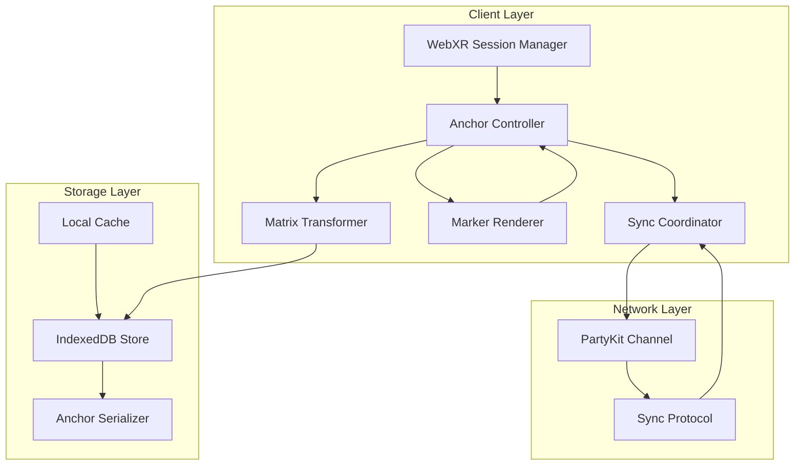
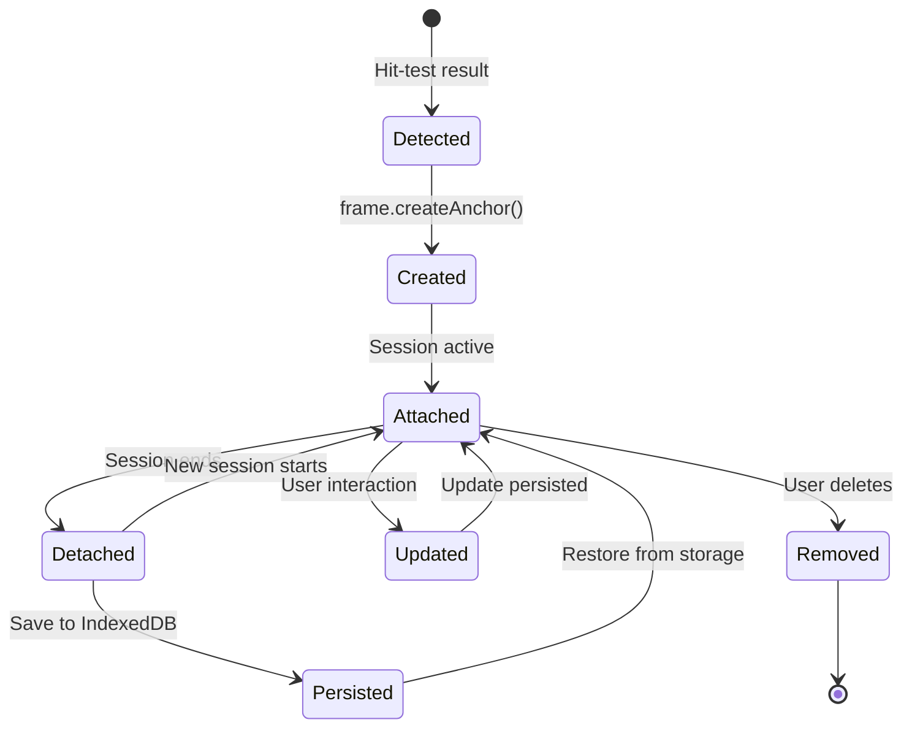
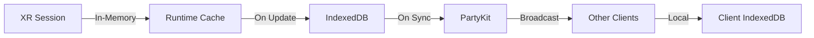
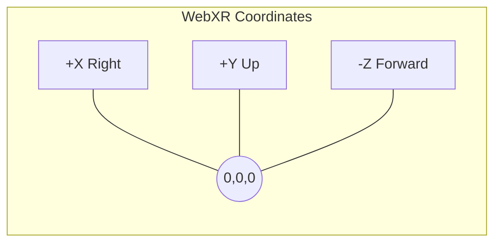
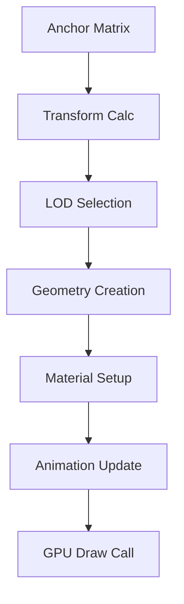
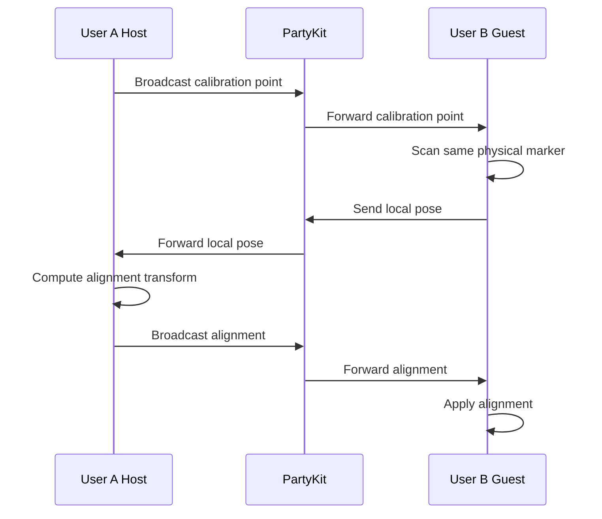

# WebXR Spatial Anchor Persistence & AR Marker Calibration Specification

## Introduction

This specification documents the design, implementation, and operational
guidelines for WebXR spatial anchor persistence, transformation matrix storage,
AR desk marker rendering, and multi-user calibration within the WorkSphere
platform. It serves as the authoritative reference for developers working with
spatial computing features.

WorkSphere leverages the WebXR Device API to provide immersive augmented
reality experiences for indoor navigation, workspace discovery, and
collaborative AR features. This document covers the complete lifecycle of
spatial anchors—from creation through persistence to multi-user
synchronization.

## Problem Statement

Indoor AR experiences face several technical challenges that this
specification addresses:

1. **Anchor Persistence**: WebXR sessions are ephemeral, but workspace
   markers must survive across sessions, device restarts, and application
   updates.
2. **Coordinate System Alignment**: Different devices and sessions establish
   independent coordinate systems that must be aligned for consistent marker
   placement.
3. **Multi-User Synchronization**: Collaborative AR requires all
   participants to see virtual markers at the same physical locations,
   despite having independent tracking systems.
4. **Device Fragmentation**: WebXR support varies significantly across
   browsers, devices, and operating systems, requiring graceful degradation
   strategies.
5. **Storage Limitations**: Browser storage quotas and XR session
   constraints require efficient persistence strategies for spatial data.

Without a standardized approach to these challenges, each AR feature would
require ad-hoc solutions, leading to inconsistent behavior, poor performance,
and maintenance overhead.

## Goals

The primary goals of this specification are:

- **Define a persistent anchor architecture** that survives session
  boundaries and device restarts
- **Standardize transformation matrix storage** for efficient spatial data
  serialization and retrieval
- **Establish AR desk marker rendering guidelines** for consistent visual
  presentation across devices
- **Enable multi-user calibration** for collaborative AR experiences
- **Provide comprehensive device compatibility guidance** for graceful
  degradation
- **Document security and privacy considerations** for spatial data handling

## Scope

This specification covers:

- WebXR Device API integration for immersive-ar sessions
- Spatial anchor creation, update, and removal workflows
- Transformation matrix computation, storage, and application
- AR desk marker geometry, materials, and animation
- Multi-user calibration protocol and synchronization
- Error handling and recovery strategies
- Performance optimization guidelines
- Security and privacy requirements

This specification does not cover:

- Underlying SLAM algorithm implementations
- Native platform ARCore/ARKit specifics
- Server-side spatial data processing
- Hardware requirements beyond WebXR API capabilities

---

## WebXR Spatial Anchor Architecture

### System Overview

The spatial anchor system consists of several interconnected components
that work together to provide persistent AR experiences:



### Component Responsibilities

| Component             | Responsibility                                    |
| --------------------- | ------------------------------------------------- |
| WebXR Session Manager | Handles session creation, feature negotiation     |
| Anchor Controller     | Manages anchor CRUD operations and state          |
| Matrix Transformer    | Computes and applies transformation matrices      |
| Marker Renderer       | Creates and animates AR desk marker visuals       |
| Sync Coordinator      | Orchestrates multi-user anchor synchronization    |
| IndexedDB Store       | Provides persistent storage for anchor data       |
| PartyKit Channel      | Enables real-time multi-user communication        |

---

## Persistent Anchor Lifecycle

### Lifecycle States

Spatial anchors transition through well-defined states during their
lifetime:



### State Descriptions

| State     | Description                                    | Duration       |
| --------- | ---------------------------------------------- | -------------- |
| Detected  | Anchor position identified via hit-test        | Transient      |
| Created   | Anchor object instantiated in XR runtime       | Until session  |
| Attached  | Anchor actively tracked in current session     | Session        |
| Detached  | Anchor not tracked but preserved in storage    | Indefinite     |
| Persisted | Anchor data saved to IndexedDB                 | Until pruned   |
| Updated   | Anchor position modified by user               | Transient      |
| Removed   | Anchor deleted from all storage and runtime    | Permanent      |

---

## Anchor Creation Flow

### Step-by-Step Process

1. **Session Initialization**: Request XR session with anchor support
2. **Reference Space Acquisition**: Obtain local reference space
3. **Hit-Test or Calibration**: Determine anchor position
4. **Anchor Instantiation**: Create anchor via XRFrame API
5. **Matrix Extraction**: Extract transformation matrix
6. **Storage Serialization**: Convert matrix to storable format
7. **IndexedDB Persistence**: Save anchor data with metadata

### Code Example

```typescript
// 1. Request session with anchor support
const session = await navigator.xr.requestSession(
  "immersive-ar",
  {
    requiredFeatures: ["local", "anchors"],
    optionalFeatures: ["hit-test"],
  }
);

// 2. Get reference space
const referenceSpace = await session
  .requestReferenceSpace("local");

// 3. Create anchor from hit-test result
const hitTestSource = await session
  .requestHitTestSource({
    space: referenceSpace,
    entityTypes: ["plane"],
  });

// In render loop:
const hitResults = frame
  .getHitTestResults(hitTestSource);

if (hitResults.length > 0) {
  const hit = hitResults[0];
  const pose = hit.getPose(referenceSpace);

  // 4. Create anchor
  const anchor = await frame.createAnchor(
    new XRRigidTransform(
      {
        x: pose.transform.position.x,
        y: pose.transform.position.y,
        z: pose.transform.position.z,
        w: 1,
      },
      pose.transform.orientation
    ),
    referenceSpace
  );

  // 5. Extract matrix
  const matrix = anchor.transform.matrix;

  // 6. Serialize and store
  await persistAnchor({
    id: crypto.randomUUID(),
    name: "Desk A-12",
    matrix: Array.from(matrix),
    createdAt: Date.now(),
    markerType: "desk",
  });
}
```

---

## Anchor Update Flow

Anchors may need updating due to:

- User repositioning via drag interaction
- Calibration refinement from multi-user alignment
- Drift correction based on tracking quality
- Metadata changes (name, status, notes)

### Update Process

```typescript
async function updateAnchor(
  anchorId: string,
  newTransform: XRRigidTransform
): Promise<void> {
  // 1. Retrieve existing anchor
  const existing = await getAnchorById(anchorId);
  if (!existing) {
    throw new Error("Anchor not found");
  }

  // 2. Compute new matrix
  const newMatrix = rigidTransformToMatrix(
    newTransform
  );

  // 3. Validate transform
  if (!isValidMatrix(newMatrix)) {
    throw new Error("Invalid transformation matrix");
  }

  // 4. Update storage
  await updateAnchorStorage(anchorId, {
    matrix: Array.from(newMatrix),
    updatedAt: Date.now(),
    version: existing.version + 1,
  });

  // 5. Broadcast update to collaborators
  await broadcastAnchorUpdate(anchorId, newMatrix);
}
```

### Conflict Resolution Strategies

When multiple users update the same anchor
simultaneously:

| Strategy         | Description                     | Use Case            |
| ---------------- | ------------------------------- | ------------------- |
| Last-Writer-Wins | Most recent timestamp wins      | Simple collab.      |
| Vector Clock     | Logical ordering of events      | Causal consistency  |
| Manual Merge     | User resolves conflicts         | Critical markers    |
| CRDT             | Conflict-free replicated data   | High-concurrency    |

---

## Anchor Removal Flow

### Soft vs Hard Deletion

| Type        | Description                                | Recoverable      |
| ----------- | ------------------------------------------ | ---------------- |
| Soft Delete | Flag anchor as deleted, retain data        | Yes (30 days)    |
| Hard Delete | Remove all data from storage               | No               |

### Removal Process

```typescript
async function removeAnchor(
  anchorId: string,
  hard: boolean = false
): Promise<void> {
  if (hard) {
    // Permanent removal
    await deleteFromIndexedDB(anchorId);
    await broadcastAnchorDeletion(anchorId);
  } else {
    // Soft delete with 30-day grace period
    await updateAnchorStorage(anchorId, {
      deleted: true,
      deletedAt: Date.now(),
      expiresAt: Date.now() + 30 * 24 * 60 * 60 * 1000,
    });
  }
}
```

---

## Persistence Strategy

### Storage Architecture

WorkSphere uses a multi-tier persistence strategy:



### IndexedDB Schema

```typescript
interface AnchorRecord {
  key: string;
  value: {
    id: string;
    name: string;
    matrix: number[];
    position: {
      x: number;
      y: number;
      z: number;
    };
    orientation: {
      x: number;
      y: number;
      z: number;
      w: number;
    };
    createdAt: number;
    updatedAt: number;
    deleted?: boolean;
    deletedAt?: number;
    expiresAt?: number;
    venueId: string;
    floor: number;
    markerType:
      | "desk"
      | "waypoint"
      | "calibration"
      | "exit";
    metadata: Record<string, unknown>;
    version: number;
  };
}
```

### Sync Protocol

Anchors synchronize via PartyKit using operational
transforms:

```typescript
interface AnchorOperation {
  type: "create" | "update" | "delete";
  anchorId: string;
  timestamp: number;
  vectorClock: Record<string, number>;
  payload: Partial<AnchorRecord["value"]>;
}
```

---

## Transformation Matrix Storage

### Matrix Format

WebXR uses 4x4 transformation matrices in
column-major order:

```text
Column-major 4x4 Matrix:
┌─────────────────────────────────────┐
│  m[0]   m[4]   m[8]    m[12]       │
│  m[1]   m[5]   m[9]    m[13]       │
│  m[2]   m[6]   m[10]   m[14]       │
│  m[3]   m[7]   m[11]   m[15]       │
└─────────────────────────────────────┘

Translation: [m[12], m[13], m[14]]
Scale: [m[0], m[5], m[10]]
Rotation: 3x3 submatrix
```

### Storage Optimization

| Format           | Size    | Precision          | Use Case           |
| ---------------- | ------- | ------------------ | ------------------ |
| Float32Array     | 64 B    | ~7 decimal digits  | Runtime, GPU       |
| Float64Array     | 128 B   | ~15 decimal digits | Calibration        |
| Quantized Int16  | 32 B    | ±32767 range       | Storage-limited    |
| Quaternion+Pos   | 28 B    | Full precision     | Compact storage    |

---

## Matrix Examples

### Identity Transform

```typescript
const identityMatrix = new Float32Array([
  1, 0, 0, 0,  // Column 0: X-axis
  0, 1, 0, 0,  // Column 1: Y-axis
  0, 0, 1, 0,  // Column 2: Z-axis
  0, 0, 0, 1,  // Column 3: Translation
]);
```

### Translation Only

```typescript
// Translate 2m right, 1m up, 3m forward
const translationMatrix = new Float32Array([
  1, 0, 0, 0,
  0, 1, 0, 0,
  0, 0, 1, 0,
  2, 1, -3, 1,  // Note: -Z is forward
]);
```

### Rotation + Translation

```typescript
// 90° rotation around Y-axis + translation
const rotY90 = new Float32Array([
  0, 0, -1, 0,
  0, 1, 0, 0,
  1, 0, 0, 0,
  5, 0, -2, 1,
]);
```

---

## Coordinate Systems

### WebXR Coordinate System

WebXR uses a right-handed coordinate system:

- **+X**: Right
- **+Y**: Up
- **-Z**: Forward (into the screen)



### Reference Space Types

| Space Type      | Origin                           | Use Case        |
| --------------- | -------------------------------- | --------------- |
| `local`         | First pose at session start      | Most AR         |
| `local-floor`   | Floor below first pose           | Room-scale      |
| `bounded-floor` | Floor with tracked boundary      | Room w/ limits  |
| `unbounded`     | Continuously drifts              | Outdoor         |

---

## World Space vs Local Space

### Definitions

| Space        | Description                              | Persistence       |
| ------------ | ---------------------------------------- | ----------------- |
| World Space  | Global coordinate system                 | Requires calib.   |
| Local Space  | Device-relative per session              | Session-only      |
| Anchor Space | Per-anchor coordinate system             | Persistent        |

### Conversion Between Spaces

```typescript
function worldToAnchor(
  worldPoint: DOMPointReadOnly,
  anchorMatrix: Float32Array
): DOMPointReadOnly {
  const invMatrix = invertMatrix(anchorMatrix);
  return transformPoint(invMatrix, worldPoint);
}

function anchorToWorld(
  anchorPoint: DOMPointReadOnly,
  anchorMatrix: Float32Array
): DOMPointReadOnly {
  return transformPoint(anchorMatrix, anchorPoint);
}
```

### Calibration for World Space

World space requires calibration against known
physical points:

1. **QR Marker Calibration**: Scan known marker
2. **Geographic Calibration**: Use GPS + coordinates
3. **Manual Calibration**: User places marker
4. **Multi-User Calibration**: Shared reference points

---

## AR Desk Marker Rendering

### Marker Types

| Type          | Geometry           | Purpose           |
| ------------- | ------------------ | ----------------- |
| Available     | Green ring+circle  | Bookable desk     |
| Occupied      | Red ring+circle    | In use            |
| Reserved      | Yellow ring+circle | User reserved     |
| Waypoint      | Blue arrow         | Navigation guide  |
| Exit          | Gray door icon     | Emergency exit    |

### Rendering Pipeline



### Three.js Implementation

```typescript
function createDeskMarker(
  status: "available" | "occupied" | "reserved"
): THREE.Group {
  const group = new THREE.Group();

  // Outer ring
  const ringGeometry = new THREE.RingGeometry(
    0.3, 0.35, 64
  );
  const ringMaterial = new THREE.MeshBasicMaterial({
    color:
      status === "available"
        ? 0x22c55e
        : status === "occupied"
          ? 0xef4444
          : 0xeab308,
    side: THREE.DoubleSide,
    transparent: true,
    opacity: 0.8,
  });
  const ring = new THREE.Mesh(
    ringGeometry,
    ringMaterial
  );
  ring.rotation.x = -Math.PI / 2;
  group.add(ring);

  // Inner circle
  const circleGeometry = new THREE.CircleGeometry(
    0.28,
    64
  );
  const circleMaterial =
    new THREE.MeshBasicMaterial({
      color:
        status === "available"
          ? 0x16a34a
          : status === "occupied"
            ? 0xdc2626
            : 0xca8a04,
      transparent: true,
      opacity: 0.6,
    });
  const circle = new THREE.Mesh(
    circleGeometry,
    circleMaterial
  );
  circle.rotation.x = -Math.PI / 2;
  circle.position.y = 0.001;
  group.add(circle);

  return group;
}
```

### Performance Guidelines

| Metric              | Target     | Measurement       |
| ------------------- | ---------- | ----------------- |
| Polygon per marker  | < 500 tris | Geometry          |
| Draw calls/frame    | < 20       | All markers       |
| Texture memory      | < 10 MB    | Materials         |
| Update frequency    | 30 Hz      | Animation loop    |

---

## Multi-user Calibration

### Calibration Workflow



### Alignment Transform Calculation

```typescript
function computeAlignmentTransform(
  hostAnchor: AnchorRecord,
  guestAnchor: AnchorRecord
): Float32Array {
  // Both users scanned same marker
  // T_align = T_host * T_guest^-1
  const guestInverse = invertMatrix(
    new Float32Array(guestAnchor.matrix)
  );
  return multiplyMatrices(
    new Float32Array(hostAnchor.matrix),
    guestInverse
  );
}
```

### Calibration Quality Metrics

| Metric              | Threshold      | Action if Failed  |
| ------------------- | -------------- | ----------------- |
| Reprojection error  | < 2 cm         | Reject calib.     |
| Tracking confidence | > 0.8          | Warn user         |
| Marker distance     | 0.5 - 3.0 m    | Reposition        |
| Ambient light       | > 100 lux      | Warn accuracy     |

---

## Synchronization Workflow

### Message Types

| Message              | Direction              | Payload           |
| -------------------- | ---------------------- | ----------------- |
| `anchor:create`      | Client → Server → All  | Full anchor data  |
| `anchor:update`      | Client → Server → All  | Changed fields    |
| `anchor:delete`      | Client → Server → All  | Anchor ID         |
| `anchor:sync`        | Server → Client        | Full snapshot     |
| `calibration:point`  | Client → Server → All  | Marker pose       |
| `calibration:align`  | Client → Server → All  | Alignment matrix  |

### Synchronization Conflict Resolution

```typescript
function resolveConflict(
  local: AnchorOperation,
  remote: AnchorOperation
): AnchorOperation {
  // Vector clock comparison
  const localSum = Object.values(
    local.vectorClock
  ).reduce((a, b) => a + b, 0);

  const remoteSum = Object.values(
    remote.vectorClock
  ).reduce((a, b) => a + b, 0);

  if (remoteSum > localSum) return remote;
  if (remoteSum < localSum) return local;

  // Tie-break by timestamp
  return remote.timestamp > local.timestamp
    ? remote
    : local;
}
```

---

## Error Handling

### Error Categories

| Category | Examples                     | Recovery Strategy    |
| -------- | ---------------------------- | -------------------- |
| Session  | NotSupportedError            | Fallback to 2D       |
| Anchor   | QuotaExceededError           | Prune old anchors    |
| Sync     | Network timeout              | Queue + backoff      |
| Storage  | IndexedDB full               | Clear cache          |

### Recovery Implementation

```typescript
async function safeCreateAnchor(
  frame: XRFrame,
  referenceSpace: XRReferenceSpace,
  pose: XRRigidTransform
): Promise<XRAnchor | null> {
  try {
    return await frame.createAnchor(
      pose,
      referenceSpace
    );
  } catch (error) {
    if (error instanceof DOMException) {
      switch (error.name) {
        case "NotSupportedError":
          console.warn("Anchors not supported");
          return null;
        case " QuotaExceededError":
          await pruneOldAnchors();
          return await frame.createAnchor(
            pose,
            referenceSpace
          );
      }
    }
    throw error;
  }
}
```

---

## Performance Considerations

### Profiling Metrics

| Metric                  | Target   | Measurement Method     |
| ----------------------- | -------- | ---------------------- |
| Anchor creation latency | < 50 ms  | Performance.now()      |
| Matrix computation      | < 5 ms   | Render loop timing     |
| Sync round-trip         | < 100 ms | PartyKit metrics       |
| Storage read/write      | < 10 ms  | IndexedDB performance  |
| Memory per anchor       | < 2 KB   | Heap snapshot          |

### Optimization Strategies

1. **LOD System**: Reduce marker complexity at distance
2. **Frustum Culling**: Only render visible markers
3. **Batch Updates**: Group multiple anchor updates
4. **Lazy Loading**: Load markers on-demand
5. **Compression**: Use quantized matrices

### Memory Management

```typescript
class AnchorRenderer {
  private pool: Map<string, THREE.Group> = new Map();
  private maxSize = 50;

  acquire(id: string): THREE.Group {
    if (this.pool.has(id)) {
      return this.pool.get(id)!;
    }

    if (this.pool.size >= this.maxSize) {
      this.evictOldest();
    }

    const marker = createDeskMarker();
    this.pool.set(id, marker);
    return marker;
  }

  release(id: string): void {
    const marker = this.pool.get(id);
    if (marker) {
      marker.visible = false;
      this.pool.delete(id);
    }
  }

  private evictOldest(): void {
    const first = this.pool.keys().next().value;
    if (first) this.release(first);
  }
}
```

---

## Security and Privacy

### Data Sensitivity

| Data Type              | Sensitivity | Protection Required |
| ---------------------- | ----------- | ------------------- |
| Anchor positions       | Medium      | Encrypted storage   |
| Calibration data       | High        | E2E encryption      |
| Venue floor plans      | High        | Access control      |
| Device tracking        | Very High   | Minimal retention   |

### Security Requirements

1. **HTTPS Only**: All WebXR sessions require secure
   context
2. **User Consent**: Explicit permission before anchor
   creation
3. **Data Minimization**: Store only required data
4. **Retention Limits**: Auto-delete after period
5. **Access Control**: Venue-based permissions

### Privacy Guidelines

```typescript
interface PrivacySettings {
  anchorRetentionDays: number;
  syncEnabled: boolean;
  anonymousCalibration: boolean;
  dataEncryption: "AES-GCM" | "None";
}
```

---

## Browser Compatibility Table

| Browser          | WebXR    | Anchors | Hit-Test | Notes           |
| ---------------- | -------- | ------- | -------- | --------------- |
| Chrome 79+       | Full     | Yes     | Yes      | Primary         |
| Edge 79+         | Full     | Yes     | Yes      | Chromium-based  |
| Samsung Internet | Partial  | Varies  | Varies   | Device-dep.     |
| Firefox          | Exper.   | No      | No       | Behind flag     |
| Safari (iOS)     | Limited  | No      | No       | No immersive    |
| Quest Browser    | Full     | Yes     | Yes      | Native XR       |

---

## Device Compatibility Table

| Device Category     | Immersive AR | Anchors | Hit-Test | Performance |
| ------------------- | ------------ | ------- | -------- | ----------- |
| Android (ARCore)    | Yes          | Yes     | Yes      | High        |
| Android (no ARCore) | Limited      | No      | No       | Low         |
| iOS                 | No           | No      | No       | N/A         |
| Desktop             | No           | No      | No       | N/A         |
| VR Headsets         | Yes          | Yes     | Yes      | High        |
| HoloLens            | Yes          | Yes     | Yes      | High        |

---

## Best Practices

### Anchor Management

- **Use meaningful names**: `"Desk A-12"` not `"anchor-001"`
- **Set appropriate retention**: Balance persistence with limits
- **Validate transforms**: Check for NaN/infinity
- **Batch operations**: Group updates for efficiency

### Matrix Operations

- **Prefer Float32Array**: Better performance
- **Avoid unnecessary inversions**: Cache inverses
- **Use column-major order**: Match WebXR convention
- **Validate before GPU upload**: Ensure valid transforms

### Multi-User Sync

- **Implement conflict resolution**: Don't assume last-write
- **Handle disconnections**: Queue during network issues
- **Use vector clocks**: Maintain causal ordering
- **Broadcast incrementally**: Send deltas not full state

### Performance

- **Profile regularly**: Monitor count and performance
- **Implement LOD**: Reduce complexity at distance
- **Pool objects**: Reuse geometries and materials
- **Use Web Workers**: Offload matrix computation

---

## Future Improvements

### Short-term (3-6 months)

- [ ] Implement anchor drift correction
- [ ] Add visual calibration feedback
- [ ] Support cloud anchor backup
- [ ] Optimize sync for mobile networks

### Medium-term (6-12 months)

- [ ] Add semantic label recognition
- [ ] Implement automatic venue mapping
- [ ] Support cross-platform anchor sharing
- [ ] Add anchor grouping and hierarchies

### Long-term (12+ months)

- [ ] ML-based drift correction
- [ ] Collaborative 3D reconstruction
- [ ] Persistent world-scale AR maps
- [ ] Integration with native AR platforms

---

## Conclusion

This specification provides a comprehensive framework
for implementing persistent spatial anchors in WebXR
applications. By following these guidelines, developers
can create reliable, performant, and secure AR
experiences that work across diverse devices and
support collaborative use cases.

The key takeaways are:

1. **Persistence requires planning**: Design storage
   strategies early
2. **Calibration is critical**: Multi-user alignment
   needs careful implementation
3. **Performance matters**: Optimize for mobile and
   limited bandwidth
4. **Privacy is paramount**: Treat spatial data as
   sensitive
5. **Graceful degradation**: Always provide fallbacks

For questions or contributions, refer to the WebXR
specification and WebXR Device API documentation.
