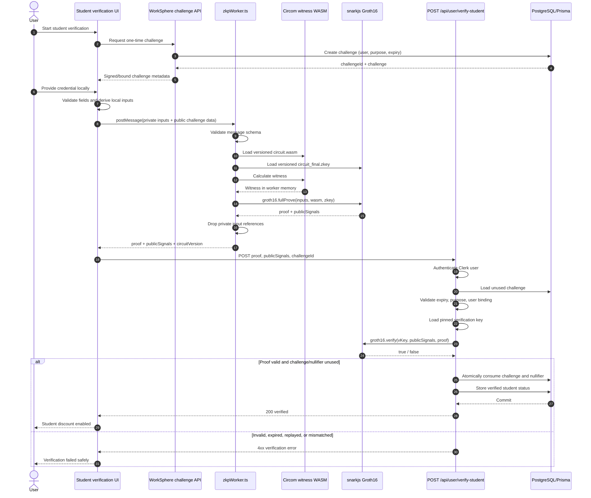

# Zero-Knowledge Student Discount Verification Pipeline

This guide documents a privacy-preserving student-discount verification design
for WorkSphere using Circom circuits, `snarkjs`, a browser Web Worker
(`zkpWorker.ts`), and the `/api/user/verify-student` API.

The goal is to let a user prove that they satisfy a student-eligibility policy
without uploading the underlying student credential, enrollment record, or
private circuit witness to the WorkSphere server.

> This document describes the intended protocol and API contract. Keep the
> circuit, worker implementation, verification key, and API route synchronized
> with this guide whenever the implementation changes.

---

## 1. Goals

The verification pipeline should:

- prove that a user satisfies a student-discount policy;
- generate the witness and proof on the user's device;
- send only the proof and public signals to the WorkSphere API;
- verify the proof against a pinned verification key;
- bind the proof to the authenticated user and intended action;
- prevent replay of an already-consumed proof;
- avoid storing raw student IDs, dates of birth, documents, or private witness
  values;
- return a short-lived or persisted verification result suitable for applying
  a discount.

The pipeline should not claim that zero knowledge proves facts that are not
actually constrained by the circuit. The verifier learns only that the supplied
proof satisfies the compiled circuit and that its public signals match the
verification request.

---

## 2. Terminology

| Term                  | Meaning                                                             |
| --------------------- | ------------------------------------------------------------------- |
| Circuit               | Circom program defining the eligibility constraints                 |
| Private signal        | Witness value known to the prover but not sent as a public input    |
| Public signal         | Value revealed to and checked by the verifier                       |
| Witness               | Complete assignment satisfying the circuit constraints              |
| Proving key (`.zkey`) | Artifact used to create the proof                                   |
| Verification key      | JSON artifact used to verify the proof                              |
| Proof                 | Succinct cryptographic object generated by `snarkjs`                |
| Nullifier             | Deterministic, privacy-preserving value used to prevent replay      |
| Commitment            | Hash that binds hidden values without revealing them                |
| Nonce/challenge       | Server-generated value binding a proof to one verification attempt  |
| Groth16               | Common succinct non-interactive proof system supported by `snarkjs` |

---

## 3. High-level architecture

```text
┌───────────────────────────────────────────────────────────────┐
│ Browser                                                       │
│                                                               │
│ Student credential input                                      │
│       │                                                       │
│       ▼                                                       │
│ Page / verification component                                 │
│       │ postMessage()                                         │
│       ▼                                                       │
│ zkpWorker.ts                                                  │
│   ├── load circuit.wasm                                       │
│   ├── load circuit_final.zkey                                 │
│   ├── build private/public circuit inputs                     │
│   ├── calculate witness                                      │
│   └── snarkjs.groth16.fullProve()                            │
│       │                                                       │
│       └── proof + publicSignals                               │
└───────────────────────────┬───────────────────────────────────┘
                            │ HTTPS POST
                            ▼
┌───────────────────────────────────────────────────────────────┐
│ POST /api/user/verify-student                                 │
│   ├── authenticate Clerk user                                 │
│   ├── validate request schema                                 │
│   ├── load pinned verification_key.json                       │
│   ├── validate challenge, purpose, expiry, and nullifier      │
│   ├── snarkjs.groth16.verify()                                │
│   ├── consume nullifier/challenge atomically                  │
│   └── persist verification outcome                            │
└───────────────────────────┬───────────────────────────────────┘
                            │
                            ▼
                  Student discount enabled
```

Private credential values remain inside the browser/worker. The server receives
only the proof, public signals, and request metadata required by the API
contract.

---

## 4. Recommended circuit statement

The exact Circom circuit determines what the proof means.

A representative statement is:

> “I know a valid student credential secret whose commitment is authorized,
> whose enrollment expiration is not earlier than the policy date, and whose
> nullifier is correctly derived for this WorkSphere user and verification
> challenge.”

Possible private inputs:

```text
credentialSecret
institutionSecret
studentIdentifier
enrollmentExpiry
issuerSignatureWitness or Merkle authentication path
```

Possible public inputs:

```text
credentialRoot or issuer commitment root
minimumEnrollmentDate
userBinding
challengeHash
purposeHash
nullifierHash
circuitVersion
```

Only values declared public by the circuit are revealed to the verifier.

### Example conceptual Circom interface

```circom
pragma circom 2.1.9;

template StudentEligibility() {
    // Private witness values
    signal input credentialSecret;
    signal input studentIdentifier;
    signal input enrollmentExpiry;

    // Public verification inputs
    signal input credentialRoot;
    signal input minimumEnrollmentDate;
    signal input userBinding;
    signal input challengeHash;
    signal input purposeHash;

    // Public output
    signal output nullifierHash;

    // Conceptual constraints:
    // 1. Credential commitment belongs to an accepted issuer/root.
    // 2. enrollmentExpiry >= minimumEnrollmentDate.
    // 3. userBinding and challengeHash are included in the nullifier domain.
    // 4. nullifierHash is derived from private credential values plus
    //    user/purpose/challenge binding.
    //
    // Production circuits must implement these constraints using
    // circuit-compatible hash, comparison, signature, or Merkle components.
}

component main {public [
    credentialRoot,
    minimumEnrollmentDate,
    userBinding,
    challengeHash,
    purposeHash
]} = StudentEligibility();
```

This is an interface illustration, not a drop-in security-reviewed circuit.

---

## 5. Public-signal ordering

`snarkjs` returns public signals as an ordered array. The verifier must use the
same ordering produced by the compiled circuit and verification key.

Define the mapping once:

```ts
export const STUDENT_PUBLIC_SIGNAL_INDEX = {
  credentialRoot: 0,
  minimumEnrollmentDate: 1,
  userBinding: 2,
  challengeHash: 3,
  purposeHash: 4,
  nullifierHash: 5,
  circuitVersion: 6,
} as const;
```

Do not silently change this mapping. A circuit rebuild can change signal order.

Recommended safeguards:

- store a circuit identifier and version;
- validate the expected number of public signals;
- parse every field as a bounded field-element string;
- reject unknown circuit versions;
- pin the matching verification key;
- add fixture tests with known valid and invalid proofs.

---

## 6. `zkpWorker.ts` responsibilities

Proof generation is CPU- and memory-intensive. Run it in a Web Worker so the
main UI remains responsive.

The worker should:

1. receive validated proof-generation input;
2. load the versioned `.wasm` and `.zkey` artifacts;
3. build the circuit input object;
4. generate the witness and proof;
5. return only `proof` and `publicSignals`;
6. clear references to credential input after completion;
7. return a stable, non-sensitive error code on failure.

The worker should not:

- send private witness values to the API;
- log raw credential fields;
- store the credential in local storage;
- cache private inputs in IndexedDB;
- include private values in error messages;
- fetch proof artifacts from an untrusted or user-controlled origin.

---

## 7. Proof-generation sequence diagram



---

## 8. Suggested worker message contract

### Request

```ts
export type StudentProofWorkerRequest = {
  type: "GENERATE_STUDENT_PROOF";
  requestId: string;
  circuitVersion: string;

  artifacts: {
    wasmUrl: string;
    provingKeyUrl: string;
  };

  privateInputs: {
    credentialSecret: string;
    studentIdentifier: string;
    enrollmentExpiry: string;
    institutionSecret?: string;
    merklePathElements?: string[];
    merklePathIndices?: string[];
  };

  publicInputs: {
    credentialRoot: string;
    minimumEnrollmentDate: string;
    userBinding: string;
    challengeHash: string;
    purposeHash: string;
  };
};
```

### Success response

```ts
export type StudentProofWorkerSuccess = {
  type: "STUDENT_PROOF_READY";
  requestId: string;
  circuitVersion: string;
  proof: unknown;
  publicSignals: string[];
};
```

### Failure response

```ts
export type StudentProofWorkerFailure = {
  type: "STUDENT_PROOF_FAILED";
  requestId: string;
  code:
    | "INVALID_INPUT"
    | "ARTIFACT_LOAD_FAILED"
    | "WITNESS_GENERATION_FAILED"
    | "PROOF_GENERATION_FAILED"
    | "UNSUPPORTED_CIRCUIT_VERSION";
};
```

Do not return credential values or stack traces to the UI in production.

---

## 9. Example `zkpWorker.ts`

```ts
/// <reference lib="webworker" />

import { groth16 } from "snarkjs";

type WorkerRequest = StudentProofWorkerRequest;
type WorkerResponse = StudentProofWorkerSuccess | StudentProofWorkerFailure;

const workerScope = self as unknown as DedicatedWorkerGlobalScope;

workerScope.onmessage = async (event: MessageEvent<WorkerRequest>) => {
  const message = event.data;

  if (!message || message.type !== "GENERATE_STUDENT_PROOF") {
    return;
  }

  const { requestId, circuitVersion, artifacts, privateInputs, publicInputs } =
    message;

  try {
    validateWorkerRequest(message);

    const circuitInput = {
      credentialSecret: privateInputs.credentialSecret,
      studentIdentifier: privateInputs.studentIdentifier,
      enrollmentExpiry: privateInputs.enrollmentExpiry,

      credentialRoot: publicInputs.credentialRoot,
      minimumEnrollmentDate: publicInputs.minimumEnrollmentDate,
      userBinding: publicInputs.userBinding,
      challengeHash: publicInputs.challengeHash,
      purposeHash: publicInputs.purposeHash,
    };

    const { proof, publicSignals } = await groth16.fullProve(
      circuitInput,
      artifacts.wasmUrl,
      artifacts.provingKeyUrl,
    );

    const response: StudentProofWorkerSuccess = {
      type: "STUDENT_PROOF_READY",
      requestId,
      circuitVersion,
      proof,
      publicSignals: publicSignals.map(String),
    };

    workerScope.postMessage(response);
  } catch (error) {
    const response: StudentProofWorkerFailure = {
      type: "STUDENT_PROOF_FAILED",
      requestId,
      code: classifyProofError(error),
    };

    workerScope.postMessage(response);
  }
};
```

Security notes:

- artifact URLs should come from application-controlled configuration;
- validate message structure before proof generation;
- terminate the worker after a sensitive one-shot flow when practical;
- never include the credential input in analytics or telemetry.

---

## 10. Main-thread worker lifecycle

```ts
export function generateStudentProof(
  request: StudentProofWorkerRequest,
): Promise<StudentProofWorkerSuccess> {
  return new Promise((resolve, reject) => {
    const worker = new Worker(
      new URL("../workers/zkpWorker.ts", import.meta.url),
      {
        type: "module",
      },
    );

    const timeout = window.setTimeout(() => {
      worker.terminate();
      reject(new Error("Student proof generation timed out"));
    }, 120_000);

    worker.onmessage = (event: MessageEvent<WorkerResponse>) => {
      const response = event.data;

      if (response.requestId !== request.requestId) {
        return;
      }

      window.clearTimeout(timeout);
      worker.terminate();

      if (response.type === "STUDENT_PROOF_READY") {
        resolve(response);
        return;
      }

      reject(new Error(response.code));
    };

    worker.onerror = () => {
      window.clearTimeout(timeout);
      worker.terminate();

      reject(new Error("Student proof worker failed"));
    };

    worker.postMessage(request);
  });
}
```

Do not keep the one-shot worker alive after it has processed sensitive inputs
unless repeated proofs are required and the lifecycle is carefully controlled.

---

## 11. Challenge binding

A proof that is valid forever and is not bound to the current user or request
can be replayed.

Recommended server challenge record:

```ts
type StudentVerificationChallenge = {
  id: string;
  userId: string;
  purpose: "STUDENT_DISCOUNT";
  challengeHash: string;
  expiresAt: Date;
  consumedAt: Date | null;
};
```

The challenge should be:

- generated by a cryptographically secure random source;
- associated with the authenticated user;
- associated with the verification purpose;
- short-lived;
- consumed once;
- included in the circuit's public statement or a public hash constrained by
  the circuit.

The public `userBinding` should be derived from the authenticated user and
application domain without revealing unnecessary identity data.

Conceptual derivation:

```text
userBinding =
Poseidon(
  domainTag,
  hash(clerkUserId)
)
```

Use the exact circuit-compatible hash function expected by Circom.

---

## 12. Nullifier design

A nullifier prevents reuse while avoiding storage of the private credential.

Conceptually:

```text
nullifierHash =
Hash(
  credentialSecret,
  userBinding,
  purposeHash,
  challengeHash,
  circuitVersion
)
```

The circuit must constrain the nullifier derivation. The server must reject a
previously consumed nullifier in the relevant scope.

Possible scopes:

| Scope                | Result                                                                             |
| -------------------- | ---------------------------------------------------------------------------------- |
| Per challenge        | Proof cannot be replayed for the same challenge                                    |
| Per user and purpose | Credential can verify one account for one purpose                                  |
| Per discount period  | User can reverify after a defined term                                             |
| Global credential    | Prevents one credential from being used across accounts, but increases linkability |

Choose the least linkable scope that still enforces the business policy.

Store only the public nullifier hash, not the secret preimage.

---

## 13. API contract: `POST /api/user/verify-student`

### Authentication

The request must use an authenticated WorkSphere session.

The API must derive the user ID from the trusted server-side authentication
context. It must not accept a client-selected `userId` as authority.

### Request headers

```http
POST /api/user/verify-student HTTP/1.1
Content-Type: application/json
```

Authentication is provided by the application's normal Clerk session/cookie
handling.

### Request body

```json
{
  "challengeId": "challenge_123",
  "circuitVersion": "student-eligibility-v1",
  "proof": {
    "pi_a": ["...", "...", "1"],
    "pi_b": [
      ["...", "..."],
      ["...", "..."],
      ["1", "0"]
    ],
    "pi_c": ["...", "...", "1"],
    "protocol": "groth16",
    "curve": "bn128"
  },
  "publicSignals": ["...", "...", "...", "...", "...", "...", "1"]
}
```

### Suggested validation schema

```ts
import { z } from "zod";

const fieldElementSchema = z
  .string()
  .regex(/^[0-9]+$/)
  .max(100);

const groth16ProofSchema = z.object({
  pi_a: z.array(fieldElementSchema).length(3),
  pi_b: z.array(z.array(fieldElementSchema).length(2)).length(3),
  pi_c: z.array(fieldElementSchema).length(3),
  protocol: z.literal("groth16"),
  curve: z.enum(["bn128", "bn254"]),
});

export const verifyStudentRequestSchema = z.object({
  challengeId: z.string().min(1).max(128),
  circuitVersion: z.string().min(1).max(64),
  proof: groth16ProofSchema,
  publicSignals: z.array(fieldElementSchema).min(1).max(32),
});
```

Adjust the exact proof schema to match the installed `snarkjs` representation.

---

## 14. Successful response

```http
HTTP/1.1 200 OK
Content-Type: application/json
Cache-Control: no-store
```

```json
{
  "verified": true,
  "studentStatus": "VERIFIED",
  "verifiedAt": "2026-07-23T12:00:00.000Z",
  "expiresAt": "2027-01-31T23:59:59.000Z",
  "discount": {
    "eligible": true,
    "code": "STUDENT"
  }
}
```

Recommended properties:

- do not return the nullifier;
- do not echo the proof;
- do not echo public signals unless needed for debugging in development;
- set `Cache-Control: no-store`;
- avoid exposing internal verification-key paths or cryptographic errors.

---

## 15. Error responses

### Invalid request

```http
HTTP/1.1 400 Bad Request
```

```json
{
  "verified": false,
  "error": {
    "code": "INVALID_REQUEST",
    "message": "The verification request is invalid."
  }
}
```

### Invalid proof

```http
HTTP/1.1 422 Unprocessable Entity
```

```json
{
  "verified": false,
  "error": {
    "code": "INVALID_PROOF",
    "message": "The student proof could not be verified."
  }
}
```

### Expired or consumed challenge

```http
HTTP/1.1 409 Conflict
```

```json
{
  "verified": false,
  "error": {
    "code": "CHALLENGE_INVALID",
    "message": "The verification challenge has expired or was already used."
  }
}
```

### Nullifier replay

```http
HTTP/1.1 409 Conflict
```

```json
{
  "verified": false,
  "error": {
    "code": "PROOF_REPLAYED",
    "message": "This proof cannot be reused."
  }
}
```

### Unsupported circuit

```http
HTTP/1.1 400 Bad Request
```

```json
{
  "verified": false,
  "error": {
    "code": "UNSUPPORTED_CIRCUIT_VERSION",
    "message": "The proof uses an unsupported circuit version."
  }
}
```

### Authentication required

```http
HTTP/1.1 401 Unauthorized
```

```json
{
  "verified": false,
  "error": {
    "code": "UNAUTHENTICATED",
    "message": "Sign in before verifying student status."
  }
}
```

---

## 16. Verification route sequence

The API should perform these steps in order:

1. authenticate the user;
2. enforce request size and rate limits;
3. parse and validate JSON;
4. look up the supported circuit version;
5. load the challenge by ID;
6. ensure the challenge belongs to the authenticated user;
7. ensure the challenge purpose is `STUDENT_DISCOUNT`;
8. ensure it has not expired or been consumed;
9. decode and validate public-signal ordering;
10. compare the public user binding to the authenticated user;
11. compare challenge and purpose public signals;
12. reject a consumed nullifier;
13. run `groth16.verify`;
14. atomically consume the challenge and nullifier;
15. update student-verification status;
16. return a non-sensitive response.

Cryptographic verification alone is insufficient if the public signals are not
checked against server-side context.

---

## 17. Example route structure

```ts
import { auth } from "@clerk/nextjs/server";
import { groth16 } from "snarkjs";
import { NextResponse } from "next/server";

import { prisma } from "@/lib/prisma";
import { verifyStudentRequestSchema } from "@/lib/zk/studentVerificationSchema";
import {
  getVerificationKey,
  parseStudentPublicSignals,
} from "@/lib/zk/studentVerification";

export async function POST(request: Request) {
  const { userId } = await auth();

  if (!userId) {
    return NextResponse.json(
      {
        verified: false,
        error: {
          code: "UNAUTHENTICATED",
          message: "Sign in before verifying student status.",
        },
      },
      {
        status: 401,
        headers: {
          "Cache-Control": "no-store",
        },
      },
    );
  }

  const parsed = verifyStudentRequestSchema.safeParse(await request.json());

  if (!parsed.success) {
    return NextResponse.json(
      {
        verified: false,
        error: {
          code: "INVALID_REQUEST",
          message: "The verification request is invalid.",
        },
      },
      { status: 400 },
    );
  }

  const { challengeId, circuitVersion, proof, publicSignals } = parsed.data;

  const circuit = getSupportedCircuit(circuitVersion);

  if (!circuit) {
    return verificationError(
      400,
      "UNSUPPORTED_CIRCUIT_VERSION",
      "The proof uses an unsupported circuit version.",
    );
  }

  const signals = parseStudentPublicSignals(publicSignals, circuit);

  const verificationKey = await getVerificationKey(circuit);

  const cryptographicallyValid = await groth16.verify(
    verificationKey,
    publicSignals,
    proof,
  );

  if (!cryptographicallyValid) {
    return verificationError(
      422,
      "INVALID_PROOF",
      "The student proof could not be verified.",
    );
  }

  const result = await prisma.$transaction(
    async (tx) => {
      const challenge = await tx.studentVerificationChallenge.findUnique({
        where: {
          id: challengeId,
        },
      });

      validateChallenge({
        challenge,
        authenticatedUserId: userId,
        signals,
        circuitVersion,
      });

      const existingNullifier = await tx.studentProofNullifier.findUnique({
        where: {
          nullifierHash: signals.nullifierHash,
        },
      });

      if (existingNullifier) {
        throw new ProofReplayError();
      }

      await tx.studentProofNullifier.create({
        data: {
          nullifierHash: signals.nullifierHash,
          purpose: "STUDENT_DISCOUNT",
          circuitVersion,
        },
      });

      await tx.studentVerificationChallenge.update({
        where: {
          id: challengeId,
        },
        data: {
          consumedAt: new Date(),
        },
      });

      return tx.user.update({
        where: {
          clerkId: userId,
        },
        data: {
          studentVerified: true,
          studentVerifiedAt: new Date(),
        },
      });
    },
    {
      isolationLevel: "Serializable",
    },
  );

  return NextResponse.json(
    {
      verified: true,
      studentStatus: "VERIFIED",
      verifiedAt: result.studentVerifiedAt,
      discount: {
        eligible: true,
        code: "STUDENT",
      },
    },
    {
      status: 200,
      headers: {
        "Cache-Control": "no-store",
      },
    },
  );
}
```

This is an architectural example. Match model names and Prisma transaction
configuration to the actual repository.

---

## 18. Verification key management

The verification key determines which circuit statement the server accepts.

Requirements:

- pin verification keys by circuit version;
- include them in trusted application artifacts or an integrity-protected
  deployment bundle;
- do not accept a verification key from the client;
- do not fetch it from a user-controlled URL;
- publish hashes for circuit artifacts;
- review and version circuit changes;
- retain old keys only while old proofs remain intentionally supported.

Example registry:

```ts
export const STUDENT_CIRCUITS = {
  "student-eligibility-v1": {
    verificationKeyPath: "zk/student-eligibility-v1/verification_key.json",
    publicSignalCount: 7,
    artifactHash: "sha256:...",
  },
} as const;
```

Groth16 proving keys are circuit-specific and depend on a trusted setup.
Production use requires a properly generated and verified ceremony output.

---

## 19. Artifact integrity

Version and integrity-check:

```text
student_eligibility.wasm
student_eligibility_final.zkey
verification_key.json
student_eligibility.r1cs
manifest.json
```

Example manifest:

```json
{
  "circuitVersion": "student-eligibility-v1",
  "proofSystem": "groth16",
  "curve": "bn128",
  "publicSignalCount": 7,
  "artifacts": {
    "wasm": {
      "path": "/zk/student-eligibility-v1/circuit.wasm",
      "sha256": "..."
    },
    "zkey": {
      "path": "/zk/student-eligibility-v1/circuit_final.zkey",
      "sha256": "..."
    },
    "verificationKey": {
      "path": "server-only/verification_key.json",
      "sha256": "..."
    }
  }
}
```

The browser must receive the proving artifacts, but the server should use its
own trusted verification-key copy.

---

## 20. Privacy guarantees

Assuming a sound circuit, valid setup, secure implementation, and appropriate
public-signal design, the pipeline can provide these guarantees.

### 20.1 Private witness confidentiality

The proof does not require sending the complete witness to the verifier.

The WorkSphere API does not need to receive:

- raw student identifier;
- credential secret;
- enrollment document;
- issuer secret;
- Merkle authentication path, when private;
- exact expiration date, when only a threshold comparison is public;
- any other signal intentionally kept private by the circuit.

### 20.2 Statement verification

A valid proof demonstrates that the prover knows witness values satisfying the
circuit constraints and that the disclosed public signals match those used in
proof generation.

The proof does not independently demonstrate that:

- the credential issuer is trustworthy;
- the circuit contains the intended policy;
- the user did not compromise an issuer;
- the proving key was created securely;
- hidden values are meaningful unless the circuit binds them to trusted data.

### 20.3 Non-interactive verification

After proof generation, verification can be performed using:

```text
verification key + proof + public signals
```

The verifier does not need an interactive challenge-response conversation for
the cryptographic verification itself. WorkSphere should still use a
server-generated nonce to bind the non-interactive proof to a fresh
application request and prevent replay.

### 20.4 Data minimization

The server should persist only what is needed:

```text
authenticated user ID
verification status
verification timestamp
expiry/renewal timestamp
circuit version
public nullifier hash
challenge-consumption state
minimal audit outcome
```

Do not persist the proof indefinitely unless there is a documented reason.

### 20.5 Unlinkability limitations

Proofs can become linkable if they expose a stable public value such as:

- a global credential commitment;
- a global nullifier;
- a stable student identifier hash;
- a reusable institution-specific pseudonym.

Use domain-separated, purpose-scoped nullifiers and disclose the minimum number
of public signals.

---

## 21. Privacy limitations

Zero knowledge does not hide public signals.

The verifier can observe every public value in `publicSignals`, including any:

- institution identifier;
- policy date;
- credential root;
- nullifier;
- user binding;
- circuit version;
- challenge hash;
- purpose identifier.

Public signals may permit correlation across requests. Review them as carefully
as normal API data.

Browser-side risks also remain:

- malicious extensions;
- compromised application JavaScript;
- supply-chain attacks;
- analytics accidentally capturing inputs;
- memory inspection on a compromised device;
- malicious proof artifacts.

ZK protects the proof protocol; it does not make a compromised client safe.

---

## 22. Threat model

| Threat                           | Required mitigation                                           |
| -------------------------------- | ------------------------------------------------------------- |
| Proof replay                     | One-time challenge plus scoped nullifier                      |
| Proof for another user           | Public user binding checked against authenticated user        |
| Proof for another action         | Public purpose/domain binding                                 |
| Expired challenge                | Server-side expiry check                                      |
| Client-selected verification key | Server-pinned key registry                                    |
| Client-selected circuit version  | Allowlisted version registry                                  |
| Malformed proof payload          | Strict schema and request-size limits                         |
| Duplicate concurrent submission  | Serializable transaction or unique constraint                 |
| Stolen credential witness        | Issuer revocation/expiry policy and account controls          |
| Malicious proving artifact       | Integrity-pinned, application-controlled assets               |
| Logging of private inputs        | Redaction and worker-only processing                          |
| Linkability                      | Purpose-scoped nullifiers and minimal public signals          |
| Circuit bug                      | Circuit review, tests, audits, versioning                     |
| Toxic trusted setup              | Verified multi-party ceremony or suitable proof-system choice |

---

## 23. Rate limits and abuse controls

Proof verification is more expensive than ordinary input validation.

Apply:

- authenticated-user rate limits;
- IP-level abuse protection;
- body-size limits;
- challenge-generation limits;
- short challenge expiry;
- proof-verification timeout;
- circuit-version allowlists;
- concurrency limits;
- structured security logging without private witness data.

Do not reveal whether a particular hidden credential exists.

---

## 24. Logging policy

Safe fields:

```text
request ID
authenticated user ID or internal pseudonym
challenge ID
circuit version
verification duration
success/failure code
replay detection outcome
```

Do not log:

```text
credentialSecret
studentIdentifier
raw credential
witness
private input object
full proof payload
complete public signal array
proving-key contents
session token
```

A public nullifier may still be sensitive for correlation. Log it only when
required, preferably hashed again for operations logs.

---

## 25. Database recommendations

Conceptual records:

```prisma
model StudentVerificationChallenge {
  id            String   @id @default(cuid())
  userId        String
  purpose       String
  challengeHash String   @unique
  circuitVersion String
  expiresAt     DateTime
  consumedAt    DateTime?
  createdAt     DateTime @default(now())

  @@index([userId, createdAt])
  @@index([expiresAt])
}

model StudentProofNullifier {
  id             String   @id @default(cuid())
  nullifierHash  String   @unique
  purpose        String
  circuitVersion String
  createdAt      DateTime @default(now())
}

model StudentVerification {
  id             String   @id @default(cuid())
  userId         String   @unique
  status         String
  circuitVersion String
  verifiedAt     DateTime
  expiresAt      DateTime?
  createdAt      DateTime @default(now())
  updatedAt      DateTime @updatedAt
}
```

Use actual enum types and relations according to the WorkSphere schema.

The unique nullifier constraint provides a database-level replay guard.

---

## 26. Circuit and proof testing

### Circuit tests

Test that the circuit accepts:

- valid student credential;
- expiry exactly on the policy boundary;
- accepted issuer/root;
- correct user binding;
- correct challenge and purpose;
- correct nullifier derivation.

Test that it rejects:

- expired enrollment;
- altered credential;
- unaccepted issuer/root;
- wrong user binding;
- wrong challenge;
- wrong purpose;
- forged nullifier;
- out-of-range values.

### Worker tests

Mock `snarkjs.groth16.fullProve` and verify:

- expected circuit inputs are constructed;
- request IDs are preserved;
- private inputs are not included in success responses;
- stable failure codes are returned;
- unsupported versions are rejected;
- worker termination occurs after completion.

### API tests

Test:

- unauthenticated request;
- malformed proof;
- wrong public-signal count;
- unsupported version;
- invalid proof;
- proof bound to another user;
- challenge mismatch;
- purpose mismatch;
- expired challenge;
- consumed challenge;
- duplicate nullifier;
- valid proof;
- concurrent submissions of the same proof.

### Known fixtures

Maintain:

```text
fixtures/
├── valid-proof.json
├── valid-public-signals.json
├── invalid-proof.json
└── verification-key.json
```

Fixture secrets should be synthetic and non-production.

---

## 27. End-to-end verification checklist

1. Sign in as a test user.
2. Request a fresh student-verification challenge.
3. Open the verification UI.
4. Enter synthetic credential data locally.
5. Confirm the page remains responsive during worker proof generation.
6. Inspect Network tools:
   - the raw credential must not be sent;
   - the private input object must not be sent;
   - only proof, public signals, challenge ID, and circuit version should be
     submitted.
7. Confirm a valid proof returns `verified: true`.
8. Resubmit the same proof:
   - it must be rejected as replayed or consumed.
9. Generate a proof for another account:
   - it must fail user-binding validation.
10. Alter one proof or public-signal value:

- verification must fail.

11. Wait until challenge expiry:

- submission must fail.

12. Confirm logs contain no private credential data.
13. Confirm the database contains only minimized verification records.

---

## 28. Performance considerations

Proof generation may take noticeable time and use significant memory.

UI recommendations:

- display preparation, witness, and proof stages;
- provide a cancel action that terminates the worker;
- disable duplicate submission;
- avoid running multiple proof workers;
- show a clear fallback when the browser lacks required WebAssembly support;
- fetch and cache immutable versioned proving artifacts;
- do not cache the user's private input;
- report non-sensitive timing metrics only.

Server recommendations:

- cache the parsed verification key by circuit version;
- place strict limits on request body size;
- avoid repeated disk parsing for every request;
- rate limit verification;
- measure verification latency;
- fail closed when the key or circuit registry is unavailable.

---

## 29. Circuit upgrades

A circuit change is a security-sensitive protocol change.

Upgrade steps:

1. update and review the Circom source;
2. run positive and negative circuit tests;
3. compile to new versioned artifacts;
4. perform or verify the required setup;
5. verify the final `.zkey`;
6. export the matching verification key;
7. compute artifact hashes;
8. add a new server allowlist entry;
9. deploy server support before activating the client;
10. monitor verification failures;
11. retire old versions deliberately.

Never overwrite an artifact in place while keeping the same version identifier.

---

## 30. Operational checklist

### Circuit

- [ ] Every eligibility requirement is represented by a constraint.
- [ ] Private and public signals are explicitly reviewed.
- [ ] Comparisons are range-constrained correctly.
- [ ] Hash domains are separated.
- [ ] Nullifier derivation is constrained.
- [ ] Circuit tests cover invalid witnesses.
- [ ] Setup artifacts are verified.

### Worker

- [ ] Proof generation runs outside the main UI thread.
- [ ] Artifact URLs are application-controlled.
- [ ] Private inputs are not logged or persisted.
- [ ] Worker responses omit private values.
- [ ] Timeouts and cancellation terminate the worker.
- [ ] Circuit versions are allowlisted.

### API

- [ ] Clerk authentication is server-derived.
- [ ] Request schema and size are validated.
- [ ] Verification key is pinned server-side.
- [ ] Public signals are matched to user, purpose, and challenge.
- [ ] Challenge expiry and consumption are checked.
- [ ] Nullifier replay is blocked by a unique constraint.
- [ ] State updates are atomic.
- [ ] Responses use `Cache-Control: no-store`.
- [ ] Error messages reveal no private credential details.

### Privacy

- [ ] Raw credential never leaves the browser.
- [ ] Private witness never leaves the worker/prover.
- [ ] Public signals are minimized.
- [ ] Nullifiers are scoped to reduce linkability.
- [ ] Proof retention has a documented policy.
- [ ] Logs contain no credential or witness values.
- [ ] Privacy claims match the actual circuit.

---

## 31. Summary

The recommended WorkSphere pipeline is:

```text
server challenge
    ↓
browser-only private credential processing
    ↓
zkpWorker.ts
    ↓
Circom witness + snarkjs Groth16 proof
    ↓
proof + publicSignals only
    ↓
POST /api/user/verify-student
    ↓
server-pinned verification key
    ↓
user/purpose/challenge/nullifier checks
    ↓
atomic verification status update
```

The central privacy property is data minimization: the server verifies a
circuit-defined statement without receiving the full private witness. That
property remains valid only when private signals stay private, public signals
are minimized, the circuit correctly represents the policy, and the verifier
binds the proof to the authenticated WorkSphere request.
