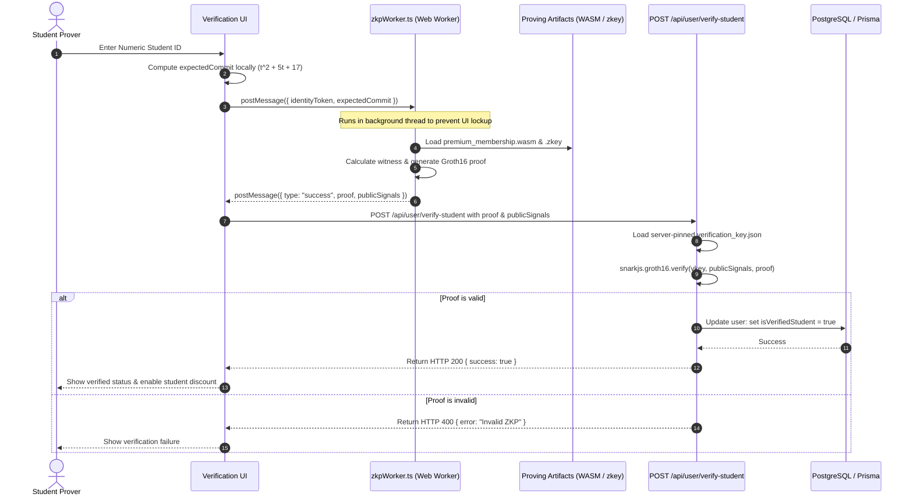

# Zero-Knowledge Student Discount Verification Pipeline

WorkSphere implements a privacy-preserving zero-knowledge proof (ZKP) verification pipeline to allow users to verify their student status for discounts without exposing their raw student credentials or numeric identities to the WorkSphere server.

By leveraging **zk-SNARKs** (Groth16 proving system) over the **BN128 (alt_bn128)** elliptic curve, the client-side browser generates a proof of identity token commitment which the server verifies against a pinned verification key.

---

## 1. Pipeline & Execution Architecture

The verification workflow spans client-side input, Web Worker witness calculation, local proof generation, and server-side verification:



---

## 2. WASM Proving in Web Workers (`zkpWorker.ts`)

To avoid freezing the browser's main execution/UI thread during CPU-intensive cryptographic witness calculation and proof generation, WorkSphere offloads the execution to a dedicated background Web Worker: `src/workers/zkpWorker.ts`.

### Worker Proving Process

1. **Instantiation:** The component `StudentDiscountVerification.tsx` initializes the Web Worker:
   ```typescript
   workerRef.current = new Worker(
     new URL("../../workers/zkpWorker.ts", import.meta.url),
   );
   ```
2. **Execution:** The worker receives the private inputs and triggers `snarkjs.groth16.fullProve` utilizing the pre-compiled WASM circuit and proving key:
   ```typescript
   const { proof, publicSignals } = await snarkjs.groth16.fullProve(
     { identityToken, expectedCommit },
     "/zkp/premium_membership.wasm",
     "/zkp/premium_membership.zkey",
   );
   ```
3. **Response:** Upon successful generation, the worker returns the proof and public signals back to the main thread via `postMessage`.

---

## 3. Cryptographic Security Model & Inputs

### Mathematical Commitment

To satisfy the Zero-Knowledge condition, the student identity token $t$ (a private input) is hidden inside a polynomial commitment $C(t)$:
$$C(t) = t^2 + 5t + 17 \pmod{r}$$
where $r$ is the BN128 scalar field order.

### Input Configuration

- **Private Input:** `identityToken` (Numeric Student ID, kept strictly in-browser).
- **Public Input:** `expectedCommit` (Commitment hash $C(t)$ verified on the server).

### Verification Key Management

- The verification key `verification_key.json` is pinned on the server-side filesystem at `/public/zkp/verification_key.json`.
- The server only loads this local trusted key for validation; it never accepts client-supplied or dynamically queried keys.

---

## 4. Local Development & Testing Guide

Follow these step-by-step instructions to compile the circuit, perform a mock trusted setup, and generate a test ZKP proof locally for verification:

### Step 1: Write the Circom Circuit (`circuits/student_discount.circom`)

```circom
pragma circom 2.0.0;

template StudentDiscount() {
    signal input identityToken; // Private ID
    signal input expectedCommit; // Public Commitment

    signal t2;
    t2 <== identityToken * identityToken;

    signal commit;
    commit <== t2 + identityToken * 5 + 17;

    expectedCommit === commit;
}

component main {public [expectedCommit]} = StudentDiscount();
```

### Step 2: Compile the Circuit

Compile the circuit into Rank-1 Constraint System (R1CS) format and generate the WebAssembly (WASM) code for witness calculation:

```bash
circom circuits/student_discount.circom --r1cs --wasm --sym --output ./build/
```

### Step 3: Run the Powers of Tau (Universal Trusted Setup)

For local development, create a mock universal trusted setup ceremony:

```bash
# Start a new ceremony
npx snarkjs powersoftau new bn128 12 pot12_0000.ptau -v

# Contribute randomness to the setup
npx snarkjs powersoftau contribute pot12_0000.ptau pot12_0001.ptau --name="Dev Contribution" -v -entropy="some_random_seed"

# Prepare Phase 2 of the setup
npx snarkjs powersoftau prepare phase2 pot12_0001.ptau pot12_final.ptau -v
```

### Step 4: Perform Circuit-Specific Setup

Generate the proving key (`.zkey`) and the matching verification key (`verification_key.json`):

```bash
# Setup proving key
npx snarkjs groth16 setup build/student_discount.r1cs pot12_final.ptau build/student_discount_0000.zkey

# Contribute to the proving key
npx snarkjs zkey contribute build/student_discount_0000.zkey build/student_discount.zkey --name="Dev Prover Key" -v -entropy="another_random_seed"

# Export the verification key
npx snarkjs zkey export verificationkey build/student_discount.zkey public/zkp/verification_key.json
```

### Step 5: Generate Witness and Prove Locally

1. Create a test input file `input.json` (e.g. for ID `12345`, expectedCommit = $12345^2 + 5 \times 12345 + 17 = 152461042$):
   ```json
   {
     "identityToken": "12345",
     "expectedCommit": "152461042"
   }
   ```
2. Calculate the witness:
   ```bash
   node build/student_discount_js/generate_witness.js build/student_discount_js/student_discount.wasm input.json build/witness.wtns
   ```
3. Generate the Groth16 Proof:
   ```bash
   npx snarkjs groth16 prove build/student_discount.zkey build/witness.wtns build/proof.json build/public.json
   ```

### Step 6: Verify the Proof Locally

Validate that the generated proof matches the public signals using the verification key:

```bash
npx snarkjs groth16 verify public/zkp/verification_key.json build/public.json build/proof.json
```

If successful, the terminal will print: `[INFO]  snarkJS: OK!`.
